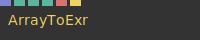
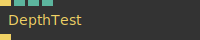
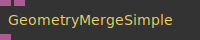
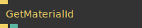
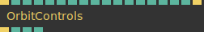
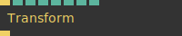
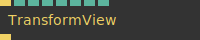

# Ops.Graphics


```{=latex}
\OpsSubsubNoSubsectionNumbering\setcounter{subsubsection}{0}
```
### ArrayToExr


**Full Name:** `Ops.Graphics.ArrayToExr`

convert and download an array of numbers as an .exr image file.

**`\inputsymbol`{=latex} Inputs**

- **Array** (Array)
- **Width** (Number: Integer)
- **Height** (Number: Integer)
- **ZIP Compression** (Number: Boolean)
- **Filename** (String)
- **Download** (Trigger)

**`\outputsymbol`{=latex} Output**

- *Visit [Ops.Graphics.ArrayToExr documentation](https://cables.gl/op/Ops.Graphics.ArrayToExr) for output port details*

**Example Patch:** [cables.gl/edit/PoAXNA](https://cables.gl/edit/PoAXNA)

**Doc:** [cables.gl/op/Ops.Graphics.ArrayToExr](https://cables.gl/op/Ops.Graphics.ArrayToExr)

### DepthTest


**Full Name:** `Ops.Graphics.DepthTest`

change depth testing method (depthMask,depthWrite,depthFunc).

**`\inputsymbol`{=latex} Inputs**

- **Render** (Trigger)
- **Enable Depth Testing** (Number: Boolean)
- **Depth Test Method Index** (Number: Integer)
- **Write To Depth Buffer** (Number: Boolean)

**`\outputsymbol`{=latex} Output**

- **Next** (Trigger)

**Example Patch:** [cables.gl/edit/A9PD8i](https://cables.gl/edit/A9PD8i)

**Doc:** [cables.gl/op/Ops.Graphics.DepthTest](https://cables.gl/op/Ops.Graphics.DepthTest)

### GeometryMergeSimple


**Full Name:** `Ops.Graphics.GeometryMergeSimple`

merge two geometries into one.

**`\inputsymbol`{=latex} Inputs**

- **Geometry** (Object)
- **Geometry 2** (Object)

**`\outputsymbol`{=latex} Output**

- **Geometry Result** (Object)

**Example Patch:** [cables.gl/edit/4gsNve](https://cables.gl/edit/4gsNve)

**Doc:** [cables.gl/op/Ops.Graphics.GeometryMergeSimple](https://cables.gl/op/Ops.Graphics.GeometryMergeSimple)

### GetMaterialId


**Full Name:** `Ops.Graphics.GetMaterialId`

get the id/index of the current set material.

**`\inputsymbol`{=latex} Inputs**

- **Update** (Trigger)

**`\outputsymbol`{=latex} Output**

- **Next** (Trigger)
- **Material Id** (Number)

**Example Patch:** [cables.gl/edit/PYpQit](https://cables.gl/edit/PYpQit)

**Doc:** [cables.gl/op/Ops.Graphics.GetMaterialId](https://cables.gl/op/Ops.Graphics.GetMaterialId)

### GetObjectId


**Full Name:** `Ops.Graphics.GetObjectId`

get the id/index of the current object/mesh.

**`\inputsymbol`{=latex} Inputs**

- **Update** (Trigger)

**`\outputsymbol`{=latex} Output**

- **Next** (Trigger)
- **Material Id** (Number)

**Example Patch:** [cables.gl/op/Ops.Graphics.GetObjectId#example](https://cables.gl/op/Ops.Graphics.GetObjectId#example)

**Doc:** [cables.gl/op/Ops.Graphics.GetObjectId](https://cables.gl/op/Ops.Graphics.GetObjectId)

### OrbitControls_v3


**Full Name:** `Ops.Graphics.OrbitControls_v3`

rotate your object by clicking and dragging the mouse.

**`\inputsymbol`{=latex} Inputs**

- **Render** (Trigger)
- **Min Distance** (Number)
- **Max Distance** (Number)
- **Min Rot Y** (Number)
- **Max Rot Y** (Number)
- **Initial Radius** (Number)
- **Initial Axis Y** (Number)
- **Initial Axis X** (Number)
- **Smoothness** (Number)
- **Speed X** (Number)
- **Speed Y** (Number)
- **Active** (Number: Boolean)
- **Allow Panning** (Number: Boolean)
- **Allow Zooming** (Number: Boolean)
- **Allow Rotation** (Number: Boolean)
- **Restricted** (Number: Boolean)
- **Identity** (Number: Boolean)
- **Reset** (Trigger)

**`\outputsymbol`{=latex} Output**

- **Trigger** (Trigger)
- **Radius** (Number)
- **Rot X** (Number)
- **Rot Y** (Number)

**Example Patch:** [cables.gl/edit/Krorsh](https://cables.gl/edit/Krorsh)

**Doc:** [cables.gl/op/Ops.Graphics.OrbitControls_v3](https://cables.gl/op/Ops.Graphics.OrbitControls_v3)

### Transform


**Full Name:** `Ops.Graphics.Transform`

Transform objects in 3d space (rotate, translate, scale).

**`\inputsymbol`{=latex} Inputs**

- **Render** (Trigger)
- **PosX** (Number)
- **PosY** (Number)
- **PosZ** (Number)
- **Scale** (Number)
- **RotX** (Number)
- **RotY** (Number)
- **RotZ** (Number)

**`\outputsymbol`{=latex} Output**

- **Trigger** (Trigger)

**Example Patch:** [cables.gl/edit/o741ft](https://cables.gl/edit/o741ft)

**Doc:** [cables.gl/op/Ops.Graphics.Transform](https://cables.gl/op/Ops.Graphics.Transform)

### TransformView


**Full Name:** `Ops.Graphics.TransformView`

the most simple camera op / transform the viewmatrix.

**`\inputsymbol`{=latex} Inputs**

- **Render** (Trigger)
- **PosX** (Number)
- **PosY** (Number)
- **PosZ** (Number)
- **Scale** (Number)
- **RotX** (Number)
- **RotY** (Number)
- **RotZ** (Number)

**`\outputsymbol`{=latex} Output**

- **Trigger** (Trigger)

**Example Patch:** [cables.gl/edit/0GAv8i](https://cables.gl/edit/0GAv8i)

**Doc:** [cables.gl/op/Ops.Graphics.TransformView](https://cables.gl/op/Ops.Graphics.TransformView)


