# Ops.Graphics.Geometry


```{=latex}
\OpsSubsubNoSubsectionNumbering\setcounter{subsubsection}{0}
```
### AlignGeometry
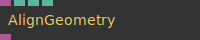

**Full Name:** `Ops.Graphics.Geometry.AlignGeometry`

align a geometry / change its pivot / center / origin point.

**`\inputsymbol`{=latex} Inputs**

- **Geometry** (Object)
- **X Index** (Number: Integer)
- **Y Index** (Number: Integer)
- **Z Index** (Number: Integer)

**`\outputsymbol`{=latex} Output**

- **Result** (Object)

**Example:** [cables.gl/edit/FbXQ-G](https://cables.gl/edit/FbXQ-G)

**Doc:** [cables.gl/op/Ops.Graphics.Geometry.AlignGeometry](https://cables.gl/op/Ops.Graphics.Geometry.AlignGeometry)

### BoundingBox
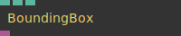

**Full Name:** `Ops.Graphics.Geometry.BoundingBox`

create a simple bounding box from width,height,depth.

**`\inputsymbol`{=latex} Inputs**

- **Width** (Number)
- **Height** (Number)
- **Depth** (Number)

**`\outputsymbol`{=latex} Output**

- **Result** (Object)

**Example:** [cables.gl/op/Ops.Graphics.Geometry.BoundingBox#example](https://cables.gl/op/Ops.Graphics.Geometry.BoundingBox#example)

**Doc:** [cables.gl/op/Ops.Graphics.Geometry.BoundingBox](https://cables.gl/op/Ops.Graphics.Geometry.BoundingBox)

### CalculateNormals
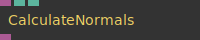

**Full Name:** `Ops.Graphics.Geometry.CalculateNormals`

calculate normals of a geometry.

**`\inputsymbol`{=latex} Inputs**

- **Geometry** (Object)
- **Smooth** (Number: Boolean)
- **Force Z Up** (Number: Boolean)

**`\outputsymbol`{=latex} Output**

- **Geometry Out** (Object)

**Example:** [cables.gl/op/Ops.Graphics.Geometry.CalculateNormals#example](https://cables.gl/op/Ops.Graphics.Geometry.CalculateNormals#example)

**Doc:** [cables.gl/op/Ops.Graphics.Geometry.CalculateNormals](https://cables.gl/op/Ops.Graphics.Geometry.CalculateNormals)

### DivideGeometry
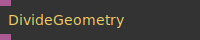

**Full Name:** `Ops.Graphics.Geometry.DivideGeometry`

disconnect faces/polygons of a mesh.

**`\inputsymbol`{=latex} Inputs**

- **Geometry** (Object)

**`\outputsymbol`{=latex} Output**

- **Result** (Object)

**Example:** [cables.gl/edit/sYIxm1](https://cables.gl/edit/sYIxm1)

**Doc:** [cables.gl/op/Ops.Graphics.Geometry.DivideGeometry](https://cables.gl/op/Ops.Graphics.Geometry.DivideGeometry)

### FlipNormals
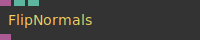

**Full Name:** `Ops.Graphics.Geometry.FlipNormals`

flip all normals of a geometry.

**`\inputsymbol`{=latex} Inputs**

- **Geometry** (Object)
- **Flip** (Number: Boolean)
- **Normalize** (Number: Boolean)

**`\outputsymbol`{=latex} Output**

- **Result** (Object)

**Example:** [cables.gl/edit/cTfoii](https://cables.gl/edit/cTfoii)

**Doc:** [cables.gl/op/Ops.Graphics.Geometry.FlipNormals](https://cables.gl/op/Ops.Graphics.Geometry.FlipNormals)

### FreezeMeshes
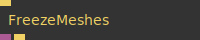

**Full Name:** `Ops.Graphics.Geometry.FreezeMeshes`

capture all following meshes into one geometry.

**`\inputsymbol`{=latex} Inputs**

- **Capture** (Trigger)

**`\outputsymbol`{=latex} Output**

- **Geometry** (Object)
- **Next** (Trigger)

**Example:** [cables.gl/edit/BwxY2f](https://cables.gl/edit/BwxY2f)

**Doc:** [cables.gl/op/Ops.Graphics.Geometry.FreezeMeshes](https://cables.gl/op/Ops.Graphics.Geometry.FreezeMeshes)

### GeometryAttributes
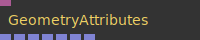

**Full Name:** `Ops.Graphics.Geometry.GeometryAttributes`

Get vertices of a geometry as array3x (vertex vertices).

**`\inputsymbol`{=latex} Inputs**

- **Geometry** (Object)

**`\outputsymbol`{=latex} Output**

- **Faces** (Array)
- **Vertices** (Array)
- **Normals** (Array)
- **TexCoords** (Array)
- **Vertex Colors** (Array)
- **Tangents** (Array)
- **BiTangents** (Array)

**Example:** [cables.gl/edit/4VpJz6](https://cables.gl/edit/4VpJz6)

**Doc:** [cables.gl/op/Ops.Graphics.Geometry.GeometryAttributes](https://cables.gl/op/Ops.Graphics.Geometry.GeometryAttributes)

### GeometryExtrude
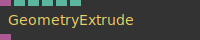

**Full Name:** `Ops.Graphics.Geometry.GeometryExtrude`

basic extrusion of flat geometry.

**`\inputsymbol`{=latex} Inputs**

- **Geometry** (Object:Geometry)
- **Height** (Number)
- **Smooth** (Number: Boolean)
- **Walls** (Number: Boolean)
- **Top** (Number: Boolean)
- **Bottom** (Number: Boolean)

**`\outputsymbol`{=latex} Output**

- **Result Geometry** (Object)

**Example:** [cables.gl/edit/Cp5VS3](https://cables.gl/edit/Cp5VS3)

**Doc:** [cables.gl/op/Ops.Graphics.Geometry.GeometryExtrude](https://cables.gl/op/Ops.Graphics.Geometry.GeometryExtrude)

### GeometryFromArrays


**Full Name:** `Ops.Graphics.Geometry.GeometryFromArrays`

Create a geometry from array data.

**`\inputsymbol`{=latex} Inputs**

- **Render** (Trigger)
- **Vertices** (Array)
- **Faces** (Array)
- **Texture Coords** (Array)
- **Normals** (Array)

**`\outputsymbol`{=latex} Output**

- **Next** (Trigger)
- **Geometry** (Object)

**Example:** [cables.gl/edit/isWvii](https://cables.gl/edit/isWvii)

**Doc:** [cables.gl/op/Ops.Graphics.Geometry.GeometryFromArrays](https://cables.gl/op/Ops.Graphics.Geometry.GeometryFromArrays)

### GeometryInfo
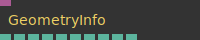

**Full Name:** `Ops.Graphics.Geometry.GeometryInfo`

information about a geometry.

**`\inputsymbol`{=latex} Inputs**

- **Geometry** (Object:Geometry)

**`\outputsymbol`{=latex} Output**

- **Indexed** (Number)
- **Faces** (Number)
- **Indices** (Number)
- **Vertices** (Number)
- **Normals** (Number)
- **TexCoords** (Number)
- **Tangents** (Number)
- **BiTangents** (Number)
- **VertexColors** (Number)
- **Other Attributes** (Number)

**Example:** [cables.gl/op/Ops.Graphics.Geometry.GeometryInfo#example](https://cables.gl/op/Ops.Graphics.Geometry.GeometryInfo#example)

**Doc:** [cables.gl/op/Ops.Graphics.Geometry.GeometryInfo](https://cables.gl/op/Ops.Graphics.Geometry.GeometryInfo)

### GeometryMerge
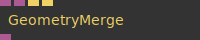

**Full Name:** `Ops.Graphics.Geometry.GeometryMerge`

merge two geometries to one.

**`\inputsymbol`{=latex} Inputs**

- **Geometry** (Object)
- **Geometry 2** (Object)
- **Merge** (Trigger)
- **Reset** (Trigger)

**`\outputsymbol`{=latex} Output**

- **Geometry Result** (Object)

**Example:** [cables.gl/edit/3rCDz6](https://cables.gl/edit/3rCDz6)

**Doc:** [cables.gl/op/Ops.Graphics.Geometry.GeometryMerge](https://cables.gl/op/Ops.Graphics.Geometry.GeometryMerge)

### GeometryToObj
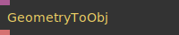

**Full Name:** `Ops.Graphics.Geometry.GeometryToObj`

Generate an .obj file as string from a geometry.

**`\inputsymbol`{=latex} Inputs**

- **Geometry** (Object:Geometry)

**`\outputsymbol`{=latex} Output**

- **Obj** (String)

**Example:** [cables.gl/edit/BwxY2f](https://cables.gl/edit/BwxY2f)

**Doc:** [cables.gl/op/Ops.Graphics.Geometry.GeometryToObj](https://cables.gl/op/Ops.Graphics.Geometry.GeometryToObj)

### GeometryToWireframeArray3
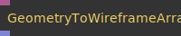

**Full Name:** `Ops.Graphics.Geometry.GeometryToWireframeArray3`

generate an array of lines from a mesh to render a wireframe.

**`\inputsymbol`{=latex} Inputs**

- **Geometry** (Object)

**`\outputsymbol`{=latex} Output**

- **Array** (Array)

**Example:** [cables.gl/edit/r--xve](https://cables.gl/edit/r--xve)

**Doc:** [cables.gl/op/Ops.Graphics.Geometry.GeometryToWireframeArray3](https://cables.gl/op/Ops.Graphics.Geometry.GeometryToWireframeArray3)

### GeometryUnIndex
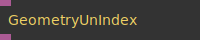

**Full Name:** `Ops.Graphics.Geometry.GeometryUnIndex`

convert geometry to only flat triangles without reusing vertices positions.

**`\inputsymbol`{=latex} Inputs**

- **Geometry** (Object:Geometry)

**`\outputsymbol`{=latex} Output**

- **Result** (Object)

**Example:** [cables.gl/op/Ops.Graphics.Geometry.GeometryUnIndex#example](https://cables.gl/op/Ops.Graphics.Geometry.GeometryUnIndex#example)

**Doc:** [cables.gl/op/Ops.Graphics.Geometry.GeometryUnIndex](https://cables.gl/op/Ops.Graphics.Geometry.GeometryUnIndex)

### ObjGeometry
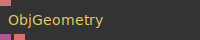

**Full Name:** `Ops.Graphics.Geometry.ObjGeometry`

parse an obj string to a geometry object.

**`\inputsymbol`{=latex} Inputs**

- **Obj** (String)

**`\outputsymbol`{=latex} Output**

- **Geometry** (Object)
- **Status** (String)

**Example:** [cables.gl/edit/JeA8ck](https://cables.gl/edit/JeA8ck)

**Doc:** [cables.gl/op/Ops.Graphics.Geometry.ObjGeometry](https://cables.gl/op/Ops.Graphics.Geometry.ObjGeometry)

### RandomizeTriangles
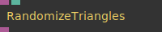

**Full Name:** `Ops.Graphics.Geometry.RandomizeTriangles`

randomize order of triangles in a geometry.

**`\inputsymbol`{=latex} Inputs**

- **Geometry** (Object)
- **Seed** (Number)

**`\outputsymbol`{=latex} Output**

- **Result** (Object)

**Example:** [cables.gl/edit/gLrrJV](https://cables.gl/edit/gLrrJV)

**Doc:** [cables.gl/op/Ops.Graphics.Geometry.RandomizeTriangles](https://cables.gl/op/Ops.Graphics.Geometry.RandomizeTriangles)

### ReverseVertices


**Full Name:** `Ops.Graphics.Geometry.ReverseVertices`

Reverses the order of vertices in a geometry, back facing triangles become front facing ones.

**`\inputsymbol`{=latex} Inputs**

- **Geometry** (Object)
- **Flip** (Number: Boolean)

**`\outputsymbol`{=latex} Output**

- **Result** (Object)

**Example:** [cables.gl/edit/u9N6v4](https://cables.gl/edit/u9N6v4)

**Doc:** [cables.gl/op/Ops.Graphics.Geometry.ReverseVertices](https://cables.gl/op/Ops.Graphics.Geometry.ReverseVertices)

### ScaleGeometry
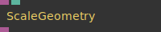

**Full Name:** `Ops.Graphics.Geometry.ScaleGeometry`

uniform scaling of geometry vertices.

**`\inputsymbol`{=latex} Inputs**

- **Geometry** (Object)
- **Scale** (Number)

**`\outputsymbol`{=latex} Output**

- **Result** (Object)

**Example:** [cables.gl/op/Ops.Graphics.Geometry.ScaleGeometry#example](https://cables.gl/op/Ops.Graphics.Geometry.ScaleGeometry#example)

**Doc:** [cables.gl/op/Ops.Graphics.Geometry.ScaleGeometry](https://cables.gl/op/Ops.Graphics.Geometry.ScaleGeometry)

### SortGeometryAxis
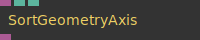

**Full Name:** `Ops.Graphics.Geometry.SortGeometryAxis`

sort geometry triangles by position.

**`\inputsymbol`{=latex} Inputs**

- **Geometry** (Object)
- **Sort Index** (Number: Integer)
- **Reverse** (Number: Boolean)

**`\outputsymbol`{=latex} Output**

- **Result** (Object)

**Example:** [cables.gl/op/Ops.Graphics.Geometry.SortGeometryAxis#example](https://cables.gl/op/Ops.Graphics.Geometry.SortGeometryAxis#example)

**Doc:** [cables.gl/op/Ops.Graphics.Geometry.SortGeometryAxis](https://cables.gl/op/Ops.Graphics.Geometry.SortGeometryAxis)

### SvgPathToGeometry_v2
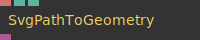

**Full Name:** `Ops.Graphics.Geometry.SvgPathToGeometry_v2`

Generate a SVG path string of a string using an opentype font.

**`\inputsymbol`{=latex} Inputs**

- **SVG Path** (String)
- **Bezier Stepsize** (Number)
- **Rescale** (Number)

**`\outputsymbol`{=latex} Output**

- **Geometry** (Object)

**Example:** [cables.gl/edit/Cp5VS3](https://cables.gl/edit/Cp5VS3)

**Doc:** [cables.gl/op/Ops.Graphics.Geometry.SvgPathToGeometry_v2](https://cables.gl/op/Ops.Graphics.Geometry.SvgPathToGeometry_v2)

### TesselateGeometry
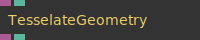

**Full Name:** `Ops.Graphics.Geometry.TesselateGeometry`

create new triangles in a mesh (subdivide).

**`\inputsymbol`{=latex} Inputs**

- **Geometry** (Object)
- **Iterations** (Number: Integer)

**`\outputsymbol`{=latex} Output**

- **Result** (Object)
- **Num Vertices** (Number)

**Example:** [cables.gl/edit/gLrrJV](https://cables.gl/edit/gLrrJV)

**Doc:** [cables.gl/op/Ops.Graphics.Geometry.TesselateGeometry](https://cables.gl/op/Ops.Graphics.Geometry.TesselateGeometry)

### TransformGeometry
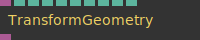

**Full Name:** `Ops.Graphics.Geometry.TransformGeometry`

transform vertices of geometry.

**`\inputsymbol`{=latex} Inputs**

- **Geometry** (Object)
- **Translate X** (Number)
- **Translate Y** (Number)
- **Translate Z** (Number)
- **Scale X** (Number)
- **Scale Y** (Number)
- **Scale Z** (Number)
- **Rotation X** (Number)
- **Rotation Y** (Number)
- **Rotation Z** (Number)

**`\outputsymbol`{=latex} Output**

- **Result** (Object)

**Example:** [cables.gl/edit/aoBFz6](https://cables.gl/edit/aoBFz6)

**Doc:** [cables.gl/op/Ops.Graphics.Geometry.TransformGeometry](https://cables.gl/op/Ops.Graphics.Geometry.TransformGeometry)

### TriangleArrayToGeometry_v2
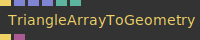

**Full Name:** `Ops.Graphics.Geometry.TriangleArrayToGeometry_v2`

Draws multiple triangles using coordinates from an array.

**`\inputsymbol`{=latex} Inputs**

- **Render** (Trigger)
- **Points** (Array)
- **Vertex Colors** (Array)
- **TexCoords** (Array)
- **Flat** (Number: Boolean)
- **Render Mesh** (Number: Boolean)

**`\outputsymbol`{=latex} Output**

- **Next** (Trigger)
- **Geometry** (Object)

**Example:** [cables.gl/edit/0fnxrc](https://cables.gl/edit/0fnxrc)

**Doc:** [cables.gl/op/Ops.Graphics.Geometry.TriangleArrayToGeometry_v2](https://cables.gl/op/Ops.Graphics.Geometry.TriangleArrayToGeometry_v2)

### Triangulate2dPath
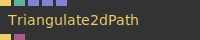

**Full Name:** `Ops.Graphics.Geometry.Triangulate2dPath`

Triangulate a 2d path to a flat and filled 3d geometry.

**`\inputsymbol`{=latex} Inputs**

- **Update** (Trigger)
- **Combine Index** (Number: Integer)
- **Path 2** (Array)
- **Path 3** (Array)

**`\outputsymbol`{=latex} Output**

- **Next** (Trigger)
- **Geometry** (Object)

**Example:** [cables.gl/edit/LzTAeT](https://cables.gl/edit/LzTAeT)

**Doc:** [cables.gl/op/Ops.Graphics.Geometry.Triangulate2dPath](https://cables.gl/op/Ops.Graphics.Geometry.Triangulate2dPath)


