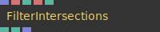
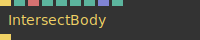
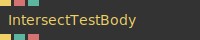
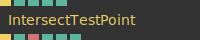
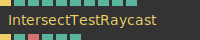
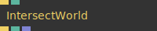

# Ops.Graphics.Intersection

---

```{=latex}
\stepcounter{subsection}\setcounter{subsubsection}{0}
```
### FilterIntersections


**Full Name:** `Ops.Graphics.Intersection.FilterIntersections`

**Description:** Define filters to get colliding and intersecting bodies

**`\inputsymbol`{=latex} Inputs**

- **Collisions** (Array)
- **Name 1** (String)
- **Match Name 1 Index** (Number: Integer)
- **Name 2** (String)
- **Match Name 2 Index** (Number: Integer)

**`\outputsymbol`{=latex} Output**

- **Colliding** (booleanNumber)
- **Num Collisions** (Number)
- **Result Collisions** (Array)

**Example Patch:** [Open in Editor](https://cables.gl/op/Ops.Graphics.Intersection.FilterIntersections#example)

**Docs:** [https://cables.gl/op/Ops.Graphics.Intersection.FilterIntersections](https://cables.gl/op/Ops.Graphics.Intersection.FilterIntersections)

### IntersectBody


**Full Name:** `Ops.Graphics.Intersection.IntersectBody`

**Description:** Add Bodies and check if they intersect/collide with each other

**`\inputsymbol`{=latex} Inputs**

- **Trigger** (Trigger)
- **Name** (String)
- **Radius** (Number)
- **Size X** (Number)
- **Size Y** (Number)
- **Size Z** (Number)
- **Positions** (Array)
- **Append Index To Name** (Number: Boolean)

**`\outputsymbol`{=latex} Output**

- **Next** (Trigger)

**Example Patch:** [Open in Editor](https://cables.gl/edit/ffRjjz)

**Docs:** [https://cables.gl/op/Ops.Graphics.Intersection.IntersectBody](https://cables.gl/op/Ops.Graphics.Intersection.IntersectBody)

### IntersectTestBody


**Full Name:** `Ops.Graphics.Intersection.IntersectTestBody`

**Description:** test one body against all bodies in the world

**`\inputsymbol`{=latex} Inputs**

- **Trigger** (Trigger)
- **Name** (String)
- **Active** (Number: Boolean)

**`\outputsymbol`{=latex} Output**

- **Next** (Trigger)
- **Has Hit** (booleanNumber)
- **Hit Body Name** (String)

**Example Patch:** [Open in Editor](https://cables.gl/edit/bg73Qc)

**Docs:** [https://cables.gl/op/Ops.Graphics.Intersection.IntersectTestBody](https://cables.gl/op/Ops.Graphics.Intersection.IntersectTestBody)

### IntersectTestPoint


**Full Name:** `Ops.Graphics.Intersection.IntersectTestPoint`

**Description:** test intersect bodies collision against a point/coordinate

**`\inputsymbol`{=latex} Inputs**

- **Trigger** (Trigger)
- **X** (Number)
- **Y** (Number)
- **Z** (Number)
- **Active** (Number: Boolean)

**`\outputsymbol`{=latex} Output**

- **Next** (Trigger)
- **Has Hit** (booleanNumber)
- **Hit Body Name** (String)
- **Hit X** (Number)
- **Hit Y** (Number)
- **Hit Z** (Number)

**Example Patch:** [Open in Editor](https://cables.gl/edit/c2DAO8)

**Docs:** [https://cables.gl/op/Ops.Graphics.Intersection.IntersectTestPoint](https://cables.gl/op/Ops.Graphics.Intersection.IntersectTestPoint)

### IntersectTestRaycast


**Full Name:** `Ops.Graphics.Intersection.IntersectTestRaycast`

**Description:** Cast a ray and check if it intersect/collide with bodies

**`\inputsymbol`{=latex} Inputs**

- **Trigger** (Trigger)
- **X** (Number)
- **Y** (Number)
- **Z** (Number)
- **To X** (Number)
- **To Y** (Number)
- **To Z** (Number)
- **Active** (Number: Boolean)
- **Change Cursor** (Number: Boolean)

**`\outputsymbol`{=latex} Output**

- **Next** (Trigger)
- **Has Hit** (booleanNumber)
- **Hit Body Name** (String)
- **Hit X** (Number)
- **Hit Y** (Number)
- **Hit Z** (Number)

**Example Patch:** [Open in Editor](https://cables.gl/edit/ffRjjz)

**Docs:** [https://cables.gl/op/Ops.Graphics.Intersection.IntersectTestRaycast](https://cables.gl/op/Ops.Graphics.Intersection.IntersectTestRaycast)

### IntersectWorld


**Full Name:** `Ops.Graphics.Intersection.IntersectWorld`

**Description:** Define a world to check for intersections and collisions

**`\inputsymbol`{=latex} Inputs**

- **Trigger** (Trigger)
- **Check Body Collisions** (Number: Boolean)

**`\outputsymbol`{=latex} Output**

- **Next** (Trigger)
- **Total Bodies** (Number)
- **Collisions** (Array)

**Example Patch:** [Open in Editor](https://cables.gl/edit/ffRjjz)

**Docs:** [https://cables.gl/op/Ops.Graphics.Intersection.IntersectWorld](https://cables.gl/op/Ops.Graphics.Intersection.IntersectWorld)


