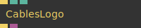
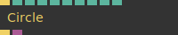
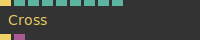
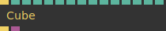
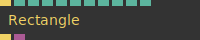
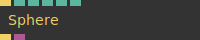
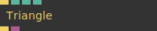

# Ops.Graphics.Meshes

*Part of the [All Operators Reference](13-_AllOps.md)*

---

## Ops.Graphics.Meshes

### CablesLogo

**Full Name:** `Ops.Graphics.Meshes.CablesLogo`
**Description:** cables logo mesh/geometry

**> Input Ports:**
- **Render** (Trigger): *See documentation*
- **Scale** (Number): *See documentation*
- **Draw** (Number: Boolean): *See documentation*

**< Output Ports:**
- **Trigger** (Trigger): *See documentation*
- **Geometry** (Object): *See documentation*

**Example Patch:** [Open in Editor](https://cables.gl/edit/xUMq3j)
**Patches Using This Op:** *Search [cables.gl patches](https://cables.gl/patches) for "CablesLogo"*
**Docs:** [https://cables.gl/op/Ops.Graphics.Meshes.CablesLogo](https://cables.gl/op/Ops.Graphics.Meshes.CablesLogo)

---

### Circle_v3

**Full Name:** `Ops.Graphics.Meshes.Circle_v3`
**Description:** Draws a circle to the canvas.

**> Input Ports:**
- **Render** (Trigger): *See documentation*
- **Radius** (Number): *See documentation*
- **InnerRadius** (Number): *See documentation*
- **Segments** (Number: Integer): *See documentation*
- **Percent** (Number): *See documentation*
- **Steps** (Number): *See documentation*
- **InvertSteps** (Number: Boolean): *See documentation*
- **Spline** (Number: Boolean): *See documentation*
- **Render Mesh** (Number: Boolean): *See documentation*

**< Output Ports:**
- **Trigger** (Trigger): *See documentation*
- **Geometry** (Object): *See documentation*

**Example Patch:** [Open in Editor](https://cables.gl/edit/DAAkQ6)
**Patches Using This Op:** *Search [cables.gl patches](https://cables.gl/patches) for "Circle_v3"*
**Docs:** [https://cables.gl/op/Ops.Graphics.Meshes.Circle_v3](https://cables.gl/op/Ops.Graphics.Meshes.Circle_v3)

---

### Cross

**Full Name:** `Ops.Graphics.Meshes.Cross`
**Description:** Draws a cross with controllable thickness and length.

**> Input Ports:**
- **Render** (Trigger): *See documentation*
- **Size** (Number): *See documentation*
- **Thickness** (Number): *See documentation*
- **Crosshair** (Number: Boolean): *See documentation*
- **Left** (Number: Boolean): *See documentation*
- **Right** (Number: Boolean): *See documentation*
- **Top** (Number: Boolean): *See documentation*
- **Bottom** (Number: Boolean): *See documentation*
- **Active** (Number: Boolean): *See documentation*

**< Output Ports:**
- **Next** (Trigger): *See documentation*
- **Geometry** (Object): *See documentation*

**Example Patch:** [Open in Editor](https://cables.gl/edit/ojTS_o)
**Patches Using This Op:** *Search [cables.gl patches](https://cables.gl/patches) for "Cross"*
**Docs:** [https://cables.gl/op/Ops.Graphics.Meshes.Cross](https://cables.gl/op/Ops.Graphics.Meshes.Cross)

---

### Cube_v2

**Full Name:** `Ops.Graphics.Meshes.Cube_v2`
**Description:** Draws a cube to the canvas. Please note that without doing a rotation you will only see a rectangle.

**> Input Ports:**
- **Render** (Trigger): *See documentation*
- **Render Mesh** (Number: Boolean): *See documentation*
- **Width** (Number): *See documentation*
- **Length** (Number): *See documentation*
- **Height** (Number): *See documentation*
- **Center** (Number: Boolean): *See documentation*
- **Bias** (Number): *See documentation*
- **Flip X** (Number: Boolean): *See documentation*
- **Top** (Number: Boolean): *See documentation*
- **Bottom** (Number: Boolean): *See documentation*
- **Left** (Number: Boolean): *See documentation*
- **Right** (Number: Boolean): *See documentation*
- **Front** (Number: Boolean): *See documentation*
- **Back** (Number: Boolean): *See documentation*

**< Output Ports:**
- **Next** (Trigger): *See documentation*
- **Geometry** (Object): *See documentation*

**Example Patch:** [Open in Editor](https://cables.gl/edit/0ghhQ6)
**Patches Using This Op:** *Search [cables.gl patches](https://cables.gl/patches) for "Cube_v2"*
**Docs:** [https://cables.gl/op/Ops.Graphics.Meshes.Cube_v2](https://cables.gl/op/Ops.Graphics.Meshes.Cube_v2)

---

### Rectangle_v4

**Full Name:** `Ops.Graphics.Meshes.Rectangle_v4`
**Description:** draw a rectangle (plane, square)

**> Input Ports:**
- **Trigger** (Trigger): *See documentation*
- **Render** (Number: Boolean): *See documentation*
- **Width** (Number): *See documentation*
- **Height** (Number): *See documentation*
- **Flip TexCoord X** (Number: Boolean): *See documentation*
- **Flip TexCoord Y** (Number: Boolean): *See documentation*
- **Num Columns** (Number: Integer): *See documentation*
- **Num Rows** (Number: Integer): *See documentation*

**< Output Ports:**
- **Trigger** (Trigger): *See documentation*
- **Geometry** (Object): *See documentation*

**Example Patch:** [Open in Editor](https://cables.gl/edit/M3QiQ6)
**Patches Using This Op:** *Search [cables.gl patches](https://cables.gl/patches) for "Rectangle_v4"*
**Docs:** [https://cables.gl/op/Ops.Graphics.Meshes.Rectangle_v4](https://cables.gl/op/Ops.Graphics.Meshes.Rectangle_v4)

---

### Sphere_v3

**Full Name:** `Ops.Graphics.Meshes.Sphere_v3`
**Description:** Draw parameterizable sphere

**> Input Ports:**
- **Render** (Trigger): *See documentation*
- **Radius** (Number): *See documentation*
- **Stacks** (Number): *See documentation*
- **Slices** (Number): *See documentation*
- **Filloffset** (Number): *See documentation*

**< Output Ports:**
- **Trigger** (Trigger): *See documentation*
- **Geometry** (Object): *See documentation*

**Example Patch:** [Open in Editor](https://cables.gl/edit/HvxfQ6)
**Patches Using This Op:** *Search [cables.gl patches](https://cables.gl/patches) for "Sphere_v3"*
**Docs:** [https://cables.gl/op/Ops.Graphics.Meshes.Sphere_v3](https://cables.gl/op/Ops.Graphics.Meshes.Sphere_v3)

---

### Star_v2

**Full Name:** `Ops.Graphics.Meshes.Star_v2`
**Description:** draw a star mesh (saw,gear)

**> Input Ports:**
- **Render** (Trigger): *See documentation*
- **Segments** (Number): *See documentation*
- **Radius** (Number): *See documentation*
- **Shape Index** (Number: Integer): *See documentation*
- **Length** (Number): *See documentation*
- **Peak Z Pos** (Number): *See documentation*
- **Percent** (Number): *See documentation*
- **Fill** (Number: Boolean): *See documentation*
- **Render Mesh** (Number: Boolean): *See documentation*

**< Output Ports:**
- **Trigger** (Trigger): *See documentation*
- **Geometry** (Object): *See documentation*

**Example Patch:** [Open in Editor](https://cables.gl/edit/eXhAY4)
**Patches Using This Op:** *Search [cables.gl patches](https://cables.gl/patches) for "Star_v2"*
**Docs:** [https://cables.gl/op/Ops.Graphics.Meshes.Star_v2](https://cables.gl/op/Ops.Graphics.Meshes.Star_v2)

---

### Triangle_v2

**Full Name:** `Ops.Graphics.Meshes.Triangle_v2`
**Description:** Renders a triangle to the canvas.

**> Input Ports:**
- **Render** (Trigger): *See documentation*
- **Width** (Number): *See documentation*
- **Height** (Number): *See documentation*
- **Draw** (Number: Boolean): *See documentation*

**< Output Ports:**
- **Trigger** (Trigger): *See documentation*
- **Geometry** (Object): *See documentation*

**Example Patch:** [Open in Editor](https://cables.gl/edit/RnNiQ6)
**Patches Using This Op:** *Search [cables.gl patches](https://cables.gl/patches) for "Triangle_v2"*
**Docs:** [https://cables.gl/op/Ops.Graphics.Meshes.Triangle_v2](https://cables.gl/op/Ops.Graphics.Meshes.Triangle_v2)

---

