# Ops.Html


```{=latex}
\OpsSubsubNoSubsectionNumbering\setcounter{subsubsection}{0}
```
### ActiveElement
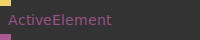

**Full Name:** `Ops.Html.ActiveElement`

Outputs the currently active/focused element.

**`\inputsymbol`{=latex} Inputs**

- **Trigger** (Trigger)

**`\outputsymbol`{=latex} Output**

- **Active Element** (Object)

**Example Patch:** [cables.gl/edit/0iRDu1](https://cables.gl/edit/0iRDu1)

**Doc:** [cables.gl/op/Ops.Html.ActiveElement](https://cables.gl/op/Ops.Html.ActiveElement)

### AlignElement
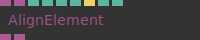

**Full Name:** `Ops.Html.AlignElement`

Align a HTML element to another, keep positioning.

**`\inputsymbol`{=latex} Inputs**

- **Element** (Object:Element)
- **Align Element** (Object:Element)
- **Force Update** (Trigger)
- **Offset X** (Number)
- **Offset Y** (Number)

**`\outputsymbol`{=latex} Output**

- **Element Passthrough** (Object)
- **Aligned Element** (Object)

**Example Patch:** [cables.gl/edit/jKcTdv](https://cables.gl/edit/jKcTdv)

**Doc:** [cables.gl/op/Ops.Html.AlignElement](https://cables.gl/op/Ops.Html.AlignElement)

### AppendChild_v2
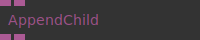

**Full Name:** `Ops.Html.AppendChild_v2`

Appends a HTML DOM Element to another.

**`\inputsymbol`{=latex} Inputs**

- **Parent** (Object:Element)
- **Child** (Object:Element)

**`\outputsymbol`{=latex} Output**

- **Parent Out** (Object)
- **Child Out** (Object)

**Example Patch:** [cables.gl/edit/PakK8i](https://cables.gl/edit/PakK8i)

**Doc:** [cables.gl/op/Ops.Html.AppendChild_v2](https://cables.gl/op/Ops.Html.AppendChild_v2)

### BrowserSpecificFile_v2
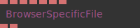

**Full Name:** `Ops.Html.BrowserSpecificFile_v2`

set file dependant on browser.

**`\inputsymbol`{=latex} Inputs**

- **Chrome File** (String)
- **Firefox File** (String)
- **Safari File** (String)
- **Edge File** (String)
- **Opera File** (String)
- **Default File** (String)

**`\outputsymbol`{=latex} Output**

- **Browser Specific File** (String)
- **Detected Browser** (String)

**Example Patch:** [cables.gl/edit/CfJkIk](https://cables.gl/edit/CfJkIk)

**Doc:** [cables.gl/op/Ops.Html.BrowserSpecificFile_v2](https://cables.gl/op/Ops.Html.BrowserSpecificFile_v2)

### CanvasToBase64
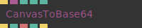

**Full Name:** `Ops.Html.CanvasToBase64`

Create an image file from a canvas.

**`\inputsymbol`{=latex} Inputs**

- **Trigger** (Trigger)
- **Texture** (Object)
- **Quality** (Number)
- **Output DataUrl** (Number: Boolean)

**`\outputsymbol`{=latex} Output**

- **Next** (Trigger)
- **Binary Size** (Number)
- **Base64 String** (String)
- **Loading** (booleanNumber)
- **Finished** (Trigger)

**Example Patch:** [cables.gl/op/Ops.Html.CanvasToBase64#example](https://cables.gl/op/Ops.Html.CanvasToBase64#example)

**Doc:** [cables.gl/op/Ops.Html.CanvasToBase64](https://cables.gl/op/Ops.Html.CanvasToBase64)

### CompareImages_v2
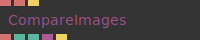

**Full Name:** `Ops.Html.CompareImages_v2`

compares two images and shows the difference as a pink color.

**`\inputsymbol`{=latex} Inputs**

- **Image 1** (String)
- **Image 2** (String)
- **Start** (Trigger)

**`\outputsymbol`{=latex} Output**

- **Difference Image** (String)
- **Mismatch Percentage** (Number)
- **Same Dimensions** (booleanNumber)
- **Resemble Data** (Object)
- **Finished** (Trigger)

**Example Patch:** [cables.gl/edit/1xkRN8](https://cables.gl/edit/1xkRN8)

**Doc:** [cables.gl/op/Ops.Html.CompareImages_v2](https://cables.gl/op/Ops.Html.CompareImages_v2)

### DocumentBody


**Full Name:** `Ops.Html.DocumentBody`

Outputs the current document body element.

**`\inputsymbol`{=latex} Inputs**

- *Visit [Ops.Html.DocumentBody documentation](https://cables.gl/op/Ops.Html.DocumentBody) for input port details*

**`\outputsymbol`{=latex} Output**

- **Body** (Object)

**Example Patch:** [cables.gl/op/Ops.Html.DocumentBody#example](https://cables.gl/op/Ops.Html.DocumentBody#example)

**Doc:** [cables.gl/op/Ops.Html.DocumentBody](https://cables.gl/op/Ops.Html.DocumentBody)

### DraggableElement
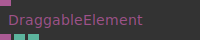

**Full Name:** `Ops.Html.DraggableElement`

Make a HTML element draggable to move it around with the mouse.

**`\inputsymbol`{=latex} Inputs**

- **Element** (Object:Element)

**`\outputsymbol`{=latex} Output**

- **Element Out** (Object)
- **X** (Number)
- **Y** (Number)

**Example Patch:** [cables.gl/edit/WSi9iO](https://cables.gl/edit/WSi9iO)

**Doc:** [cables.gl/op/Ops.Html.DraggableElement](https://cables.gl/op/Ops.Html.DraggableElement)

### ElementAsHtmlString
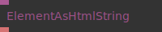

**Full Name:** `Ops.Html.ElementAsHtmlString`

Serialize HTML/SVG elements to a string.

**`\inputsymbol`{=latex} Inputs**

- **Parent** (Object:Element)

**`\outputsymbol`{=latex} Output**

- **HTML String** (String)

**Example Patch:** [cables.gl/edit/3kGgr5](https://cables.gl/edit/3kGgr5)

**Doc:** [cables.gl/op/Ops.Html.ElementAsHtmlString](https://cables.gl/op/Ops.Html.ElementAsHtmlString)

### ElementChilds_v2
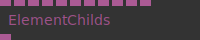

**Full Name:** `Ops.Html.ElementChilds_v2`

Set childs of a HTML Element.

**`\inputsymbol`{=latex} Inputs**

- **Parent** (Object:Element)
- **Child 1** (Object:Element)
- **Child 2** (Object:Element)
- **Child 3** (Object:Element)
- **Child 4** (Object:Element)
- **Child 5** (Object:Element)
- **Child 6** (Object:Element)
- **Child 7** (Object:Element)
- **Child 8** (Object:Element)
- **Child 9** (Object:Element)
- **Child 10** (Object:Element)

**`\outputsymbol`{=latex} Output**

- **Parent Out** (Object)

**Example Patch:** [cables.gl/edit/S4VD0H](https://cables.gl/edit/S4VD0H)

**Doc:** [cables.gl/op/Ops.Html.ElementChilds_v2](https://cables.gl/op/Ops.Html.ElementChilds_v2)

### ElementChildsMultiPort_v2
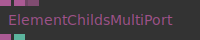

**Full Name:** `Ops.Html.ElementChildsMultiPort_v2`

add child elements to another HTML Element.

**`\inputsymbol`{=latex} Inputs**

- **Parent** (Object:Element)
- **Childs_0** (Object)
- **Add Port** (Object)

**`\outputsymbol`{=latex} Output**

- **Parent Out** (Object)
- **Num Values** (Number)

**Example Patch:** [cables.gl/edit/zC9iWh](https://cables.gl/edit/zC9iWh)

**Doc:** [cables.gl/op/Ops.Html.ElementChildsMultiPort_v2](https://cables.gl/op/Ops.Html.ElementChildsMultiPort_v2)

### ElementClientRect


**Full Name:** `Ops.Html.ElementClientRect`

get html element absolute position and size in pixels on screen.

**`\inputsymbol`{=latex} Inputs**

- **Update** (Trigger)
- **Element** (Object:Element)

**`\outputsymbol`{=latex} Output**

- **X** (Number)
- **Y** (Number)
- **Width** (Number)
- **Height** (Number)

**Example Patch:** [cables.gl/edit/1Z8oLu](https://cables.gl/edit/1Z8oLu)

**Doc:** [cables.gl/op/Ops.Html.ElementClientRect](https://cables.gl/op/Ops.Html.ElementClientRect)

### ElementCssCursor_v3
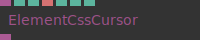

**Full Name:** `Ops.Html.ElementCssCursor_v3`

Set the mouse cursor.

**`\inputsymbol`{=latex} Inputs**

- **Element** (Object:Element)
- **CSS Cursors Index** (Number: Integer)
- **File** (String)
- **Offset X** (Number: Integer)
- **Offset Y** (Number: Integer)

**`\outputsymbol`{=latex} Output**

- **HTML Element** (Object)

**Example Patch:** [cables.gl/edit/_f5W8s](https://cables.gl/edit/_f5W8s)

**Doc:** [cables.gl/op/Ops.Html.ElementCssCursor_v3](https://cables.gl/op/Ops.Html.ElementCssCursor_v3)

### ElementCssString
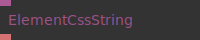

**Full Name:** `Ops.Html.ElementCssString`

Output css attributes of an element as a string.

**`\inputsymbol`{=latex} Inputs**

- **Element** (Object:Element)

**`\outputsymbol`{=latex} Output**

- **CSS** (String)

**Example Patch:** [cables.gl/edit/8JmrBZ](https://cables.gl/edit/8JmrBZ)

**Doc:** [cables.gl/op/Ops.Html.ElementCssString](https://cables.gl/op/Ops.Html.ElementCssString)

### ElementDataSet
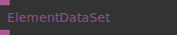

**Full Name:** `Ops.Html.ElementDataSet`

Get the data-attributes and values of an HTML element.

**`\inputsymbol`{=latex} Inputs**

- **HTML Element** (Object:Element)

**`\outputsymbol`{=latex} Output**

- **Dataset** (Object)

**Example Patch:** [cables.gl/edit/MgdKjH](https://cables.gl/edit/MgdKjH)

**Doc:** [cables.gl/op/Ops.Html.ElementDataSet](https://cables.gl/op/Ops.Html.ElementDataSet)

### ElementEquals
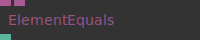

**Full Name:** `Ops.Html.ElementEquals`

Check if two HTML element objects are equal.

**`\inputsymbol`{=latex} Inputs**

- **HTML Element** (Object:Element)
- **HTML Element 2** (Object:Element)

**`\outputsymbol`{=latex} Output**

- **Equal** (booleanNumber)

**Example Patch:** [cables.gl/edit/LZSRjH](https://cables.gl/edit/LZSRjH)

**Doc:** [cables.gl/op/Ops.Html.ElementEquals](https://cables.gl/op/Ops.Html.ElementEquals)

### ElementFadeInOut_v2
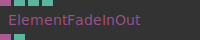

**Full Name:** `Ops.Html.ElementFadeInOut_v2`

fade html elements in or out.

**`\inputsymbol`{=latex} Inputs**

- **HTML Element** (Object)
- **Visible** (Number: Boolean)
- **Duration** (Number)
- **Opacity** (Number)

**`\outputsymbol`{=latex} Output**

- **PassThrough** (Object)
- **Is Showing** (booleanNumber)

**Example Patch:** [cables.gl/edit/Whj018](https://cables.gl/edit/Whj018)

**Doc:** [cables.gl/op/Ops.Html.ElementFadeInOut_v2](https://cables.gl/op/Ops.Html.ElementFadeInOut_v2)

### ElementGetClosest
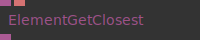

**Full Name:** `Ops.Html.ElementGetClosest`

get the closest parent element matching the query selector.

**`\inputsymbol`{=latex} Inputs**

- **HTML Element** (Object:Element)
- **Query** (String)

**`\outputsymbol`{=latex} Output**

- **Element** (Object)

**Example Patch:** [cables.gl/edit/ojHGjH](https://cables.gl/edit/ojHGjH)

**Doc:** [cables.gl/op/Ops.Html.ElementGetClosest](https://cables.gl/op/Ops.Html.ElementGetClosest)

### ElementGradientBg
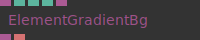

**Full Name:** `Ops.Html.ElementGradientBg`

Use a cables gradient as HTML element background.

**`\inputsymbol`{=latex} Inputs**

- **Element** (Object:Element)
- **Rect Color Space Index** (Number: Integer)
- **Angle** (Number)
- **Gradient Object** (Object:Gradient)

**`\outputsymbol`{=latex} Output**

- **HTML Element** (Object)
- **CSS String** (String)

**Example Patch:** [cables.gl/edit/QB7br5](https://cables.gl/edit/QB7br5)

**Doc:** [cables.gl/op/Ops.Html.ElementGradientBg](https://cables.gl/op/Ops.Html.ElementGradientBg)

### ElementHasClass
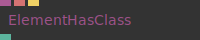

**Full Name:** `Ops.Html.ElementHasClass`

Does the element currenty have a specific class set.

**`\inputsymbol`{=latex} Inputs**

- **Element** (Object:Element)
- **Classname** (String)
- **Update** (Trigger)

**`\outputsymbol`{=latex} Output**

- **Has Class** (booleanNumber)

**Example Patch:** [cables.gl/op/Ops.Html.ElementHasClass#example](https://cables.gl/op/Ops.Html.ElementHasClass#example)

**Doc:** [cables.gl/op/Ops.Html.ElementHasClass](https://cables.gl/op/Ops.Html.ElementHasClass)

### ElementInfo
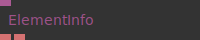

**Full Name:** `Ops.Html.ElementInfo`

Get information about an element.

**`\inputsymbol`{=latex} Inputs**

- **Element** (Object)

**`\outputsymbol`{=latex} Output**

- **Tagname** (String)
- **Id** (String)

**Example Patch:** [cables.gl/edit/0iRDu1](https://cables.gl/edit/0iRDu1)

**Doc:** [cables.gl/op/Ops.Html.ElementInfo](https://cables.gl/op/Ops.Html.ElementInfo)

### ElementIsFocused
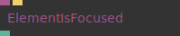

**Full Name:** `Ops.Html.ElementIsFocused`

Is the connected element currently focused.

**`\inputsymbol`{=latex} Inputs**

- **Element** (Object:Element)
- **Update** (Trigger)

**`\outputsymbol`{=latex} Output**

- **Has Focus** (booleanNumber)

**Example Patch:** [cables.gl/edit/9jTwz1](https://cables.gl/edit/9jTwz1)

**Doc:** [cables.gl/op/Ops.Html.ElementIsFocused](https://cables.gl/op/Ops.Html.ElementIsFocused)

### ElementsPositionsByClass
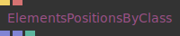

**Full Name:** `Ops.Html.ElementsPositionsByClass`

get html element absolute positions and sizes by classname.

**`\inputsymbol`{=latex} Inputs**

- **Update** (Trigger)
- **Classname** (String)

**`\outputsymbol`{=latex} Output**

- **Position** (Array)
- **Size** (Array)
- **Total Elements** (Number)

**Example Patch:** [cables.gl/op/Ops.Html.ElementsPositionsByClass#example](https://cables.gl/op/Ops.Html.ElementsPositionsByClass#example)

**Doc:** [cables.gl/op/Ops.Html.ElementsPositionsByClass](https://cables.gl/op/Ops.Html.ElementsPositionsByClass)

### FontFile_v2
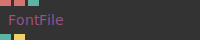

**Full Name:** `Ops.Html.FontFile_v2`

Load a font file like .otf, .ttf, .woff via css.

**`\inputsymbol`{=latex} Inputs**

- **File** (String)
- **Family** (String)
- **Active** (Number: Boolean)

**`\outputsymbol`{=latex} Output**

- **Loaded** (booleanNumber)
- **Loaded Trigger** (Trigger)

**Example Patch:** [cables.gl/edit/xR9zIR](https://cables.gl/edit/xR9zIR)

**Doc:** [cables.gl/op/Ops.Html.FontFile_v2](https://cables.gl/op/Ops.Html.FontFile_v2)

### FontsLoaded
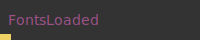

**Full Name:** `Ops.Html.FontsLoaded`

triggers when asynchronous requests finised loading.

**`\inputsymbol`{=latex} Inputs**

- *Visit [Ops.Html.FontsLoaded documentation](https://cables.gl/op/Ops.Html.FontsLoaded) for input port details*

**`\outputsymbol`{=latex} Output**

- **Font Loaded** (Trigger)

**Example Patch:** [cables.gl/edit/xP04r1](https://cables.gl/edit/xP04r1)

**Doc:** [cables.gl/op/Ops.Html.FontsLoaded](https://cables.gl/op/Ops.Html.FontsLoaded)

### FullscreenMode
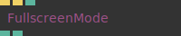

**Full Name:** `Ops.Html.FullscreenMode`

Switch webgl to fullscreen.

**`\inputsymbol`{=latex} Inputs**

- **Request Fullscreen** (Trigger)
- **Exit Fullscreen** (Trigger)

**`\outputsymbol`{=latex} Output**

- **Is Fullscreen** (booleanNumber)
- **Supported** (booleanNumber)

**Example Patch:** [cables.gl/edit/CCoJji](https://cables.gl/edit/CCoJji)

**Doc:** [cables.gl/op/Ops.Html.FullscreenMode](https://cables.gl/op/Ops.Html.FullscreenMode)

### GlCopyToCanvas
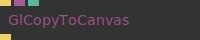

**Full Name:** `Ops.Html.GlCopyToCanvas`

Copy GL canvas content to another canvas.

**`\inputsymbol`{=latex} Inputs**

- **Render** (Trigger)
- **Canvas** (Object:Element)
- **Smooth** (Number: Boolean)

**`\outputsymbol`{=latex} Output**

- **Next** (Trigger)

**Example Patch:** [cables.gl/edit/u2vAu1](https://cables.gl/edit/u2vAu1)

**Doc:** [cables.gl/op/Ops.Html.GlCopyToCanvas](https://cables.gl/op/Ops.Html.GlCopyToCanvas)

### HyperLink_v3
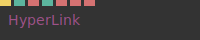

**Full Name:** `Ops.Html.HyperLink_v3`

Open another website.

**`\inputsymbol`{=latex} Inputs**

- **Open** (Trigger)
- **URL** (String)
- **Frame Name** (String)
- **Win Specs** (String)
- **Rel Attribute** (String)

**`\outputsymbol`{=latex} Output**

- *Visit [Ops.Html.HyperLink_v3 documentation](https://cables.gl/op/Ops.Html.HyperLink_v3) for output port details*

**Example Patch:** [cables.gl/edit/ilts7O](https://cables.gl/edit/ilts7O)

**Doc:** [cables.gl/op/Ops.Html.HyperLink_v3](https://cables.gl/op/Ops.Html.HyperLink_v3)

### InnerHTML
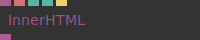

**Full Name:** `Ops.Html.InnerHTML`

Set innerHTML or innerTEXT of an HTML element.

**`\inputsymbol`{=latex} Inputs**

- **Element** (Object)
- **Value** (String)
- **Active** (Number: Boolean)
- **Clear** (Trigger)

**`\outputsymbol`{=latex} Output**

- **HTML Element** (Object)

**Example Patch:** [cables.gl/edit/jgArsw](https://cables.gl/edit/jgArsw)

**Doc:** [cables.gl/op/Ops.Html.InnerHTML](https://cables.gl/op/Ops.Html.InnerHTML)

### InnerHtmlAppend
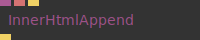

**Full Name:** `Ops.Html.InnerHtmlAppend`

Append string to the inner html or an element.

**`\inputsymbol`{=latex} Inputs**

- **Element** (Object:Element)
- **Html** (String)
- **Trigger** (Trigger)

**`\outputsymbol`{=latex} Output**

- **Next** (Trigger)

**Example Patch:** [cables.gl/edit/hmTiu1](https://cables.gl/edit/hmTiu1)

**Doc:** [cables.gl/op/Ops.Html.InnerHtmlAppend](https://cables.gl/op/Ops.Html.InnerHtmlAppend)

### MailtoLink
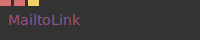

**Full Name:** `Ops.Html.MailtoLink`

creates a mailto: link to open the default email app.

**`\inputsymbol`{=latex} Inputs**

- **Email** (String)
- **Subject** (String)
- **Execute** (Trigger)

**`\outputsymbol`{=latex} Output**

- *Visit [Ops.Html.MailtoLink documentation](https://cables.gl/op/Ops.Html.MailtoLink) for output port details*

**Example Patch:** [cables.gl/edit/ilts7O](https://cables.gl/edit/ilts7O)

**Doc:** [cables.gl/op/Ops.Html.MailtoLink](https://cables.gl/op/Ops.Html.MailtoLink)

### MarkdownToHtml
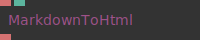

**Full Name:** `Ops.Html.MarkdownToHtml`

markdown markup language to html parser.

**`\inputsymbol`{=latex} Inputs**

- **Markdown** (String)
- **Active** (Number: Boolean)

**`\outputsymbol`{=latex} Output**

- **Html** (String)

**Example Patch:** [cables.gl/edit/52Zlij](https://cables.gl/edit/52Zlij)

**Doc:** [cables.gl/op/Ops.Html.MarkdownToHtml](https://cables.gl/op/Ops.Html.MarkdownToHtml)

### ModalOverlay
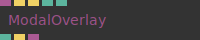

**Full Name:** `Ops.Html.ModalOverlay`

create a modal HTML overlay with a darkened background.

**`\inputsymbol`{=latex} Inputs**

- **Content Element** (Object)
- **Show** (Trigger)
- **Close** (Trigger)
- **Show Closebutton** (Number: Boolean)
- **Opacity** (Number)

**`\outputsymbol`{=latex} Output**

- **Visible** (booleanNumber)
- **Closed** (Trigger)
- **Element** (Object)

**Example Patch:** [cables.gl/edit/RXU-K2](https://cables.gl/edit/RXU-K2)

**Doc:** [cables.gl/op/Ops.Html.ModalOverlay](https://cables.gl/op/Ops.Html.ModalOverlay)

### QuerySelector_v3
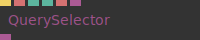

**Full Name:** `Ops.Html.QuerySelector_v3`

Selects an element in the DOM.

**`\inputsymbol`{=latex} Inputs**

- **Update** (Trigger)
- **Query** (String)
- **Type Index** (Number: Integer)
- **Document** (String)
- **Input Element** (Object:Element)

**`\outputsymbol`{=latex} Output**

- **Element** (Object)

**Example Patch:** [cables.gl/edit/C6z3GH](https://cables.gl/edit/C6z3GH)

**Doc:** [cables.gl/op/Ops.Html.QuerySelector_v3](https://cables.gl/op/Ops.Html.QuerySelector_v3)

### QuerySelectorAll_v2
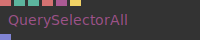

**Full Name:** `Ops.Html.QuerySelectorAll_v2`

Selects all matching elements in the DOM.

**`\inputsymbol`{=latex} Inputs**

- **Query** (String)
- **Mode Index** (Number: Integer)
- **Type Index** (Number: Integer)
- **Document** (String)
- **Element** (Object:Element)
- **Update** (Trigger)

**`\outputsymbol`{=latex} Output**

- **Elements** (Array)

**Example Patch:** [cables.gl/edit/QTs5GH](https://cables.gl/edit/QTs5GH)

**Doc:** [cables.gl/op/Ops.Html.QuerySelectorAll_v2](https://cables.gl/op/Ops.Html.QuerySelectorAll_v2)

### ReloadPage
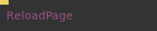

**Full Name:** `Ops.Html.ReloadPage`

reload the website.

**`\inputsymbol`{=latex} Inputs**

- **Exec** (Trigger)

**`\outputsymbol`{=latex} Output**

- *Visit [Ops.Html.ReloadPage documentation](https://cables.gl/op/Ops.Html.ReloadPage) for output port details*

**Example Patch:** [cables.gl/edit/BPeCci](https://cables.gl/edit/BPeCci)

**Doc:** [cables.gl/op/Ops.Html.ReloadPage](https://cables.gl/op/Ops.Html.ReloadPage)

### ScrollIntoView
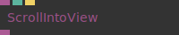

**Full Name:** `Ops.Html.ScrollIntoView`

Scroll an area, so the html element is visible/in view.

**`\inputsymbol`{=latex} Inputs**

- **Element** (Object:Element)
- **Scroll Into View** (Trigger)

**`\outputsymbol`{=latex} Output**

- **HTML Element** (Object)

**Example Patch:** [cables.gl/edit/KmnVEm](https://cables.gl/edit/KmnVEm)

**Doc:** [cables.gl/op/Ops.Html.ScrollIntoView](https://cables.gl/op/Ops.Html.ScrollIntoView)

### ScrollPosition_v2
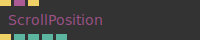

**Full Name:** `Ops.Html.ScrollPosition_v2`

the current x y top left scrolling position of html page or element.

**`\inputsymbol`{=latex} Inputs**

- **Update** (Trigger)
- **Element** (Object:Element)
- **Scroll To Top** (Trigger)

**`\outputsymbol`{=latex} Output**

- **Next** (Trigger)
- **Left** (Number)
- **Top** (Number)
- **Percentage X** (Number)
- **Percentage Y** (Number)

**Example Patch:** [cables.gl/op/Ops.Html.ScrollPosition_v2#example](https://cables.gl/op/Ops.Html.ScrollPosition_v2#example)

**Doc:** [cables.gl/op/Ops.Html.ScrollPosition_v2](https://cables.gl/op/Ops.Html.ScrollPosition_v2)

### ScrollTo
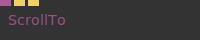

**Full Name:** `Ops.Html.ScrollTo`

Trigger the browser to scroll to top or bottom of an element.

**`\inputsymbol`{=latex} Inputs**

- **Element** (Object:Element)
- **Scroll To Top** (Trigger)
- **Scroll To Bottom** (Trigger)

**`\outputsymbol`{=latex} Output**

- *Visit [Ops.Html.ScrollTo documentation](https://cables.gl/op/Ops.Html.ScrollTo) for output port details*

**Example Patch:** [cables.gl/edit/JEThu1](https://cables.gl/edit/JEThu1)

**Doc:** [cables.gl/op/Ops.Html.ScrollTo](https://cables.gl/op/Ops.Html.ScrollTo)

### WindowClose
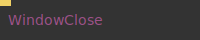

**Full Name:** `Ops.Html.WindowClose`

close current window.

**`\inputsymbol`{=latex} Inputs**

- **Close** (Trigger)

**`\outputsymbol`{=latex} Output**

- *Visit [Ops.Html.WindowClose documentation](https://cables.gl/op/Ops.Html.WindowClose) for output port details*

**Example Patch:** [cables.gl/edit/WGBCci](https://cables.gl/edit/WGBCci)

**Doc:** [cables.gl/op/Ops.Html.WindowClose](https://cables.gl/op/Ops.Html.WindowClose)

### WindowHasFocus
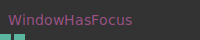

**Full Name:** `Ops.Html.WindowHasFocus`

detect if the browser window/tab has focus.

**`\inputsymbol`{=latex} Inputs**

- *Visit [Ops.Html.WindowHasFocus documentation](https://cables.gl/op/Ops.Html.WindowHasFocus) for input port details*

**`\outputsymbol`{=latex} Output**

- **Has Focus** (booleanNumber)
- **Tab Visible** (booleanNumber)

**Example Patch:** [cables.gl/edit/uI9yOg](https://cables.gl/edit/uI9yOg)

**Doc:** [cables.gl/op/Ops.Html.WindowHasFocus](https://cables.gl/op/Ops.Html.WindowHasFocus)

### WindowInfo
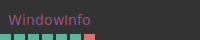

**Full Name:** `Ops.Html.WindowInfo`

size of browser window in pixels.

**`\inputsymbol`{=latex} Inputs**

- *Visit [Ops.Html.WindowInfo documentation](https://cables.gl/op/Ops.Html.WindowInfo) for input port details*

**`\outputsymbol`{=latex} Output**

- **ClientWidth** (Number)
- **ClientHeight** (Number)
- **Body Scroll Height** (Number)
- **Device Pixel Ratio** (Number)
- **Iframe Parent** (booleanNumber)
- **Orientation Angle** (Number)
- **Orientation Type** (String)

**Example Patch:** [cables.gl/edit/DyHxSP](https://cables.gl/edit/DyHxSP)

**Doc:** [cables.gl/op/Ops.Html.WindowInfo](https://cables.gl/op/Ops.Html.WindowInfo)

### WindowScroll
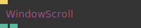

**Full Name:** `Ops.Html.WindowScroll`

Get the current scroll position of the window.

**`\inputsymbol`{=latex} Inputs**

- **Update** (Trigger)

**`\outputsymbol`{=latex} Output**

- **Scoll X** (Number)
- **Scoll Y** (Number)

**Example Patch:** [cables.gl/op/Ops.Html.WindowScroll#example](https://cables.gl/op/Ops.Html.WindowScroll#example)

**Doc:** [cables.gl/op/Ops.Html.WindowScroll](https://cables.gl/op/Ops.Html.WindowScroll)


