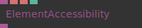
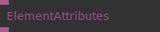
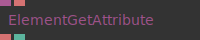
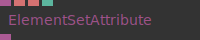

# Ops.Html.Attributes


```{=latex}
\OpsSubsubNoSubsectionNumbering\setcounter{subsubsection}{0}
```
### ElementAccessibility


**Full Name:** `Ops.Html.Attributes.ElementAccessibility`

Element Accessibility properties for screen reader.

**`\inputsymbol`{=latex} Inputs**

- **Element** (Object)
- **Aria Label** (String)
- **Aria Labeled By** (String)
- **Aria Hidden** (Number: Boolean)

**`\outputsymbol`{=latex} Output**

- **HTML Element** (Object)

**Example:** [cables.gl/edit/R5XS8x](https://cables.gl/edit/R5XS8x)

**Doc:** [cables.gl/op/Ops.Html.Attributes.ElementAccessibility](https://cables.gl/op/Ops.Html.Attributes.ElementAccessibility)

### ElementAttributes


**Full Name:** `Ops.Html.Attributes.ElementAttributes`

Get all attributes from an element an object.

**`\inputsymbol`{=latex} Inputs**

- **Element** (Object)

**`\outputsymbol`{=latex} Output**

- **Attribs** (Object)

**Example:** [cables.gl/edit/Gflosw](https://cables.gl/edit/Gflosw)

**Doc:** [cables.gl/op/Ops.Html.Attributes.ElementAttributes](https://cables.gl/op/Ops.Html.Attributes.ElementAttributes)

### ElementGetAttribute


**Full Name:** `Ops.Html.Attributes.ElementGetAttribute`

Read or Get the value of an HTML element Attribute.

**`\inputsymbol`{=latex} Inputs**

- **Element** (Object)
- **Attribute Name** (String)

**`\outputsymbol`{=latex} Output**

- **Value** (String)
- **Has Attribute** (booleanNumber)

**Example:** [cables.gl/edit/lfiS8x](https://cables.gl/edit/lfiS8x)

**Doc:** [cables.gl/op/Ops.Html.Attributes.ElementGetAttribute](https://cables.gl/op/Ops.Html.Attributes.ElementGetAttribute)

### ElementSetAttribute


**Full Name:** `Ops.Html.Attributes.ElementSetAttribute`

Write or Set the value of an HTML element Attribute.

**`\inputsymbol`{=latex} Inputs**

- **Element** (Object)
- **Attribute** (String)
- **Value** (String)
- **Active** (Number: Boolean)

**`\outputsymbol`{=latex} Output**

- **HTML Element** (Object)

**Example:** [cables.gl/edit/lfiS8x](https://cables.gl/edit/lfiS8x)

**Doc:** [cables.gl/op/Ops.Html.Attributes.ElementSetAttribute](https://cables.gl/op/Ops.Html.Attributes.ElementSetAttribute)


