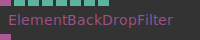
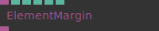

# Ops.Html.Css

---

## Ops.Html.Css

### ElementBackDropFilter

**Full Name:** `Ops.Html.Css.ElementBackDropFilter`

**Description:** Set CSS backdrop filter like blur, contrast, brightness, saturation

**`\inputsymbol`{=latex} Inputs**

- **Element** (Object)
- **Blur** (Number)
- **Contrast** (Number)
- **Brightness** (Number)
- **Hue** (Number)
- **Invert** (Number)
- **Saturate** (Number)
- **Sepia** (Number)

**`\outputsymbol`{=latex} Output**

- **HTML Element** (Object)

**Example Patch:** [Open in Editor](https://cables.gl/edit/Tem67C)

**Docs:** [https://cables.gl/op/Ops.Html.Css.ElementBackDropFilter](https://cables.gl/op/Ops.Html.Css.ElementBackDropFilter)

### ElementMargin

**Full Name:** `Ops.Html.Css.ElementMargin`

**Description:** Set CSS margins of a html element

**`\inputsymbol`{=latex} Inputs**

- **Element** (Object:Element)
- **Margin** (Number)
- **Margin Top** (Number)
- **Margin Bottom** (Number)
- **Margin Left** (Number)
- **Margin Right** (Number)

**`\outputsymbol`{=latex} Output**

- **HTML Element** (Object)

**Example Patch:** [Open in Editor](https://cables.gl/op/Ops.Html.Css.ElementMargin#example)

**Docs:** [https://cables.gl/op/Ops.Html.Css.ElementMargin](https://cables.gl/op/Ops.Html.Css.ElementMargin)

