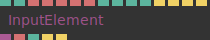

# Ops.Html.Elements

*Part of the [All Operators Reference](13-_AllOps.md)*

---

## Ops.Html.Elements

### AudioMediaElement

**Full Name:** `Ops.Html.Elements.AudioMediaElement`
**Description:** *Visit [documentation](https://cables.gl/op/Ops.Html.Elements.AudioMediaElement) for details*

**> Input Ports:**
- **File** (String)
- **Play** (Number: Boolean)
- **Volume** (Number)
- **Loop** (Number: Boolean)

**< Output Ports:**
- **Playing** (Number)
- **Element** (Object)
- **Has Ended** (Trigger)

**Example Patch:** [Open in Editor](https://cables.gl/op/Ops.Html.Elements.AudioMediaElement#example)
**Patches Using This Op:** *Search [cables.gl patches](https://cables.gl/patches) for "AudioMediaElement"*
**Docs:** [https://cables.gl/op/Ops.Html.Elements.AudioMediaElement](https://cables.gl/op/Ops.Html.Elements.AudioMediaElement)

---

### Element_v2

**Full Name:** `Ops.Html.Elements.Element_v2`
**Description:** *Visit [documentation](https://cables.gl/op/Ops.Html.Elements.Element_v2) for details*

**> Input Ports:**
- **Text** (String)
- **Set Size** (Number: Boolean)
- **Width** (Number)
- **Height** (Number)
- **Inline Style** (String)
- **CSS Class** (String)
- **Disable CSS Props** (String)
- **Display Index** (Number: Integer)
- **Tag Name** (String)
- **Opacity** (Number)
- **Propagate Click-Events** (Number: Boolean)
- **Add To DOM** (Number: Boolean)

**< Output Ports:**
- **DOM Element** (Object)
- **Hovering** (booleanNumber)
- **Clicked** (Trigger)

**Example Patch:** [Open in Editor](https://cables.gl/op/Ops.Html.Elements.Element_v2#example)
**Patches Using This Op:** *Search [cables.gl patches](https://cables.gl/patches) for "Element_v2"*
**Docs:** [https://cables.gl/op/Ops.Html.Elements.Element_v2](https://cables.gl/op/Ops.Html.Elements.Element_v2)

---

### IFrame_v3

**Full Name:** `Ops.Html.Elements.IFrame_v3`
**Description:** *Visit [documentation](https://cables.gl/op/Ops.Html.Elements.IFrame_v3) for details*

**> Input Ports:**
- **URL** (String)
- **ID** (String)
- **Active** (Number: Boolean)
- **Style** (String)

**< Output Ports:**
- **Element** (Object)

**Example Patch:** [Open in Editor](https://cables.gl/op/Ops.Html.Elements.IFrame_v3#example)
**Patches Using This Op:** *Search [cables.gl patches](https://cables.gl/patches) for "IFrame_v3"*
**Docs:** [https://cables.gl/op/Ops.Html.Elements.IFrame_v3](https://cables.gl/op/Ops.Html.Elements.IFrame_v3)

---

### ImageElement_v3

**Full Name:** `Ops.Html.Elements.ImageElement_v3`
**Description:** *Visit [documentation](https://cables.gl/op/Ops.Html.Elements.ImageElement_v3) for details*

**> Input Ports:**
- **File** (String)
- **Class** (String)
- **Style** (String)
- **Alt Text** (String)

**< Output Ports:**
- **Image Element** (Object)
- **Width** (Number)
- **Height** (Number)
- **Loading** (booleanNumber)
- **Error** (booleanNumber)
- **Loaded** (Trigger)

**Example Patch:** [Open in Editor](https://cables.gl/op/Ops.Html.Elements.ImageElement_v3#example)
**Patches Using This Op:** *Search [cables.gl patches](https://cables.gl/patches) for "ImageElement_v3"*
**Docs:** [https://cables.gl/op/Ops.Html.Elements.ImageElement_v3](https://cables.gl/op/Ops.Html.Elements.ImageElement_v3)

---

### InputElement

**Full Name:** `Ops.Html.Elements.InputElement`
**Description:** *Visit [documentation](https://cables.gl/op/Ops.Html.Elements.InputElement) for details*

**> Input Ports:**
- **Default Value** (String)
- **Placeholder** (String)
- **Id** (String)
- **Class** (String)
- **Style** (String)
- **Autocomplete** (Number: Boolean)
- **Max Length** (Number: Integer)
- **Enter Key Prevent Default** (Number: Boolean)
- **Visible** (Number: Boolean)
- **Focus** (Trigger)
- **Blur** (Trigger)
- **Clear** (Trigger)
- **Select** (Trigger)

**< Output Ports:**
- **DOM Element** (Object)
- **Value** (String)
- **Hover** (booleanNumber)
- **Enter Pressed** (Trigger)
- **Escape Pressed** (Trigger)

**Example Patch:** [Open in Editor](https://cables.gl/op/Ops.Html.Elements.InputElement#example)
**Patches Using This Op:** *Search [cables.gl patches](https://cables.gl/patches) for "InputElement"*
**Docs:** [https://cables.gl/op/Ops.Html.Elements.InputElement](https://cables.gl/op/Ops.Html.Elements.InputElement)

---

### VideoElement

**Full Name:** `Ops.Html.Elements.VideoElement`
**Description:** *Visit [documentation](https://cables.gl/op/Ops.Html.Elements.VideoElement) for details*

**> Input Ports:**
- **File** (String)
- **ID** (String)
- **Play** (Number: Boolean)
- **Autoplay** (Number: Boolean)
- **Controls** (Number: Boolean)
- **Active** (Number: Boolean)
- **Loop** (Number: Boolean)
- **Muted** (Number: Boolean)
- **Style** (String)
- **Rewind** (Trigger)

**< Output Ports:**
- **Element** (Object)
- **Playing** (booleanNumber)
- **Can Play Through** (booleanNumber)
- **Time** (Number)
- **Ended** (Trigger)
- **Has Error** (booleanNumber)
- **Error Message** (String)
- **Video Width** (Number)
- **Video Height** (Number)

**Example Patch:** [Open in Editor](https://cables.gl/op/Ops.Html.Elements.VideoElement#example)
**Patches Using This Op:** *Search [cables.gl patches](https://cables.gl/patches) for "VideoElement"*
**Docs:** [https://cables.gl/op/Ops.Html.Elements.VideoElement](https://cables.gl/op/Ops.Html.Elements.VideoElement)

---

