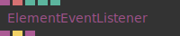
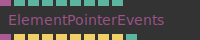
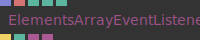
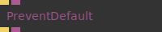
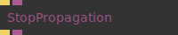

# Ops.Html.Event


```{=latex}
\OpsSubsubNoSubsectionNumbering\setcounter{subsubsection}{0}
```
### ElementEventListener_v2


**Full Name:** `Ops.Html.Event.ElementEventListener_v2`

Add a custom event listener.

**`\inputsymbol`{=latex} Inputs**

- **Element** (Object)
- **Event Name** (String)
- **Use Capture** (Number: Boolean)
- **Prevent Default** (Number: Boolean)
- **Stop Propagation** (Number: Boolean)

**`\outputsymbol`{=latex} Output**

- **Element Passthrough** (Object)
- **Event Trigger** (Trigger)
- **Event Object** (Object)

**Example Patch:** [cables.gl/edit/9ixt13](https://cables.gl/edit/9ixt13)

**Doc:** [cables.gl/op/Ops.Html.Event.ElementEventListener_v2](https://cables.gl/op/Ops.Html.Event.ElementEventListener_v2)

### ElementPointerEvents


**Full Name:** `Ops.Html.Event.ElementPointerEvents`

Listen to events of an element.

**`\inputsymbol`{=latex} Inputs**

- **Dom Element** (Object)
- **Mouse Down Active** (Number: Boolean)
- **Mouse Up Active** (Number: Boolean)
- **Click Active** (Number: Boolean)
- **Mouse Move Active** (Number: Boolean)
- **Touch Start Active** (Number: Boolean)
- **Touch Move Active** (Number: Boolean)
- **Touch End Active** (Number: Boolean)
- **Touch Cancel Active** (Number: Boolean)

**`\outputsymbol`{=latex} Output**

- **Event Object** (Object)
- **Mouse Down** (Trigger)
- **Mouse Up** (Trigger)
- **Click** (Trigger)
- **Mouse Move** (Trigger)
- **Touch Start** (Trigger)
- **Touch Move** (Trigger)
- **Touch End** (Trigger)
- **Touch Cancel** (Trigger)
- **Event Name** (Number)

**Example Patch:** [cables.gl/op/Ops.Html.Event.ElementPointerEvents#example](https://cables.gl/op/Ops.Html.Event.ElementPointerEvents#example)

**Doc:** [cables.gl/op/Ops.Html.Event.ElementPointerEvents](https://cables.gl/op/Ops.Html.Event.ElementPointerEvents)

### ElementsArrayEventListener


**Full Name:** `Ops.Html.Event.ElementsArrayEventListener`

listen to events on multiple html elements.

**`\inputsymbol`{=latex} Inputs**

- **Elements** (Array)
- **Event Name** (String)
- **Use Capture** (Number: Boolean)
- **Prevent Default** (Number: Boolean)
- **Stop Propagation** (Number: Boolean)

**`\outputsymbol`{=latex} Output**

- **Event Trigger** (Trigger)
- **Index** (Number)
- **Event Object** (Object)
- **Event Element** (Object)

**Example Patch:** [cables.gl/edit/4rKHP0](https://cables.gl/edit/4rKHP0)

**Doc:** [cables.gl/op/Ops.Html.Event.ElementsArrayEventListener](https://cables.gl/op/Ops.Html.Event.ElementsArrayEventListener)

### PreventDefault


**Full Name:** `Ops.Html.Event.PreventDefault`

Prevents the default on a JavaScript event.

**`\inputsymbol`{=latex} Inputs**

- **Execute** (Trigger)
- **Event In** (Object)

**`\outputsymbol`{=latex} Output**

- **Next** (Trigger)
- **Event Out** (Object)

**Example Patch:** [cables.gl/op/Ops.Html.Event.PreventDefault#example](https://cables.gl/op/Ops.Html.Event.PreventDefault#example)

**Doc:** [cables.gl/op/Ops.Html.Event.PreventDefault](https://cables.gl/op/Ops.Html.Event.PreventDefault)

### StopPropagation


**Full Name:** `Ops.Html.Event.StopPropagation`

Stop a JavaScript event (bubbling / capturing).

**`\inputsymbol`{=latex} Inputs**

- **Execute** (Trigger)
- **Event In** (Object)

**`\outputsymbol`{=latex} Output**

- **Next** (Trigger)
- **Event Out** (Object)

**Example Patch:** [cables.gl/op/Ops.Html.Event.StopPropagation#example](https://cables.gl/op/Ops.Html.Event.StopPropagation#example)

**Doc:** [cables.gl/op/Ops.Html.Event.StopPropagation](https://cables.gl/op/Ops.Html.Event.StopPropagation)


