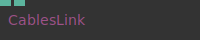
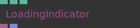
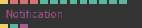
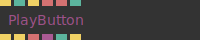
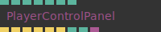
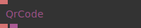

# Ops.Html.Utils

*Part of the [All Operators Reference](13-_AllOps.md)*

---

## Ops.Html.Utils

### CablesLink

**Full Name:** `Ops.Html.Utils.CablesLink`
**Description:** create a cables logo which links to cables gl

**> Input Ports:**

- **Size** (Number)
- **Opacity** (Number)

**< Output Ports:**

- *Visit [Ops.Html.Utils.CablesLink documentation](https://cables.gl/op/Ops.Html.Utils.CablesLink) for output port details*

**Example Patch:** [Open in Editor](https://cables.gl/edit/ilts7O)
**Patches Using This Op:** *Search [cables.gl patches](https://cables.gl/patches) for "CablesLink"*
**Docs:** [https://cables.gl/op/Ops.Html.Utils.CablesLink](https://cables.gl/op/Ops.Html.Utils.CablesLink)

---

### LoadingIndicator_v2

**Full Name:** `Ops.Html.Utils.LoadingIndicator_v2`
**Description:** show a typical web loading/progress indicator animation

**> Input Ports:**

- **Center Position** (Number: Boolean)

**< Output Ports:**

- **Elment** (Object)
- **Requests** (Array)

**Example Patch:** [Open in Editor](https://cables.gl/edit/EsV74q)
**Patches Using This Op:** *Search [cables.gl patches](https://cables.gl/patches) for "LoadingIndicator_v2"*
**Docs:** [https://cables.gl/op/Ops.Html.Utils.LoadingIndicator_v2](https://cables.gl/op/Ops.Html.Utils.LoadingIndicator_v2)

---

### Notification

**Full Name:** `Ops.Html.Utils.Notification`
**Description:** Trigger a simple pop up notification on the screen

**> Input Ports:**

- **Trigger Animation** (Trigger)
- **Text** (String)
- **Class** (String)
- **Style** (String)
- **Active** (Number: Boolean)
- **Convert Line Breaks** (Number: Boolean)
- **Fade In** (Number)
- **Hold** (Number)
- **Fade Out** (Number)
- **Mode Index** (Number: Integer)
- **Side Index** (Number: Integer)
- **Starting Position** (Number)
- **Ending Position** (Number)

**< Output Ports:**

- **Finished Trigger** (Trigger)
- **Finished** (booleanNumber)
- **DOM Element** (Object)

**Example Patch:** [Open in Editor](https://cables.gl/edit/2Rue0j)
**Patches Using This Op:** *Search [cables.gl patches](https://cables.gl/patches) for "Notification"*
**Docs:** [https://cables.gl/op/Ops.Html.Utils.Notification](https://cables.gl/op/Ops.Html.Utils.Notification)

---

### PlayButton

**Full Name:** `Ops.Html.Utils.PlayButton`
**Description:** shows a playbutton for forcing a simple user interaction

**> Input Ports:**

- **Trigger** (Trigger)
- **Only If Audio Suspended** (Number: Boolean)
- **Reset** (Trigger)
- **Style Outer** (String)
- **Style Inner** (String)
- **Active** (Number: Boolean)

**< Output Ports:**

- **Next** (Trigger)
- **Not Clicked** (Trigger)
- **Audiocontext State** (String)
- **Element** (Object)
- **Clicked** (booleanNumber)
- **Clicked Trigger** (Trigger)

**Example Patch:** [Open in Editor](https://cables.gl/edit/WoGy8s)
**Patches Using This Op:** *Search [cables.gl patches](https://cables.gl/patches) for "PlayButton"*
**Docs:** [https://cables.gl/op/Ops.Html.Utils.PlayButton](https://cables.gl/op/Ops.Html.Utils.PlayButton)

---

### PlayerControlPanel_v2

**Full Name:** `Ops.Html.Utils.PlayerControlPanel_v2`
**Description:** simple html ui for timeline/mediaplayers (was: TimeLineUI)

**> Input Ports:**

- **Length** (Number)
- **Current** (Number)
- **Clamp** (Number: Boolean)
- **Is Playing** (Number: Boolean)
- **Visible** (Number: Boolean)
- **Show Time** (Number: Boolean)
- **Show Skip Buttons** (Number: Boolean)

**< Output Ports:**

- **Play Clicked** (Trigger)
- **Pause Clicked** (Trigger)
- **Rewind Clicked** (Trigger)
- **Skip Back Clicked** (Trigger)
- **Skip Forward Clicked** (Trigger)
- **Dragged** (Trigger)
- **Current Value** (Number)
- **Dragging** (booleanNumber)
- **DOM Element** (Object)

**Example Patch:** [Open in Editor](https://cables.gl/edit/3F6DOe)
**Patches Using This Op:** *Search [cables.gl patches](https://cables.gl/patches) for "PlayerControlPanel_v2"*
**Docs:** [https://cables.gl/op/Ops.Html.Utils.PlayerControlPanel_v2](https://cables.gl/op/Ops.Html.Utils.PlayerControlPanel_v2)

---

### QrCode

**Full Name:** `Ops.Html.Utils.QrCode`
**Description:** Generate a qr code as a texture

**> Input Ports:**

- **Text** (String)

**< Output Ports:**

- **Image DataUrl** (String)
- **Element** (Object)

**Example Patch:** [Open in Editor](https://cables.gl/edit/QjlEo-)
**Patches Using This Op:** *Search [cables.gl patches](https://cables.gl/patches) for "QrCode"*
**Docs:** [https://cables.gl/op/Ops.Html.Utils.QrCode](https://cables.gl/op/Ops.Html.Utils.QrCode)

---

### YoutubePlayer

**Full Name:** `Ops.Html.Utils.YoutubePlayer`
**Description:** play a youtube video in a HTML element

**> Input Ports:**

- **Video Id** (String)
- **Active** (Number: Boolean)
- **Style** (String)
- **ElementID** (String)
- **Autoplay** (Number: Boolean)
- **Display Captions** (Number: Boolean)
- **Loop** (Number: Boolean)
- **Allow Fullscreen** (Number: Boolean)
- **Hide Controls** (Number: Boolean)
- **Start At Second** (Number: Integer)

**< Output Ports:**

- **Element** (Object)
- **Direct Link** (String)

**Example Patch:** [Open in Editor](https://cables.gl/edit/aMkD16)
**Patches Using This Op:** *Search [cables.gl patches](https://cables.gl/patches) for "YoutubePlayer"*
**Docs:** [https://cables.gl/op/Ops.Html.Utils.YoutubePlayer](https://cables.gl/op/Ops.Html.Utils.YoutubePlayer)

---

