# Ops.Json

---

## Ops.Json

### ArrayOfObjectsMultiPort_v2
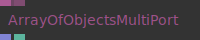

**Full Name:** `Ops.Json.ArrayOfObjectsMultiPort_v2`

**Description:** create an array with multiple objects

**`\inputsymbol`{=latex} Inputs**

- **Objects_0** (Object)
- **Add Port** (Object)

**`\outputsymbol`{=latex} Output**

- **Array** (Array)
- **Num Values** (Number)

**Example Patch:** [Open in Editor](https://cables.gl/op/Ops.Json.ArrayOfObjectsMultiPort_v2#example)

**Docs:** [https://cables.gl/op/Ops.Json.ArrayOfObjectsMultiPort_v2](https://cables.gl/op/Ops.Json.ArrayOfObjectsMultiPort_v2)

### CopyObject

**Full Name:** `Ops.Json.CopyObject`

**Description:** Creates a copy of a JSON object

**`\inputsymbol`{=latex} Inputs**

- *Visit [Ops.Json.CopyObject documentation](https://cables.gl/op/Ops.Json.CopyObject) for input port details*

**`\outputsymbol`{=latex} Output**

- **Valid** (booleanNumber)

**Example Patch:** [Open in Editor](https://cables.gl/edit/xJCXJK)

**Docs:** [https://cables.gl/op/Ops.Json.CopyObject](https://cables.gl/op/Ops.Json.CopyObject)

### CsvArray

**Full Name:** `Ops.Json.CsvArray`

**Description:** parse CSV files as array

**`\inputsymbol`{=latex} Inputs**

- **File** (String)

**`\outputsymbol`{=latex} Output**

- **Result** (Array)
- **Num Items** (Number)

**Example Patch:** [Open in Editor](https://cables.gl/edit/UlL2G1)

**Docs:** [https://cables.gl/op/Ops.Json.CsvArray](https://cables.gl/op/Ops.Json.CsvArray)

### CsvColumnArray_v2
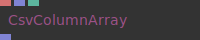

**Full Name:** `Ops.Json.CsvColumnArray_v2`

**Description:** get all values of a CSV column as array of strings

**`\inputsymbol`{=latex} Inputs**

- **Column Name** (String)
- **CSV Array** (Array)
- **Numbers** (Number: Boolean)

**`\outputsymbol`{=latex} Output**

- **Result** (Array)

**Example Patch:** [Open in Editor](https://cables.gl/op/Ops.Json.CsvColumnArray_v2#example)

**Docs:** [https://cables.gl/op/Ops.Json.CsvColumnArray_v2](https://cables.gl/op/Ops.Json.CsvColumnArray_v2)

### EmptyObject

**Full Name:** `Ops.Json.EmptyObject`

**Description:** *Visit [documentation](https://cables.gl/op/Ops.Json.EmptyObject) for details*

**`\inputsymbol`{=latex} Inputs**

- *Visit [Ops.Json.EmptyObject documentation](https://cables.gl/op/Ops.Json.EmptyObject) for input port details*

**`\outputsymbol`{=latex} Output**

- **Result** (Object)

**Example Patch:** [Open in Editor](https://cables.gl/edit/piMxeG)

**Docs:** [https://cables.gl/op/Ops.Json.EmptyObject](https://cables.gl/op/Ops.Json.EmptyObject)

### FilterValidObject
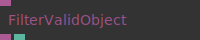

**Full Name:** `Ops.Json.FilterValidObject`

**Description:** Filter valid objects

**`\inputsymbol`{=latex} Inputs**

- **Object** (Object)

**`\outputsymbol`{=latex} Output**

- **Last Valid Object** (Object)
- **Is Valid** (booleanNumber)

**Example Patch:** [Open in Editor](https://cables.gl/op/Ops.Json.FilterValidObject#example)

**Docs:** [https://cables.gl/op/Ops.Json.FilterValidObject](https://cables.gl/op/Ops.Json.FilterValidObject)

### GateObject

**Full Name:** `Ops.Json.GateObject`

**Description:** Will only allow an Object to to be output if the the pass through parameter evaluates to true

**`\inputsymbol`{=latex} Inputs**

- **Object In** (Object)
- **Pass Through** (Number: Boolean)
- **Only Valid Objects** (Number: Boolean)

**`\outputsymbol`{=latex} Output**

- **Object Out** (Object)

**Example Patch:** [Open in Editor](https://cables.gl/op/Ops.Json.GateObject#example)

**Docs:** [https://cables.gl/op/Ops.Json.GateObject](https://cables.gl/op/Ops.Json.GateObject)

### HttpFetchStream

**Full Name:** `Ops.Json.HttpFetchStream`

**Description:** HttpRequest/Fetch Streaming

**`\inputsymbol`{=latex} Inputs**

- **Fetch Response** (Object)

**`\outputsymbol`{=latex} Output**

- **Result** (Object)
- **Received Result** (Trigger)
- **Started** (Trigger)

**Example Patch:** [Open in Editor](https://cables.gl/op/Ops.Json.HttpFetchStream#example)

**Docs:** [https://cables.gl/op/Ops.Json.HttpFetchStream](https://cables.gl/op/Ops.Json.HttpFetchStream)

### HttpRequest_v4

**Full Name:** `Ops.Json.HttpRequest_v4`

**Description:** Request a json file and output an object (ajax, url, json,fetch)

**`\inputsymbol`{=latex} Inputs**

- **URL** (String)
- **HTTP Method Index** (Number: Integer)
- **Request Body** (String)
- **Content-Type** (String)
- **the content type of the body sent** (if any)
- **Send Credentials** (Number: Boolean)
- **Headers** (Object)
- **Auto Request** (Number: Boolean)
- **trigger the request on any value change** (or on pagereload)
- **Empty Output On Change** (Number: Boolean)
- **Retry On Error** (Number: Boolean)
- **Reload** (Trigger)

**`\outputsymbol`{=latex} Output**

- **Response Json Object** (Object)
- **Response String** (String)
- **Response Data Url** (String)
- **Status Code** (Number)
- **Is Loading** (booleanNumber)
- **Has Error** (booleanNumber)
- **Error** (String)
- **Duration MS** (Number)
- **Fetch Response** (Object)
- **Loaded** (Trigger)

**Example Patch:** [Open in Editor](https://dev.cables.gl/edit/gSRYVQ)

**Docs:** [https://cables.gl/op/Ops.Json.HttpRequest_v4](https://cables.gl/op/Ops.Json.HttpRequest_v4)

### Object

**Full Name:** `Ops.Json.Object`

**Description:** *Visit [documentation](https://cables.gl/op/Ops.Json.Object) for details*

**`\inputsymbol`{=latex} Inputs**

- **Object** (Object)

**`\outputsymbol`{=latex} Output**

- **Result** (Object)

**Example Patch:** [Open in Editor](https://cables.gl/op/Ops.Json.Object#example)

**Docs:** [https://cables.gl/op/Ops.Json.Object](https://cables.gl/op/Ops.Json.Object)

### ObjectDeleteKey

**Full Name:** `Ops.Json.ObjectDeleteKey`

**Description:** Remove a Property from an Object by Key

**`\inputsymbol`{=latex} Inputs**

- **Object** (Object)
- **Key** (String)

**`\outputsymbol`{=latex} Output**

- **Object Result** (Object)

**Example Patch:** [Open in Editor](https://cables.gl/edit/piMxeG)

**Docs:** [https://cables.gl/op/Ops.Json.ObjectDeleteKey](https://cables.gl/op/Ops.Json.ObjectDeleteKey)

### ObjectFilterContentByKey
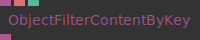

**Full Name:** `Ops.Json.ObjectFilterContentByKey`

**Description:** filter values from an object if key starts with input string

**`\inputsymbol`{=latex} Inputs**

- **Object** (Object)
- **Name** (String)
- **Remove Null** (Number: Boolean)

**`\outputsymbol`{=latex} Output**

- **Result** (Object)

**Example Patch:** [Open in Editor](https://cables.gl/edit/KEDALu)

**Docs:** [https://cables.gl/op/Ops.Json.ObjectFilterContentByKey](https://cables.gl/op/Ops.Json.ObjectFilterContentByKey)

### ObjectFunnel

**Full Name:** `Ops.Json.ObjectFunnel`

**Description:** outputs the last changed object

**`\inputsymbol`{=latex} Inputs**

- **Object1** (Object)
- **Object2** (Object)
- **Object3** (Object)
- **Object4** (Object)
- **Object5** (Object)

**`\outputsymbol`{=latex} Output**

- **Out Object** (Object)

**Example Patch:** [Open in Editor](https://cables.gl/op/Ops.Json.ObjectFunnel#example)

**Docs:** [https://cables.gl/op/Ops.Json.ObjectFunnel](https://cables.gl/op/Ops.Json.ObjectFunnel)

### ObjectGetArray_v2
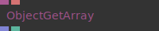

**Full Name:** `Ops.Json.ObjectGetArray_v2`

**Description:** Returns an array from a JSON-object

**`\inputsymbol`{=latex} Inputs**

- **Data** (Object)
- **Key** (String)

**`\outputsymbol`{=latex} Output**

- **Result** (Array)
- **Length** (Number)

**Example Patch:** [Open in Editor](https://cables.gl/edit/yU2Pet)

**Docs:** [https://cables.gl/op/Ops.Json.ObjectGetArray_v2](https://cables.gl/op/Ops.Json.ObjectGetArray_v2)

### ObjectGetNumber_v2
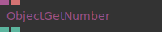

**Full Name:** `Ops.Json.ObjectGetNumber_v2`

**Description:** Get a number from an object

**`\inputsymbol`{=latex} Inputs**

- **Data** (Object)
- **Key** (String)

**`\outputsymbol`{=latex} Output**

- **Result** (Number)
- **Found** (booleanNumber)

**Example Patch:** [Open in Editor](https://cables.gl/op/Ops.Json.ObjectGetNumber_v2#example)

**Docs:** [https://cables.gl/op/Ops.Json.ObjectGetNumber_v2](https://cables.gl/op/Ops.Json.ObjectGetNumber_v2)

### ObjectGetObject_v2

**Full Name:** `Ops.Json.ObjectGetObject_v2`

**Description:** Get an object from an object

**`\inputsymbol`{=latex} Inputs**

- **Object** (Object)
- **Key** (String)

**`\outputsymbol`{=latex} Output**

- **Result** (Object)

**Example Patch:** [Open in Editor](https://cables.gl/op/Ops.Json.ObjectGetObject_v2#example)

**Docs:** [https://cables.gl/op/Ops.Json.ObjectGetObject_v2](https://cables.gl/op/Ops.Json.ObjectGetObject_v2)

### ObjectGetString_v2
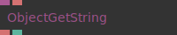

**Full Name:** `Ops.Json.ObjectGetString_v2`

**Description:** Get string from object by key

**`\inputsymbol`{=latex} Inputs**

- **Data** (Object)
- **Key** (String)

**`\outputsymbol`{=latex} Output**

- **Result** (String)
- **Found** (booleanNumber)

**Example Patch:** [Open in Editor](https://cables.gl/edit/Sn0k9Q)

**Docs:** [https://cables.gl/op/Ops.Json.ObjectGetString_v2](https://cables.gl/op/Ops.Json.ObjectGetString_v2)

### ObjectIsNull
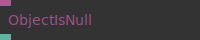

**Full Name:** `Ops.Json.ObjectIsNull`

**Description:** check if object is null or a valid object

**`\inputsymbol`{=latex} Inputs**

- **Object** (Object)

**`\outputsymbol`{=latex} Output**

- **Result** (Number)

**Example Patch:** [Open in Editor](https://cables.gl/op/Ops.Json.ObjectIsNull#example)

**Docs:** [https://cables.gl/op/Ops.Json.ObjectIsNull](https://cables.gl/op/Ops.Json.ObjectIsNull)

### ObjectKeys
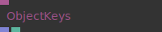

**Full Name:** `Ops.Json.ObjectKeys`

**Description:** returns an array of strings, which contain the keys of the object

**`\inputsymbol`{=latex} Inputs**

- **Object** (Object)

**`\outputsymbol`{=latex} Output**

- **Keys** (Array)
- **Num Keys** (Number)

**Example Patch:** [Open in Editor](https://cables.gl/edit/3pkLji)

**Docs:** [https://cables.gl/op/Ops.Json.ObjectKeys](https://cables.gl/op/Ops.Json.ObjectKeys)

### ObjectMerge

**Full Name:** `Ops.Json.ObjectMerge`

**Description:** merge key+values of two objects

**`\inputsymbol`{=latex} Inputs**

- **Object 1** (Object)
- **Object 2** (Object)

**`\outputsymbol`{=latex} Output**

- **Object Result** (Object)

**Example Patch:** [Open in Editor](https://cables.gl/edit/LNJHeG)

**Docs:** [https://cables.gl/op/Ops.Json.ObjectMerge](https://cables.gl/op/Ops.Json.ObjectMerge)

### ObjectOr

**Full Name:** `Ops.Json.ObjectOr`

**Description:** result is first connected valid object

**`\inputsymbol`{=latex} Inputs**

- **Object 1** (Object)
- **Object 2** (Object)
- **Object 3** (Object)
- **Object 4** (Object)
- **Object 5** (Object)
- **Object 6** (Object)
- **Object 7** (Object)
- **Object 8** (Object)

**`\outputsymbol`{=latex} Output**

- **Result** (Object)

**Example Patch:** [Open in Editor](https://cables.gl/op/Ops.Json.ObjectOr#example)

**Docs:** [https://cables.gl/op/Ops.Json.ObjectOr](https://cables.gl/op/Ops.Json.ObjectOr)

### ObjectRecorder
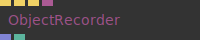

**Full Name:** `Ops.Json.ObjectRecorder`

**Description:** record objects and download as json file

**`\inputsymbol`{=latex} Inputs**

- **Exec** (Trigger)
- **Reset** (Trigger)
- **Download** (Trigger)
- **Object** (Object)

**`\outputsymbol`{=latex} Output**

- **Result** (Array)
- **Num Objects** (Number)

**Example Patch:** [Open in Editor](https://cables.gl/op/Ops.Json.ObjectRecorder#example)

**Docs:** [https://cables.gl/op/Ops.Json.ObjectRecorder](https://cables.gl/op/Ops.Json.ObjectRecorder)

### ObjectSetArray_v2

**Full Name:** `Ops.Json.ObjectSetArray_v2`

**Description:** Set array by key in an object

**`\inputsymbol`{=latex} Inputs**

- **Object** (Object)
- **Key** (String)
- **Value** (Array)

**`\outputsymbol`{=latex} Output**

- **Result Object** (Object)

**Example Patch:** [Open in Editor](https://cables.gl/op/Ops.Json.ObjectSetArray_v2#example)

**Docs:** [https://cables.gl/op/Ops.Json.ObjectSetArray_v2](https://cables.gl/op/Ops.Json.ObjectSetArray_v2)

### ObjectSetBool

**Full Name:** `Ops.Json.ObjectSetBool`

**Description:** set number at key in an object

**`\inputsymbol`{=latex} Inputs**

- **Object** (Object)
- **Key** (String)
- **Boolean** (Number: Boolean)

**`\outputsymbol`{=latex} Output**

- **Result Object** (Object)

**Example Patch:** [Open in Editor](https://cables.gl/edit/w63Au1)

**Docs:** [https://cables.gl/op/Ops.Json.ObjectSetBool](https://cables.gl/op/Ops.Json.ObjectSetBool)

### ObjectSetColorArray
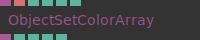

**Full Name:** `Ops.Json.ObjectSetColorArray`

**Description:** Set rgba array by key in an object

**`\inputsymbol`{=latex} Inputs**

- **Object** (Object)
- **Key** (String)
- **R** (Number)
- **G** (Number)
- **B** (Number)
- **A** (Number)

**`\outputsymbol`{=latex} Output**

- **Result Object** (Object)
- **Out R** (Number)
- **Out G** (Number)
- **Out B** (Number)
- **Out A** (Number)

**Example Patch:** [Open in Editor](https://cables.gl/edit/joA-JK)

**Docs:** [https://cables.gl/op/Ops.Json.ObjectSetColorArray](https://cables.gl/op/Ops.Json.ObjectSetColorArray)

### ObjectSetNumber_v2

**Full Name:** `Ops.Json.ObjectSetNumber_v2`

**Description:** set number at key in an object

**`\inputsymbol`{=latex} Inputs**

- **Object** (Object)
- **Key** (String)
- **Number** (Number)

**`\outputsymbol`{=latex} Output**

- **Result Object** (Object)

**Example Patch:** [Open in Editor](https://cables.gl/op/Ops.Json.ObjectSetNumber_v2#example)

**Docs:** [https://cables.gl/op/Ops.Json.ObjectSetNumber_v2](https://cables.gl/op/Ops.Json.ObjectSetNumber_v2)

### ObjectSetObject_v2

**Full Name:** `Ops.Json.ObjectSetObject_v2`

**Description:** set object as value in an object

**`\inputsymbol`{=latex} Inputs**

- **Object** (Object)
- **Key** (String)
- **Object Value** (Object)

**`\outputsymbol`{=latex} Output**

- **Result Object** (Object)

**Example Patch:** [Open in Editor](https://cables.gl/edit/7X58nR)

**Docs:** [https://cables.gl/op/Ops.Json.ObjectSetObject_v2](https://cables.gl/op/Ops.Json.ObjectSetObject_v2)

### ObjectSetString_v2

**Full Name:** `Ops.Json.ObjectSetString_v2`

**Description:** set a string value by key in an object

**`\inputsymbol`{=latex} Inputs**

- **Object** (Object)
- **Key** (String)
- **Value** (String)

**`\outputsymbol`{=latex} Output**

- **Result Object** (Object)

**Example Patch:** [Open in Editor](https://cables.gl/op/Ops.Json.ObjectSetString_v2#example)

**Docs:** [https://cables.gl/op/Ops.Json.ObjectSetString_v2](https://cables.gl/op/Ops.Json.ObjectSetString_v2)

### ObjectStringify_v2
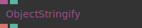

**Full Name:** `Ops.Json.ObjectStringify_v2`

**Description:** Convert object to string

**`\inputsymbol`{=latex} Inputs**

- **Object** (Object)
- **Beautify** (Number: Boolean)

**`\outputsymbol`{=latex} Output**

- **Result** (String)
- **Error** (booleanNumber)

**Example Patch:** [Open in Editor](https://cables.gl/edit/7X58nR)

**Docs:** [https://cables.gl/op/Ops.Json.ObjectStringify_v2](https://cables.gl/op/Ops.Json.ObjectStringify_v2)

### ObjectToArray
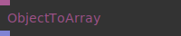

**Full Name:** `Ops.Json.ObjectToArray`

**Description:** cast an object port to an array port

**`\inputsymbol`{=latex} Inputs**

- **Object** (Object)

**`\outputsymbol`{=latex} Output**

- **Array** (Array)

**Example Patch:** [Open in Editor](https://cables.gl/op/Ops.Json.ObjectToArray#example)

**Docs:** [https://cables.gl/op/Ops.Json.ObjectToArray](https://cables.gl/op/Ops.Json.ObjectToArray)

### ObjectValuesAsArray
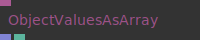

**Full Name:** `Ops.Json.ObjectValuesAsArray`

**Description:** extract all object values as an array

**`\inputsymbol`{=latex} Inputs**

- **Object** (Object)

**`\outputsymbol`{=latex} Output**

- **Values** (Array)
- **Num Values** (Number)

**Example Patch:** [Open in Editor](https://cables.gl/edit/bIQ8cI)

**Docs:** [https://cables.gl/op/Ops.Json.ObjectValuesAsArray](https://cables.gl/op/Ops.Json.ObjectValuesAsArray)

### ParseObject_v2
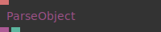

**Full Name:** `Ops.Json.ParseObject_v2`

**Description:** Parses a string to a JSON object

**`\inputsymbol`{=latex} Inputs**

- **JSON String** (String)

**`\outputsymbol`{=latex} Output**

- **Result** (Object)
- **Valid** (booleanNumber)

**Example Patch:** [Open in Editor](https://cables.gl/edit/Z17vG8)

**Docs:** [https://cables.gl/op/Ops.Json.ParseObject_v2](https://cables.gl/op/Ops.Json.ParseObject_v2)

### RemoveDataUrlPrefix
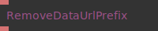

**Full Name:** `Ops.Json.RemoveDataUrlPrefix`

**Description:** Removes data URL prefix from a string

**`\inputsymbol`{=latex} Inputs**

- **String Input** (String)

**`\outputsymbol`{=latex} Output**

- **String Output** (String)

**Example Patch:** [Open in Editor](https://cables.gl/op/Ops.Json.RemoveDataUrlPrefix#example)

**Docs:** [https://cables.gl/op/Ops.Json.RemoveDataUrlPrefix](https://cables.gl/op/Ops.Json.RemoveDataUrlPrefix)

### RouteObject
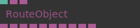

**Full Name:** `Ops.Json.RouteObject`

**Description:** Route an object to an output port

**`\inputsymbol`{=latex} Inputs**

- **Index** (Number: Integer)
- **Object In** (Object)
- **Default Object** (Object)

**`\outputsymbol`{=latex} Output**

- **Index 0 Object** (Object)
- **Index 1 Object** (Object)
- **Index 2 Object** (Object)
- **Index 3 Object** (Object)
- **Index 4 Object** (Object)
- **Index 5 Object** (Object)
- **Index 6 Object** (Object)
- **Index 7 Object** (Object)
- **Index 8 Object** (Object)
- **Index 9 Object** (Object)

**Example Patch:** [Open in Editor](https://cables.gl/edit/-xrxX8)

**Docs:** [https://cables.gl/op/Ops.Json.RouteObject](https://cables.gl/op/Ops.Json.RouteObject)

### SaveJsonFile

**Full Name:** `Ops.Json.SaveJsonFile`

**Description:** save/download an object as json file

**`\inputsymbol`{=latex} Inputs**

- **Download** (Trigger)
- **Filename** (String)
- **Object** (Object)

**`\outputsymbol`{=latex} Output**

- *Visit [Ops.Json.SaveJsonFile documentation](https://cables.gl/op/Ops.Json.SaveJsonFile) for output port details*

**Example Patch:** [Open in Editor](https://cables.gl/edit/J0c008)

**Docs:** [https://cables.gl/op/Ops.Json.SaveJsonFile](https://cables.gl/op/Ops.Json.SaveJsonFile)

### SequenceObjects_v2
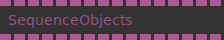

**Full Name:** `Ops.Json.SequenceObjects_v2`

**Description:** control order and flow of objects

**`\inputsymbol`{=latex} Inputs**

- **Number 0** (Object)
- **Number 1** (Object)
- **Number 2** (Object)
- **Number 3** (Object)
- **Number 4** (Object)
- **Number 5** (Object)
- **Number 6** (Object)
- **Number 7** (Object)
- **Number 8** (Object)
- **Number 9** (Object)
- **Number 10** (Object)
- **Number 11** (Object)
- **Number 12** (Object)
- **Number 13** (Object)
- **Number 14** (Object)
- **Number 15** (Object)

**`\outputsymbol`{=latex} Output**

- **Output 0** (Object)
- **Output 1** (Object)
- **Output 2** (Object)
- **Output 3** (Object)
- **Output 4** (Object)
- **Output 5** (Object)
- **Output 6** (Object)
- **Output 7** (Object)
- **Output 8** (Object)
- **Output 9** (Object)
- **Output 10** (Object)
- **Output 11** (Object)
- **Output 12** (Object)
- **Output 13** (Object)
- **Output 14** (Object)
- **Output 15** (Object)

**Example Patch:** [Open in Editor](https://cables.gl/op/Ops.Json.SequenceObjects_v2#example)

**Docs:** [https://cables.gl/op/Ops.Json.SequenceObjects_v2](https://cables.gl/op/Ops.Json.SequenceObjects_v2)

### SwitchObject
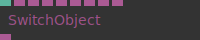

**Full Name:** `Ops.Json.SwitchObject`

**Description:** Allows switching between objects

**`\inputsymbol`{=latex} Inputs**

- **Object Index** (Number: Integer)
- **Object Port 0** (Object)
- **Object Port 1** (Object)
- **Object Port 2** (Object)
- **Object Port 3** (Object)
- **Object Port 4** (Object)
- **Object Port 5** (Object)
- **Object Port 6** (Object)
- **Object Port 7** (Object)

**`\outputsymbol`{=latex} Output**

- **Object Out** (Object)

**Example Patch:** [Open in Editor](https://cables.gl/edit/X55cRo)

**Docs:** [https://cables.gl/op/Ops.Json.SwitchObject](https://cables.gl/op/Ops.Json.SwitchObject)

### SwitchObjectMultiPort_v2
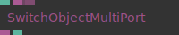

**Full Name:** `Ops.Json.SwitchObjectMultiPort_v2`

**Description:** Switch between multiple object inputs

**`\inputsymbol`{=latex} Inputs**

- **Index** (Number: Integer)
- **Objects_0** (Object)
- **Add Port** (Object)

**`\outputsymbol`{=latex} Output**

- **Object** (Object)
- **Num Values** (Number)

**Example Patch:** [Open in Editor](https://cables.gl/edit/PI2xsh)

**Docs:** [https://cables.gl/op/Ops.Json.SwitchObjectMultiPort_v2](https://cables.gl/op/Ops.Json.SwitchObjectMultiPort_v2)

### TriggerObject
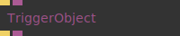

**Full Name:** `Ops.Json.TriggerObject`

**Description:** set output object when triggered

**`\inputsymbol`{=latex} Inputs**

- **Trigger** (Trigger)
- **Object** (Object)

**`\outputsymbol`{=latex} Output**

- **Next** (Trigger)
- **Result** (Object)

**Example Patch:** [Open in Editor](https://cables.gl/op/Ops.Json.TriggerObject#example)

**Docs:** [https://cables.gl/op/Ops.Json.TriggerObject](https://cables.gl/op/Ops.Json.TriggerObject)

### TriggerObjectSetNumber
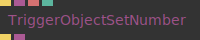

**Full Name:** `Ops.Json.TriggerObjectSetNumber`

**Description:** set a number value of an object using trigger

**`\inputsymbol`{=latex} Inputs**

- **Trigger** (Trigger)
- **Object** (Object)
- **Key** (String)
- **Number** (Number)

**`\outputsymbol`{=latex} Output**

- **Next** (Trigger)
- **Result** (Object)

**Example Patch:** [Open in Editor](https://cables.gl/op/Ops.Json.TriggerObjectSetNumber#example)

**Docs:** [https://cables.gl/op/Ops.Json.TriggerObjectSetNumber](https://cables.gl/op/Ops.Json.TriggerObjectSetNumber)

### TriggerObjectSetString
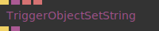

**Full Name:** `Ops.Json.TriggerObjectSetString`

**Description:** set a string value of an object using trigger

**`\inputsymbol`{=latex} Inputs**

- **Trigger** (Trigger)
- **Object** (Object)
- **Key** (String)
- **String** (String)

**`\outputsymbol`{=latex} Output**

- **Next** (Trigger)
- **Result** (Object)

**Example Patch:** [Open in Editor](https://cables.gl/op/Ops.Json.TriggerObjectSetString#example)

**Docs:** [https://cables.gl/op/Ops.Json.TriggerObjectSetString](https://cables.gl/op/Ops.Json.TriggerObjectSetString)

