# Ops.Math

*Part of the [All Operators Reference](13-_AllOps.md)*

---

## Ops.Math

### Abs

**Full Name:** `Ops.Math.Abs`
**Description:** Returns the absolute, positive value

**> Input Ports:**
- **Number** (Number)

**< Output Ports:**
- **Result** (Number)
- **The absolute value of Number** (always positive)

**Example Patch:** [Open in Editor](https://cables.gl/edit/vtPZ7i)
**Patches Using This Op:** *Search [cables.gl patches](https://cables.gl/patches) for "Abs"*
**Docs:** [https://cables.gl/op/Ops.Math.Abs](https://cables.gl/op/Ops.Math.Abs)

---

### Accumulator
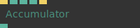

**Full Name:** `Ops.Math.Accumulator`
**Description:** Add to and multiply a number, set to current value

**> Input Ports:**
- **Trigger In** (Trigger)
- **Add To Number** (Number)
- **Multiplier To Add Number** (Number)
- **Default Value** (Number)
- **Set Default Value** (Trigger)

**< Output Ports:**
- **Current Value** (Number)

**Example Patch:** [Open in Editor](https://cables.gl/edit/Ejzvsx)
**Patches Using This Op:** *Search [cables.gl patches](https://cables.gl/patches) for "Accumulator"*
**Docs:** [https://cables.gl/op/Ops.Math.Accumulator](https://cables.gl/op/Ops.Math.Accumulator)

---

### AddUp
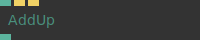

**Full Name:** `Ops.Math.AddUp`
**Description:** *Visit [documentation](https://cables.gl/op/Ops.Math.AddUp) for details*

**> Input Ports:**
- **Number** (Number)
- **Add** (Trigger)
- **Reset** (Trigger)

**< Output Ports:**
- **Result** (Number)

**Example Patch:** [Open in Editor](https://cables.gl/edit/cWh78i)
**Patches Using This Op:** *Search [cables.gl patches](https://cables.gl/patches) for "AddUp"*
**Docs:** [https://cables.gl/op/Ops.Math.AddUp](https://cables.gl/op/Ops.Math.AddUp)

---

### AngleBetweenPoints
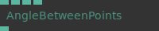

**Full Name:** `Ops.Math.AngleBetweenPoints`
**Description:** outputs the angle between two points (degree)

**> Input Ports:**
- **Point 1 X** (Number)
- **Point 1 Y** (Number)
- **Point 2 X** (Number)
- **Point 2 Y** (Number)

**< Output Ports:**
- **Angle** (Number)

**Example Patch:** [Open in Editor](https://cables.gl/edit/aMsTGc)
**Patches Using This Op:** *Search [cables.gl patches](https://cables.gl/patches) for "AngleBetweenPoints"*
**Docs:** [https://cables.gl/op/Ops.Math.AngleBetweenPoints](https://cables.gl/op/Ops.Math.AngleBetweenPoints)

---

### Array3MultiplyMatrix
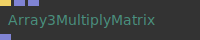

**Full Name:** `Ops.Math.Array3MultiplyMatrix`
**Description:** multiply every XYZ coordinate with a matrix

**> Input Ports:**
- **Update** (Trigger)
- **Array** (Array)
- **Matrix** (Array)

**< Output Ports:**
- **Result** (Array)

**Example Patch:** [Open in Editor](https://cables.gl/op/Ops.Math.Array3MultiplyMatrix#example)
**Patches Using This Op:** *Search [cables.gl patches](https://cables.gl/patches) for "Array3MultiplyMatrix"*
**Docs:** [https://cables.gl/op/Ops.Math.Array3MultiplyMatrix](https://cables.gl/op/Ops.Math.Array3MultiplyMatrix)

---

### Array3To2dProjection
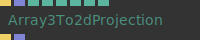

**Full Name:** `Ops.Math.Array3To2dProjection`
**Description:** calculate 2d positions of an array3x

**> Input Ports:**
- **Exec** (Trigger)
- **Array3x** (Array)
- **Fov** (Number)
- **W** (Number)
- **H** (Number)
- **Pos X** (Number)
- **Pos Y** (Number)
- **Mul** (Number)

**< Output Ports:**
- **Next** (Trigger)
- **Array2x** (Array)

**Example Patch:** [Open in Editor](https://cables.gl/op/Ops.Math.Array3To2dProjection#example)
**Patches Using This Op:** *Search [cables.gl patches](https://cables.gl/patches) for "Array3To2dProjection"*
**Docs:** [https://cables.gl/op/Ops.Math.Array3To2dProjection](https://cables.gl/op/Ops.Math.Array3To2dProjection)

---

### Atan2

**Full Name:** `Ops.Math.Atan2`
**Description:** Calculates the angle from a specified point to the coordinate origin.

**> Input Ports:**
- **X** (Number)
- **Y** (Number)
- **Phase** (Number)
- **Frequency** (Number)

**< Output Ports:**
- **Result** (Number)

**Example Patch:** [Open in Editor](https://cables.gl/op/Ops.Math.Atan2#example)
**Patches Using This Op:** *Search [cables.gl patches](https://cables.gl/patches) for "Atan2"*
**Docs:** [https://cables.gl/op/Ops.Math.Atan2](https://cables.gl/op/Ops.Math.Atan2)

---

### Average

**Full Name:** `Ops.Math.Average`
**Description:** average of last two values

**> Input Ports:**
- **Number** (Number)
- **Influence** (Number)

**< Output Ports:**
- **Result** (Number)

**Example Patch:** [Open in Editor](https://cables.gl/op/Ops.Math.Average#example)
**Patches Using This Op:** *Search [cables.gl patches](https://cables.gl/patches) for "Average"*
**Docs:** [https://cables.gl/op/Ops.Math.Average](https://cables.gl/op/Ops.Math.Average)

---

### ButterflyCurve

**Full Name:** `Ops.Math.ButterflyCurve`
**Description:** generate coordinates of a butterfly curve

**> Input Ports:**
- **Value** (Number)

**< Output Ports:**
- **X** (Number)
- **Y** (Number)

**Example Patch:** [Open in Editor](https://cables.gl/op/Ops.Math.ButterflyCurve#example)
**Patches Using This Op:** *Search [cables.gl patches](https://cables.gl/patches) for "ButterflyCurve"*
**Docs:** [https://cables.gl/op/Ops.Math.ButterflyCurve](https://cables.gl/op/Ops.Math.ButterflyCurve)

---

### Ceil

**Full Name:** `Ops.Math.Ceil`
**Description:** Returns the smallest integer greater than or equal to a given number

**> Input Ports:**
- **Number** (Number)

**< Output Ports:**
- **Result** (Number)

**Example Patch:** [Open in Editor](https://cables.gl/edit/nPvVW2)
**Patches Using This Op:** *Search [cables.gl patches](https://cables.gl/patches) for "Ceil"*
**Docs:** [https://cables.gl/op/Ops.Math.Ceil](https://cables.gl/op/Ops.Math.Ceil)

---

### CircleCoordinates
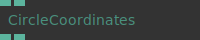

**Full Name:** `Ops.Math.CircleCoordinates`
**Description:** x and y coordinates of a circle

**> Input Ports:**
- **Position** (Number)
- **Radius** (Number)

**< Output Ports:**
- **X** (Number)
- **Y** (Number)

**Example Patch:** [Open in Editor](https://cables.gl/edit/uAkdL5)
**Patches Using This Op:** *Search [cables.gl patches](https://cables.gl/patches) for "CircleCoordinates"*
**Docs:** [https://cables.gl/op/Ops.Math.CircleCoordinates](https://cables.gl/op/Ops.Math.CircleCoordinates)

---

### Clamp

**Full Name:** `Ops.Math.Clamp`
**Description:** Makes sure a value is within range cuts off the rest

**> Input Ports:**
- **Val** (Number)
- **Min** (Number)
- **Max** (Number)
- **Ignore Outside Values** (Number: Boolean)

**< Output Ports:**
- **Result** (Number)

**Example Patch:** [Open in Editor](https://cables.gl/op/Ops.Math.Clamp#example)
**Patches Using This Op:** *Search [cables.gl patches](https://cables.gl/patches) for "Clamp"*
**Docs:** [https://cables.gl/op/Ops.Math.Clamp](https://cables.gl/op/Ops.Math.Clamp)

---

### Cosine
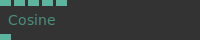

**Full Name:** `Ops.Math.Cosine`
**Description:** Calculates the cosine of an angle.

**> Input Ports:**
- **Value** (Number)
- **Phase** (Number)
- **Frequency** (Number)
- **Amplitude** (Number)
- **Asine** (Number: Boolean)

**< Output Ports:**
- **Result** (Number)

**Example Patch:** [Open in Editor](https://cables.gl/edit/RhfUW2)
**Patches Using This Op:** *Search [cables.gl patches](https://cables.gl/patches) for "Cosine"*
**Docs:** [https://cables.gl/op/Ops.Math.Cosine](https://cables.gl/op/Ops.Math.Cosine)

---

### Cross
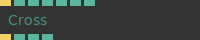

**Full Name:** `Ops.Math.Cross`
**Description:** Computes the cross product of two vec3's

**> Input Ports:**
- **Exec** (Trigger)
- **X1** (Number)
- **Y1** (Number)
- **Z1** (Number)
- **X2** (Number)
- **Y2** (Number)
- **Z2** (Number)

**< Output Ports:**
- **Next** (Trigger)
- **X** (Number)
- **Y** (Number)
- **Z** (Number)

**Example Patch:** [Open in Editor](https://cables.gl/op/Ops.Math.Cross#example)
**Patches Using This Op:** *Search [cables.gl patches](https://cables.gl/patches) for "Cross"*
**Docs:** [https://cables.gl/op/Ops.Math.Cross](https://cables.gl/op/Ops.Math.Cross)

---

### Degrees
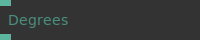

**Full Name:** `Ops.Math.Degrees`
**Description:** Converts a radian measurement to its corresponding value in degrees.

**> Input Ports:**
- **Radians** (Number)

**< Output Ports:**
- **Result** (Number)

**Example Patch:** [Open in Editor](https://cables.gl/op/Ops.Math.Degrees#example)
**Patches Using This Op:** *Search [cables.gl patches](https://cables.gl/patches) for "Degrees"*
**Docs:** [https://cables.gl/op/Ops.Math.Degrees](https://cables.gl/op/Ops.Math.Degrees)

---

### DegreeToVector
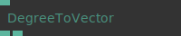

**Full Name:** `Ops.Math.DegreeToVector`
**Description:** Calculates a vector (x and y) based on an angle in degrees

**> Input Ports:**
- **Degree** (Number)
- **The angle you want to convert** (in degrees)

**< Output Ports:**
- **X** (Number)
- **Y** (Number)

**Example Patch:** [Open in Editor](https://cables.gl/edit/k76YnO)
**Patches Using This Op:** *Search [cables.gl patches](https://cables.gl/patches) for "DegreeToVector"*
**Docs:** [https://cables.gl/op/Ops.Math.DegreeToVector](https://cables.gl/op/Ops.Math.DegreeToVector)

---

### Delta

**Full Name:** `Ops.Math.Delta`
**Description:** difference to the last value (previous, store)

**> Input Ports:**
- **Value** (Number)
- **Change Always** (Number: Boolean)
- **Reset** (Trigger)

**< Output Ports:**
- **Delta** (Number)

**Example Patch:** [Open in Editor](https://cables.gl/op/Ops.Math.Delta#example)
**Patches Using This Op:** *Search [cables.gl patches](https://cables.gl/patches) for "Delta"*
**Docs:** [https://cables.gl/op/Ops.Math.Delta](https://cables.gl/op/Ops.Math.Delta)

---

### DeltaSum

**Full Name:** `Ops.Math.DeltaSum`
**Description:** add delta values to an clamped absolute value

**> Input Ports:**
- **Delta Value** (Number)
- **Default Value** (Number)
- **Multiply** (Number)
- **Reset** (Trigger)
- **Limit** (Number: Boolean)
- **Min** (Number)
- **Max** (Number)
- **Rubberband** (Number)

**< Output Ports:**
- **Absolute Value** (Number)

**Example Patch:** [Open in Editor](https://cables.gl/edit/hH8f_6)
**Patches Using This Op:** *Search [cables.gl patches](https://cables.gl/patches) for "DeltaSum"*
**Docs:** [https://cables.gl/op/Ops.Math.DeltaSum](https://cables.gl/op/Ops.Math.DeltaSum)

---

### Difference

**Full Name:** `Ops.Math.Difference`
**Description:** Difference between two numbers

**> Input Ports:**
- **Number A** (Number)
- **Number B** (Number)

**< Output Ports:**
- **Result** (Number)

**Example Patch:** [Open in Editor](https://cables.gl/op/Ops.Math.Difference#example)
**Patches Using This Op:** *Search [cables.gl patches](https://cables.gl/patches) for "Difference"*
**Docs:** [https://cables.gl/op/Ops.Math.Difference](https://cables.gl/op/Ops.Math.Difference)

---

### Distance2d

**Full Name:** `Ops.Math.Distance2d`
**Description:** Calculates the Distance between two 2d points

**> Input Ports:**
- **X1** (Number)
- **Y1** (Number)
- **X2** (Number)
- **Y2** (Number)

**< Output Ports:**
- **Distance** (Number)

**Example Patch:** [Open in Editor](https://cables.gl/edit/7mTKgg)
**Patches Using This Op:** *Search [cables.gl patches](https://cables.gl/patches) for "Distance2d"*
**Docs:** [https://cables.gl/op/Ops.Math.Distance2d](https://cables.gl/op/Ops.Math.Distance2d)

---

### Distance3d_v2

**Full Name:** `Ops.Math.Distance3d_v2`
**Description:** distance between two 3d points, calculated when triggered

**> Input Ports:**
- **Calc** (Trigger)
- **X1** (Number)
- **Y1** (Number)
- **Z1** (Number)
- **X2** (Number)
- **Y2** (Number)
- **Z2** (Number)

**< Output Ports:**
- **Next** (Trigger)
- **Distance** (Number)

**Example Patch:** [Open in Editor](https://cables.gl/op/Ops.Math.Distance3d_v2#example)
**Patches Using This Op:** *Search [cables.gl patches](https://cables.gl/patches) for "Distance3d_v2"*
**Docs:** [https://cables.gl/op/Ops.Math.Distance3d_v2](https://cables.gl/op/Ops.Math.Distance3d_v2)

---

### Divide

**Full Name:** `Ops.Math.Divide`
**Description:** Divides a number by another

**> Input Ports:**
- **Number1** (Number)
- **Number2** (Number)

**< Output Ports:**
- **Result** (Number)

**Example Patch:** [Open in Editor](https://cables.gl/op/Ops.Math.Divide#example)
**Patches Using This Op:** *Search [cables.gl patches](https://cables.gl/patches) for "Divide"*
**Docs:** [https://cables.gl/op/Ops.Math.Divide](https://cables.gl/op/Ops.Math.Divide)

---

### Ease
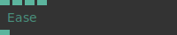

**Full Name:** `Ops.Math.Ease`
**Description:** map a value to an easing curve

**> Input Ports:**
- **Value** (Number)
- **Min** (Number)
- **Max** (Number)
- **Easing Index** (Number: Integer)

**< Output Ports:**
- **Result** (Number)

**Example Patch:** [Open in Editor](https://cables.gl/edit/rLxYY6)
**Patches Using This Op:** *Search [cables.gl patches](https://cables.gl/patches) for "Ease"*
**Docs:** [https://cables.gl/op/Ops.Math.Ease](https://cables.gl/op/Ops.Math.Ease)

---

### Exp

**Full Name:** `Ops.Math.Exp`
**Description:** Calculates the power of Euler’s number

**> Input Ports:**
- **Number** (Number)

**< Output Ports:**
- **Result** (Number)

**Example Patch:** [Open in Editor](https://cables.gl/op/Ops.Math.Exp#example)
**Patches Using This Op:** *Search [cables.gl patches](https://cables.gl/patches) for "Exp"*
**Docs:** [https://cables.gl/op/Ops.Math.Exp](https://cables.gl/op/Ops.Math.Exp)

---

### FlipSign
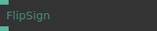

**Full Name:** `Ops.Math.FlipSign`
**Description:** positive numbers become negative and vice versa (negate)

**> Input Ports:**
- **Value** (Number)

**< Output Ports:**
- **Result** (Number)

**Example Patch:** [Open in Editor](https://cables.gl/op/Ops.Math.FlipSign#example)
**Patches Using This Op:** *Search [cables.gl patches](https://cables.gl/patches) for "FlipSign"*
**Docs:** [https://cables.gl/op/Ops.Math.FlipSign](https://cables.gl/op/Ops.Math.FlipSign)

---

### Floor
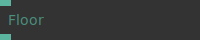

**Full Name:** `Ops.Math.Floor`
**Description:** returns the largest integer less than or equal to a given number

**> Input Ports:**
- **Number** (Number)

**< Output Ports:**
- **Result** (Number)

**Example Patch:** [Open in Editor](https://cables.gl/edit/nPvVW2)
**Patches Using This Op:** *Search [cables.gl patches](https://cables.gl/patches) for "Floor"*
**Docs:** [https://cables.gl/op/Ops.Math.Floor](https://cables.gl/op/Ops.Math.Floor)

---

### Fract

**Full Name:** `Ops.Math.Fract`
**Description:** returns the fractional part of a number

**> Input Ports:**
- **Value** (Number)

**< Output Ports:**
- **Result** (Number)

**Example Patch:** [Open in Editor](https://cables.gl/edit/VWb2t7)
**Patches Using This Op:** *Search [cables.gl patches](https://cables.gl/patches) for "Fract"*
**Docs:** [https://cables.gl/op/Ops.Math.Fract](https://cables.gl/op/Ops.Math.Fract)

---

### GaussianRandomArray
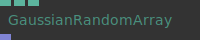

**Full Name:** `Ops.Math.GaussianRandomArray`
**Description:** random numbers fitting a Gaussian, or normal, distribution

**> Input Ports:**
- **Num** (Number: Integer)
- **Deviation** (Number)
- **Random Seed** (Number)

**< Output Ports:**
- **Array** (Array)

**Example Patch:** [Open in Editor](https://cables.gl/edit/i14QNS)
**Patches Using This Op:** *Search [cables.gl patches](https://cables.gl/patches) for "GaussianRandomArray"*
**Docs:** [https://cables.gl/op/Ops.Math.GaussianRandomArray](https://cables.gl/op/Ops.Math.GaussianRandomArray)

---

### Incrementor
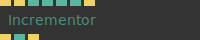

**Full Name:** `Ops.Math.Incrementor`
**Description:** increment a number by triggering

**> Input Ports:**
- **Increment** (Trigger)
- **Decrement** (Trigger)
- **Limit** (Number: Boolean)
- **Length** (Number: Integer)
- **Default** (Number: Integer)
- **Reset** (Trigger)

**< Output Ports:**
- **Changed** (Trigger)
- **Value** (Number)
- **Restarted** (Trigger)

**Example Patch:** [Open in Editor](https://cables.gl/edit/OdcvGu)
**Patches Using This Op:** *Search [cables.gl patches](https://cables.gl/patches) for "Incrementor"*
**Docs:** [https://cables.gl/op/Ops.Math.Incrementor](https://cables.gl/op/Ops.Math.Incrementor)

---

### IndexFraction
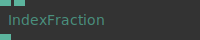

**Full Name:** `Ops.Math.IndexFraction`
**Description:** return fraction of value by index

**> Input Ports:**
- **Number** (Number)
- **Index** (Number: Integer)

**< Output Ports:**
- **Result** (Number)

**Example Patch:** [Open in Editor](https://cables.gl/edit/SV3NPO)
**Patches Using This Op:** *Search [cables.gl patches](https://cables.gl/patches) for "IndexFraction"*
**Docs:** [https://cables.gl/op/Ops.Math.IndexFraction](https://cables.gl/op/Ops.Math.IndexFraction)

---

### Interpolate

**Full Name:** `Ops.Math.Interpolate`
**Description:** Interpolate between values, lerp, linear interpolate

**> Input Ports:**
- **Value 1** (Number)
- **Value 2** (Number)
- **Percentage** (Number)

**< Output Ports:**
- **Result** (Number)

**Example Patch:** [Open in Editor](https://cables.gl/op/Ops.Math.Interpolate#example)
**Patches Using This Op:** *Search [cables.gl patches](https://cables.gl/patches) for "Interpolate"*
**Docs:** [https://cables.gl/op/Ops.Math.Interpolate](https://cables.gl/op/Ops.Math.Interpolate)

---

### IsNumberRising
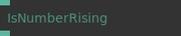

**Full Name:** `Ops.Math.IsNumberRising`
**Description:** detect if a number rising or falling

**> Input Ports:**
- **Number** (Number)

**< Output Ports:**
- **Rising** (Number)

**Example Patch:** [Open in Editor](https://cables.gl/edit/UN11cI)
**Patches Using This Op:** *Search [cables.gl patches](https://cables.gl/patches) for "IsNumberRising"*
**Docs:** [https://cables.gl/op/Ops.Math.IsNumberRising](https://cables.gl/op/Ops.Math.IsNumberRising)

---

### Log

**Full Name:** `Ops.Math.Log`
**Description:** Calculates the logarithm of Number

**> Input Ports:**
- **Number** (Number)

**< Output Ports:**
- **Result** (Number)

**Example Patch:** [Open in Editor](https://cables.gl/op/Ops.Math.Log#example)
**Patches Using This Op:** *Search [cables.gl patches](https://cables.gl/patches) for "Log"*
**Docs:** [https://cables.gl/op/Ops.Math.Log](https://cables.gl/op/Ops.Math.Log)

---

### MapGeoCoordsSpherical
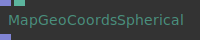

**Full Name:** `Ops.Math.MapGeoCoordsSpherical`
**Description:** map geo locations (latitude - longitude) to spherical coordinates

**> Input Ports:**
- **Coordinates** (Array)
- **Radius** (Number)

**< Output Ports:**
- **Result** (Array)

**Example Patch:** [Open in Editor](https://cables.gl/edit/BvXW5Q)
**Patches Using This Op:** *Search [cables.gl patches](https://cables.gl/patches) for "MapGeoCoordsSpherical"*
**Docs:** [https://cables.gl/op/Ops.Math.MapGeoCoordsSpherical](https://cables.gl/op/Ops.Math.MapGeoCoordsSpherical)

---

### MapRange
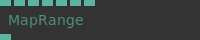

**Full Name:** `Ops.Math.MapRange`
**Description:** Maps a value from one range into another.

**> Input Ports:**
- **Value** (Number)
- **Old Min** (Number)
- **Old Max** (Number)
- **New Min** (Number)
- **New Max** (Number)
- **Easing Index** (Number: Integer)
- **Clamp** (Number: Boolean)

**< Output Ports:**
- **Result** (Number)

**Example Patch:** [Open in Editor](https://cables.gl/edit/YFIVGc)
**Patches Using This Op:** *Search [cables.gl patches](https://cables.gl/patches) for "MapRange"*
**Docs:** [https://cables.gl/op/Ops.Math.MapRange](https://cables.gl/op/Ops.Math.MapRange)

---

### Math

**Full Name:** `Ops.Math.Math`
**Description:** Allows different mathematical operations to be applied to two numbers

**> Input Ports:**
- **Number 0** (Number)
- **Number 1** (Number)
- **Math Mode Index** (Number: Integer)

**< Output Ports:**
- **Result** (Number)

**Example Patch:** [Open in Editor](https://cables.gl/edit/mTqdVJ)
**Patches Using This Op:** *Search [cables.gl patches](https://cables.gl/patches) for "Math"*
**Docs:** [https://cables.gl/op/Ops.Math.Math](https://cables.gl/op/Ops.Math.Math)

---

### MathExpression

**Full Name:** `Ops.Math.MathExpression`
**Description:** calculates a user defined mathematical expression

**> Input Ports:**
- **A** (Number)
- **B** (Number)
- **C** (Number)
- **D** (Number)
- **Expression** (String)

**< Output Ports:**
- **Result** (Number)
- **Expression Valid** (booleanNumber)

**Example Patch:** [Open in Editor](https://cables.gl/edit/s5-tve)
**Patches Using This Op:** *Search [cables.gl patches](https://cables.gl/patches) for "MathExpression"*
**Docs:** [https://cables.gl/op/Ops.Math.MathExpression](https://cables.gl/op/Ops.Math.MathExpression)

---

### Max

**Full Name:** `Ops.Math.Max`
**Description:** Sets the output to the input value which is higher

**> Input Ports:**
- **Value** (Number)
- **Maximum** (Number)

**< Output Ports:**
- **Result** (Number)

**Example Patch:** [Open in Editor](https://cables.gl/edit/hV3X7i)
**Patches Using This Op:** *Search [cables.gl patches](https://cables.gl/patches) for "Max"*
**Docs:** [https://cables.gl/op/Ops.Math.Max](https://cables.gl/op/Ops.Math.Max)

---

### MaxSinceReset

**Full Name:** `Ops.Math.MaxSinceReset`
**Description:** Outputs the maximum value since reset has been triggered

**> Input Ports:**
- **Value** (Number)
- **Reset** (Trigger)

**< Output Ports:**
- **Maximum** (Number)

**Example Patch:** [Open in Editor](https://cables.gl/op/Ops.Math.MaxSinceReset#example)
**Patches Using This Op:** *Search [cables.gl patches](https://cables.gl/patches) for "MaxSinceReset"*
**Docs:** [https://cables.gl/op/Ops.Math.MaxSinceReset](https://cables.gl/op/Ops.Math.MaxSinceReset)

---

### MercatorCoord

**Full Name:** `Ops.Math.MercatorCoord`
**Description:** project mercator coordinates

**> Input Ports:**
- **Latitude** (Number)
- **Longitude** (Number)
- **MapWidth** (Number)
- **MapHeight** (Number)

**< Output Ports:**
- **X** (Number)
- **Y** (Number)

**Example Patch:** [Open in Editor](https://cables.gl/edit/oi9AI4)
**Patches Using This Op:** *Search [cables.gl patches](https://cables.gl/patches) for "MercatorCoord"*
**Docs:** [https://cables.gl/op/Ops.Math.MercatorCoord](https://cables.gl/op/Ops.Math.MercatorCoord)

---

### MercatorCoordsArray
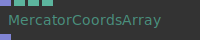

**Full Name:** `Ops.Math.MercatorCoordsArray`
**Description:** Mercator map and center an array of latitudes and longitudes to a local coordinate system

**> Input Ports:**
- **LatLon Array** (Array)
- **MapWidth** (Number)
- **Center Lat** (Number)
- **Center Lon** (Number)

**< Output Ports:**
- **Result** (Array)

**Example Patch:** [Open in Editor](https://cables.gl/edit/vgRDeT)
**Patches Using This Op:** *Search [cables.gl patches](https://cables.gl/patches) for "MercatorCoordsArray"*
**Docs:** [https://cables.gl/op/Ops.Math.MercatorCoordsArray](https://cables.gl/op/Ops.Math.MercatorCoordsArray)

---

### Min_v3

**Full Name:** `Ops.Math.Min_v3`
**Description:** Result will be the smaller number of the inputs

**> Input Ports:**
- **Value 1** (Number)
- **Value 2** (Number)

**< Output Ports:**
- **Result** (Number)

**Example Patch:** [Open in Editor](https://cables.gl/edit/rvAW7i)
**Patches Using This Op:** *Search [cables.gl patches](https://cables.gl/patches) for "Min_v3"*
**Docs:** [https://cables.gl/op/Ops.Math.Min_v3](https://cables.gl/op/Ops.Math.Min_v3)

---

### MinSinceReset
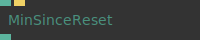

**Full Name:** `Ops.Math.MinSinceReset`
**Description:** Outputs the minimum value since reset has been triggered

**> Input Ports:**
- **Value** (Number)
- **Reset** (Trigger)

**< Output Ports:**
- **Minimum** (Number)

**Example Patch:** [Open in Editor](https://cables.gl/op/Ops.Math.MinSinceReset#example)
**Patches Using This Op:** *Search [cables.gl patches](https://cables.gl/patches) for "MinSinceReset"*
**Docs:** [https://cables.gl/op/Ops.Math.MinSinceReset](https://cables.gl/op/Ops.Math.MinSinceReset)

---

### Modulo

**Full Name:** `Ops.Math.Modulo`
**Description:** outputs the remainder after division of one number by another

**> Input Ports:**
- **Number1** (Number)
- **Number2** (Number)
- **Pingpong** (Number: Boolean)

**< Output Ports:**
- **Result** (Number)

**Example Patch:** [Open in Editor](https://cables.gl/op/Ops.Math.Modulo#example)
**Patches Using This Op:** *Search [cables.gl patches](https://cables.gl/patches) for "Modulo"*
**Docs:** [https://cables.gl/op/Ops.Math.Modulo](https://cables.gl/op/Ops.Math.Modulo)

---

### MulMatrixXyz
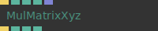

**Full Name:** `Ops.Math.MulMatrixXyz`
**Description:** multiply XYZ values with a gl matrix vec3 x mat4

**> Input Ports:**
- **Update** (Trigger)
- **X** (Number)
- **Y** (Number)
- **Z** (Number)
- **Matrix** (Array)

**< Output Ports:**
- **Next** (Trigger)
- **Result X** (Number)
- **Result Y** (Number)
- **Result Z** (Number)

**Example Patch:** [Open in Editor](https://cables.gl/edit/QlOcck)
**Patches Using This Op:** *Search [cables.gl patches](https://cables.gl/patches) for "MulMatrixXyz"*
**Docs:** [https://cables.gl/op/Ops.Math.MulMatrixXyz](https://cables.gl/op/Ops.Math.MulMatrixXyz)

---

### Multiply
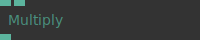

**Full Name:** `Ops.Math.Multiply`
**Description:** Multiplies two numbers

**> Input Ports:**
- **Number1** (Number)
- **Number2** (Number)

**< Output Ports:**
- **Result** (Number)

**Example Patch:** [Open in Editor](https://cables.gl/edit/0010r1)
**Patches Using This Op:** *Search [cables.gl patches](https://cables.gl/patches) for "Multiply"*
**Docs:** [https://cables.gl/op/Ops.Math.Multiply](https://cables.gl/op/Ops.Math.Multiply)

---

### Multiply3Numbers
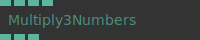

**Full Name:** `Ops.Math.Multiply3Numbers`
**Description:** multiply three numbers

**> Input Ports:**
- **R** (Number)
- **G** (Number)
- **B** (Number)
- **Multiply** (Number)

**< Output Ports:**
- **ResultR** (Number)
- **ResultG** (Number)
- **ResultB** (Number)

**Example Patch:** [Open in Editor](https://cables.gl/op/Ops.Math.Multiply3Numbers#example)
**Patches Using This Op:** *Search [cables.gl patches](https://cables.gl/patches) for "Multiply3Numbers"*
**Docs:** [https://cables.gl/op/Ops.Math.Multiply3Numbers](https://cables.gl/op/Ops.Math.Multiply3Numbers)

---

### Normalize

**Full Name:** `Ops.Math.Normalize`
**Description:** normalize a vector

**> Input Ports:**
- **X** (Number)
- **Y** (Number)
- **Z** (Number)

**< Output Ports:**
- **Result X** (Number)
- **Result Y** (Number)
- **Result Z** (Number)

**Example Patch:** [Open in Editor](https://cables.gl/edit/O8S5O8)
**Patches Using This Op:** *Search [cables.gl patches](https://cables.gl/patches) for "Normalize"*
**Docs:** [https://cables.gl/op/Ops.Math.Normalize](https://cables.gl/op/Ops.Math.Normalize)

---

### NumberDivisible
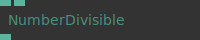

**Full Name:** `Ops.Math.NumberDivisible`
**Description:** is a number capable of being divided.

**> Input Ports:**
- **Number** (Number)
- **Divisor** (Number)

**< Output Ports:**
- **Result** (Number)

**Example Patch:** [Open in Editor](https://cables.gl/edit/-IqoJ5)
**Patches Using This Op:** *Search [cables.gl patches](https://cables.gl/patches) for "NumberDivisible"*
**Docs:** [https://cables.gl/op/Ops.Math.NumberDivisible](https://cables.gl/op/Ops.Math.NumberDivisible)

---

### OneMinus

**Full Name:** `Ops.Math.OneMinus`
**Description:** subtract a number from one

**> Input Ports:**
- **Value** (Number)

**< Output Ports:**
- **Result** (Number)

**Example Patch:** [Open in Editor](https://cables.gl/edit/8-XQ5d)
**Patches Using This Op:** *Search [cables.gl patches](https://cables.gl/patches) for "OneMinus"*
**Docs:** [https://cables.gl/op/Ops.Math.OneMinus](https://cables.gl/op/Ops.Math.OneMinus)

---

### PerlinNoise_v2

**Full Name:** `Ops.Math.PerlinNoise_v2`
**Description:** outputs a perlin noise value like random

**> Input Ports:**
- **X** (Number)
- **Y** (Number)
- **Z** (Number)
- **Scale** (Number)
- **Seed** (Number)

**< Output Ports:**
- **Result** (Number)

**Example Patch:** [Open in Editor](https://cables.gl/edit/gOCdhL)
**Patches Using This Op:** *Search [cables.gl patches](https://cables.gl/patches) for "PerlinNoise_v2"*
**Docs:** [https://cables.gl/op/Ops.Math.PerlinNoise_v2](https://cables.gl/op/Ops.Math.PerlinNoise_v2)

---

### Pi

**Full Name:** `Ops.Math.Pi`
**Description:** returns PI (3.141592653589793) * multiply amount

**> Input Ports:**
- **Multiply Amount** (Number)

**< Output Ports:**
- **Pi** (Number)

**Example Patch:** [Open in Editor](https://cables.gl/op/Ops.Math.Pi#example)
**Patches Using This Op:** *Search [cables.gl patches](https://cables.gl/patches) for "Pi"*
**Docs:** [https://cables.gl/op/Ops.Math.Pi](https://cables.gl/op/Ops.Math.Pi)

---

### PointInRectangle2d
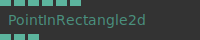

**Full Name:** `Ops.Math.PointInRectangle2d`
**Description:** test if a point is in or outside of a rectangle

**> Input Ports:**
- **X** (Number)
- **Y** (Number)
- **Rect Top** (Number)
- **Rect Left** (Number)
- **Rect Right** (Number)
- **Rect Bottom** (Number)

**< Output Ports:**
- **Result** (Number)
- **Pos X** (Number)
- **Pos Y** (Number)

**Example Patch:** [Open in Editor](https://cables.gl/edit/dG4B98)
**Patches Using This Op:** *Search [cables.gl patches](https://cables.gl/patches) for "PointInRectangle2d"*
**Docs:** [https://cables.gl/op/Ops.Math.PointInRectangle2d](https://cables.gl/op/Ops.Math.PointInRectangle2d)

---

### Pow

**Full Name:** `Ops.Math.Pow`
**Description:** value of x to the power of y

**> Input Ports:**
- **Base** (Number)
- **Exponent** (Number)

**< Output Ports:**
- **Result** (Number)

**Example Patch:** [Open in Editor](https://cables.gl/op/Ops.Math.Pow#example)
**Patches Using This Op:** *Search [cables.gl patches](https://cables.gl/patches) for "Pow"*
**Docs:** [https://cables.gl/op/Ops.Math.Pow](https://cables.gl/op/Ops.Math.Pow)

---

### PowerOfTwoSize

**Full Name:** `Ops.Math.PowerOfTwoSize`
**Description:** Return the next values as power of two

**> Input Ports:**
- **Width** (Number: Integer)
- **Height** (Number: Integer)
- **Strategy Index** (Number: Integer)

**< Output Ports:**
- **Width Result** (Number)
- **Height Result** (Number)

**Example Patch:** [Open in Editor](https://cables.gl/op/Ops.Math.PowerOfTwoSize#example)
**Patches Using This Op:** *Search [cables.gl patches](https://cables.gl/patches) for "PowerOfTwoSize"*
**Docs:** [https://cables.gl/op/Ops.Math.PowerOfTwoSize](https://cables.gl/op/Ops.Math.PowerOfTwoSize)

---

### Radians
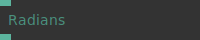

**Full Name:** `Ops.Math.Radians`
**Description:** Converts a degree measurement to its corresponding value in radians.

**> Input Ports:**
- **Degrees** (Number)

**< Output Ports:**
- **Result** (Number)

**Example Patch:** [Open in Editor](https://cables.gl/op/Ops.Math.Radians#example)
**Patches Using This Op:** *Search [cables.gl patches](https://cables.gl/patches) for "Radians"*
**Docs:** [https://cables.gl/op/Ops.Math.Radians](https://cables.gl/op/Ops.Math.Radians)

---

### RandomCounter

**Full Name:** `Ops.Math.RandomCounter`
**Description:** add up random numbers by triggering

**> Input Ports:**
- **Count** (Trigger)
- **Step Min** (Number)
- **Step Max** (Number)

**< Output Ports:**
- **Result** (Number)

**Example Patch:** [Open in Editor](https://cables.gl/edit/I8AxeE)
**Patches Using This Op:** *Search [cables.gl patches](https://cables.gl/patches) for "RandomCounter"*
**Docs:** [https://cables.gl/op/Ops.Math.RandomCounter](https://cables.gl/op/Ops.Math.RandomCounter)

---

### RandomNumbers_v3

**Full Name:** `Ops.Math.RandomNumbers_v3`
**Description:** Simple way to get random numbers without using arrays

**> Input Ports:**
- **Seed** (Number)
- **Min** (Number)
- **Max** (Number)

**< Output Ports:**
- **X** (Number)
- **Y** (Number)
- **Z** (Number)
- **W** (Number)

**Example Patch:** [Open in Editor](https://cables.gl/edit/W_z9bI)
**Patches Using This Op:** *Search [cables.gl patches](https://cables.gl/patches) for "RandomNumbers_v3"*
**Docs:** [https://cables.gl/op/Ops.Math.RandomNumbers_v3](https://cables.gl/op/Ops.Math.RandomNumbers_v3)

---

### RandomNumbersFromString
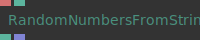

**Full Name:** `Ops.Math.RandomNumbersFromString`
**Description:** Random number generator from a string seed

**> Input Ports:**
- **Input String** (String)
- **Random Number Count** (Number: Integer)

**< Output Ports:**
- **Random Value** (Number)
- **Random Numbers** (Array)

**Example Patch:** [Open in Editor](https://cables.gl/edit/aAaJgt)
**Patches Using This Op:** *Search [cables.gl patches](https://cables.gl/patches) for "RandomNumbersFromString"*
**Docs:** [https://cables.gl/op/Ops.Math.RandomNumbersFromString](https://cables.gl/op/Ops.Math.RandomNumbersFromString)

---

### RotationFromNormal
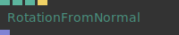

**Full Name:** `Ops.Math.RotationFromNormal`
**Description:** Create rotation matrix from normal

**> Input Ports:**
- **Normal X** (Number)
- **Normal Y** (Number)
- **Normal Z** (Number)
- **Recalculate** (Trigger)

**< Output Ports:**
- **RotationMatrix** (Array)

**Example Patch:** [Open in Editor](https://cables.gl/op/Ops.Math.RotationFromNormal#example)
**Patches Using This Op:** *Search [cables.gl patches](https://cables.gl/patches) for "RotationFromNormal"*
**Docs:** [https://cables.gl/op/Ops.Math.RotationFromNormal](https://cables.gl/op/Ops.Math.RotationFromNormal)

---

### Round

**Full Name:** `Ops.Math.Round`
**Description:** Outputs number rounded to the nearest integer

**> Input Ports:**
- **Number** (Number)
- **Decimal Places** (Number: Integer)

**< Output Ports:**
- **Result** (Number)

**Example Patch:** [Open in Editor](https://cables.gl/edit/nPvVW2)
**Patches Using This Op:** *Search [cables.gl patches](https://cables.gl/patches) for "Round"*
**Docs:** [https://cables.gl/op/Ops.Math.Round](https://cables.gl/op/Ops.Math.Round)

---

### RoundEven

**Full Name:** `Ops.Math.RoundEven`
**Description:** round to the next even number

**> Input Ports:**
- **Number** (Number)
- **Mode Index** (Number: Integer)

**< Output Ports:**
- **Result** (Number)

**Example Patch:** [Open in Editor](https://cables.gl/edit/a0z7hL)
**Patches Using This Op:** *Search [cables.gl patches](https://cables.gl/patches) for "RoundEven"*
**Docs:** [https://cables.gl/op/Ops.Math.RoundEven](https://cables.gl/op/Ops.Math.RoundEven)

---

### SchlickBias
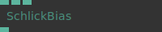

**Full Name:** `Ops.Math.SchlickBias`
**Description:** Custom easing curve via schlick bias and gain

**> Input Ports:**
- **Value** (Number)
- **Gain** (Number)
- **Bias** (Number)

**< Output Ports:**
- **Result** (Number)

**Example Patch:** [Open in Editor](https://cables.gl/edit/FO9IG3)
**Patches Using This Op:** *Search [cables.gl patches](https://cables.gl/patches) for "SchlickBias"*
**Docs:** [https://cables.gl/op/Ops.Math.SchlickBias](https://cables.gl/op/Ops.Math.SchlickBias)

---

### Sign
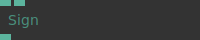

**Full Name:** `Ops.Math.Sign`
**Description:** get sign of value

**> Input Ports:**
- **Value** (Number)
- **Remove Zero** (Number: Boolean)

**< Output Ports:**
- **Result** (Number)

**Example Patch:** [Open in Editor](https://cables.gl/edit/pixllg)
**Patches Using This Op:** *Search [cables.gl patches](https://cables.gl/patches) for "Sign"*
**Docs:** [https://cables.gl/op/Ops.Math.Sign](https://cables.gl/op/Ops.Math.Sign)

---

### SimpleMovingAverage
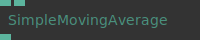

**Full Name:** `Ops.Math.SimpleMovingAverage`
**Description:** Calculate the Average of the last X values

**> Input Ports:**
- **Value** (Number)
- **Number Of Values** (Number: Integer)

**< Output Ports:**
- **Result** (Number)

**Example Patch:** [Open in Editor](https://cables.gl/op/Ops.Math.SimpleMovingAverage#example)
**Patches Using This Op:** *Search [cables.gl patches](https://cables.gl/patches) for "SimpleMovingAverage"*
**Docs:** [https://cables.gl/op/Ops.Math.SimpleMovingAverage](https://cables.gl/op/Ops.Math.SimpleMovingAverage)

---

### Sine
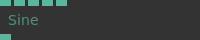

**Full Name:** `Ops.Math.Sine`
**Description:** Calculates the sine of an angle.

**> Input Ports:**
- **Value** (Number)
- **Phase** (Number)
- **Frequency** (Number)
- **Amplitude** (Number)
- **Asine** (Number: Boolean)

**< Output Ports:**
- **Result** (Number)

**Example Patch:** [Open in Editor](https://cables.gl/edit/RhfUW2)
**Patches Using This Op:** *Search [cables.gl patches](https://cables.gl/patches) for "Sine"*
**Docs:** [https://cables.gl/op/Ops.Math.Sine](https://cables.gl/op/Ops.Math.Sine)

---

### Speed
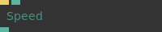

**Full Name:** `Ops.Math.Speed`
**Description:** measure speed of how much a value changes

**> Input Ports:**
- **Update** (Trigger)
- **Value** (Number)

**< Output Ports:**
- **Speed** (Number)

**Example Patch:** [Open in Editor](https://cables.gl/edit/Sgmd39)
**Patches Using This Op:** *Search [cables.gl patches](https://cables.gl/patches) for "Speed"*
**Docs:** [https://cables.gl/op/Ops.Math.Speed](https://cables.gl/op/Ops.Math.Speed)

---

### Sqrt
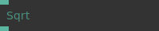

**Full Name:** `Ops.Math.Sqrt`
**Description:** square root of a number

**> Input Ports:**
- **Number** (Number)

**< Output Ports:**
- **Result** (Number)

**Example Patch:** [Open in Editor](https://cables.gl/op/Ops.Math.Sqrt#example)
**Patches Using This Op:** *Search [cables.gl patches](https://cables.gl/patches) for "Sqrt"*
**Docs:** [https://cables.gl/op/Ops.Math.Sqrt](https://cables.gl/op/Ops.Math.Sqrt)

---

### Subtract
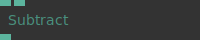

**Full Name:** `Ops.Math.Subtract`
**Description:** Subtracts Number2 from Number1 (minus, -)

**> Input Ports:**
- **Number1** (Number)
- **Number2** (Number)

**< Output Ports:**
- **Result** (Number)

**Example Patch:** [Open in Editor](https://cables.gl/op/Ops.Math.Subtract#example)
**Patches Using This Op:** *Search [cables.gl patches](https://cables.gl/patches) for "Subtract"*
**Docs:** [https://cables.gl/op/Ops.Math.Subtract](https://cables.gl/op/Ops.Math.Subtract)

---

### Sum
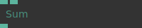

**Full Name:** `Ops.Math.Sum`
**Description:** Result of the addition

**> Input Ports:**
- **Number1** (Number)
- **Number2** (Number)

**< Output Ports:**
- **Result** (Number)

**Example Patch:** [Open in Editor](https://cables.gl/edit/P7d1r1)
**Patches Using This Op:** *Search [cables.gl patches](https://cables.gl/patches) for "Sum"*
**Docs:** [https://cables.gl/op/Ops.Math.Sum](https://cables.gl/op/Ops.Math.Sum)

---

### Tangent

**Full Name:** `Ops.Math.Tangent`
**Description:** Calculates the ratio of the sine and cosine of an angle.

**> Input Ports:**
- **Value** (Number)
- **Phase** (Number)
- **Frequency** (Number)
- **Amplitude** (Number)
- **Asine** (Number: Boolean)

**< Output Ports:**
- **Result** (Number)

**Example Patch:** [Open in Editor](https://cables.gl/op/Ops.Math.Tangent#example)
**Patches Using This Op:** *Search [cables.gl patches](https://cables.gl/patches) for "Tangent"*
**Docs:** [https://cables.gl/op/Ops.Math.Tangent](https://cables.gl/op/Ops.Math.Tangent)

---

### TriggerMathExpression
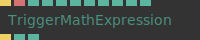

**Full Name:** `Ops.Math.TriggerMathExpression`
**Description:** calculates a user defined mathematical expression

**> Input Ports:**
- **Calculate** (Trigger)
- **Expression** (String)
- **X** (Number)
- **Y** (Number)
- **Z** (Number)
- **W** (Number)
- **A** (Number)
- **B** (Number)
- **C** (Number)
- **D** (Number)
- **I** (Number)

**< Output Ports:**
- **Next** (Trigger)
- **Result** (Number)
- **Expression Valid** (booleanNumber)

**Example Patch:** [Open in Editor](https://cables.gl/edit/6K7A5f)
**Patches Using This Op:** *Search [cables.gl patches](https://cables.gl/patches) for "TriggerMathExpression"*
**Docs:** [https://cables.gl/op/Ops.Math.TriggerMathExpression](https://cables.gl/op/Ops.Math.TriggerMathExpression)

---

### TriggerRandomNumber_v3
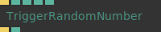

**Full Name:** `Ops.Math.TriggerRandomNumber_v3`
**Description:** Generate random number between min and max

**> Input Ports:**
- **Generate** (Trigger)
- **Min** (Number)
- **Max** (Number)
- **Integer** (Number: Boolean)
- **No Consecutive Duplicates** (Number: Boolean)

**< Output Ports:**
- **Next** (Trigger)
- **Result** (Number)

**Example Patch:** [Open in Editor](https://cables.gl/edit/s3FP7f)
**Patches Using This Op:** *Search [cables.gl patches](https://cables.gl/patches) for "TriggerRandomNumber_v3"*
**Docs:** [https://cables.gl/op/Ops.Math.TriggerRandomNumber_v3](https://cables.gl/op/Ops.Math.TriggerRandomNumber_v3)

---

### VectorLength
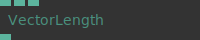

**Full Name:** `Ops.Math.VectorLength`
**Description:** length of a vector

**> Input Ports:**
- **X** (Number)
- **Y** (Number)
- **Z** (Number)

**< Output Ports:**
- **Length** (Number)

**Example Patch:** [Open in Editor](https://cables.gl/op/Ops.Math.VectorLength#example)
**Patches Using This Op:** *Search [cables.gl patches](https://cables.gl/patches) for "VectorLength"*
**Docs:** [https://cables.gl/op/Ops.Math.VectorLength](https://cables.gl/op/Ops.Math.VectorLength)

---

