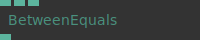
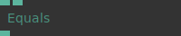
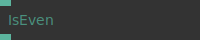
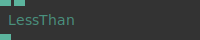

# Ops.Math.Compare

*Part of the [All Operators Reference](13-_AllOps.md)*

---

## Ops.Math.Compare

### Between

**Full Name:** `Ops.Math.Compare.Between`
**Description:** *Visit [documentation](https://cables.gl/op/Ops.Math.Compare.Between) for details*

**> Input Ports:**
- **Value** (Number)
- **Number1** (Number)
- **Number2** (Number)

**< Output Ports:**
- **Result** (Number)

**Example Patch:** [Open in Editor](https://cables.gl/op/Ops.Math.Compare.Between#example)
**Patches Using This Op:** *Search [cables.gl patches](https://cables.gl/patches) for "Between"*
**Docs:** [https://cables.gl/op/Ops.Math.Compare.Between](https://cables.gl/op/Ops.Math.Compare.Between)

---

### BetweenEquals

**Full Name:** `Ops.Math.Compare.BetweenEquals`
**Description:** *Visit [documentation](https://cables.gl/op/Ops.Math.Compare.BetweenEquals) for details*

**> Input Ports:**
- **Value** (Number)
- **Range 1** (Number)
- **Range 2** (Number)

**< Output Ports:**
- **Result** (Number)

**Example Patch:** [Open in Editor](https://cables.gl/op/Ops.Math.Compare.BetweenEquals#example)
**Patches Using This Op:** *Search [cables.gl patches](https://cables.gl/patches) for "BetweenEquals"*
**Docs:** [https://cables.gl/op/Ops.Math.Compare.BetweenEquals](https://cables.gl/op/Ops.Math.Compare.BetweenEquals)

---

### CompareNumbers

**Full Name:** `Ops.Math.Compare.CompareNumbers`
**Description:** *Visit [documentation](https://cables.gl/op/Ops.Math.Compare.CompareNumbers) for details*

**> Input Ports:**
- **Value In** (Number)
- **Comparison Mode Index** (Number: Integer)
- **Condition Value** (Number)
- **Max** (Number)

**< Output Ports:**
- **Result** (Number)

**Example Patch:** [Open in Editor](https://cables.gl/op/Ops.Math.Compare.CompareNumbers#example)
**Patches Using This Op:** *Search [cables.gl patches](https://cables.gl/patches) for "CompareNumbers"*
**Docs:** [https://cables.gl/op/Ops.Math.Compare.CompareNumbers](https://cables.gl/op/Ops.Math.Compare.CompareNumbers)

---

### Equals

**Full Name:** `Ops.Math.Compare.Equals`
**Description:** *Visit [documentation](https://cables.gl/op/Ops.Math.Compare.Equals) for details*

**> Input Ports:**
- **Number1** (Number)
- **Number2** (Number)

**< Output Ports:**
- **Result** (Number)

**Example Patch:** [Open in Editor](https://cables.gl/op/Ops.Math.Compare.Equals#example)
**Patches Using This Op:** *Search [cables.gl patches](https://cables.gl/patches) for "Equals"*
**Docs:** [https://cables.gl/op/Ops.Math.Compare.Equals](https://cables.gl/op/Ops.Math.Compare.Equals)

---

### GreaterOrEquals

**Full Name:** `Ops.Math.Compare.GreaterOrEquals`
**Description:** *Visit [documentation](https://cables.gl/op/Ops.Math.Compare.GreaterOrEquals) for details*

**> Input Ports:**
- **Number1** (Number)
- **Number2** (Number)

**< Output Ports:**
- **Result** (Number)

**Example Patch:** [Open in Editor](https://cables.gl/op/Ops.Math.Compare.GreaterOrEquals#example)
**Patches Using This Op:** *Search [cables.gl patches](https://cables.gl/patches) for "GreaterOrEquals"*
**Docs:** [https://cables.gl/op/Ops.Math.Compare.GreaterOrEquals](https://cables.gl/op/Ops.Math.Compare.GreaterOrEquals)

---

### GreaterThan

**Full Name:** `Ops.Math.Compare.GreaterThan`
**Description:** *Visit [documentation](https://cables.gl/op/Ops.Math.Compare.GreaterThan) for details*

**> Input Ports:**
- **Number1** (Number)
- **Number2** (Number)

**< Output Ports:**
- **Result** (booleanNumber)

**Example Patch:** [Open in Editor](https://cables.gl/op/Ops.Math.Compare.GreaterThan#example)
**Patches Using This Op:** *Search [cables.gl patches](https://cables.gl/patches) for "GreaterThan"*
**Docs:** [https://cables.gl/op/Ops.Math.Compare.GreaterThan](https://cables.gl/op/Ops.Math.Compare.GreaterThan)

---

### IfBetweenThen

**Full Name:** `Ops.Math.Compare.IfBetweenThen`
**Description:** *Visit [documentation](https://cables.gl/op/Ops.Math.Compare.IfBetweenThen) for details*

**> Input Ports:**
- **Exe** (Trigger)
- **Number** (Number)
- **Min** (Number)
- **Max** (Number)

**< Output Ports:**
- **Then** (Trigger)
- **Else** (Trigger)
- **Bs Between** (Number)

**Example Patch:** [Open in Editor](https://cables.gl/op/Ops.Math.Compare.IfBetweenThen#example)
**Patches Using This Op:** *Search [cables.gl patches](https://cables.gl/patches) for "IfBetweenThen"*
**Docs:** [https://cables.gl/op/Ops.Math.Compare.IfBetweenThen](https://cables.gl/op/Ops.Math.Compare.IfBetweenThen)

---

### IsEven

**Full Name:** `Ops.Math.Compare.IsEven`
**Description:** *Visit [documentation](https://cables.gl/op/Ops.Math.Compare.IsEven) for details*

**> Input Ports:**
- **Number1** (Number)

**< Output Ports:**
- **Result** (Number)

**Example Patch:** [Open in Editor](https://cables.gl/op/Ops.Math.Compare.IsEven#example)
**Patches Using This Op:** *Search [cables.gl patches](https://cables.gl/patches) for "IsEven"*
**Docs:** [https://cables.gl/op/Ops.Math.Compare.IsEven](https://cables.gl/op/Ops.Math.Compare.IsEven)

---

### LessThan

**Full Name:** `Ops.Math.Compare.LessThan`
**Description:** *Visit [documentation](https://cables.gl/op/Ops.Math.Compare.LessThan) for details*

**> Input Ports:**
- **Number1** (Number)
- **Number2** (Number)

**< Output Ports:**
- **Result** (booleanNumber)

**Example Patch:** [Open in Editor](https://cables.gl/op/Ops.Math.Compare.LessThan#example)
**Patches Using This Op:** *Search [cables.gl patches](https://cables.gl/patches) for "LessThan"*
**Docs:** [https://cables.gl/op/Ops.Math.Compare.LessThan](https://cables.gl/op/Ops.Math.Compare.LessThan)

---

