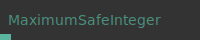
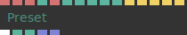
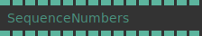
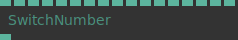
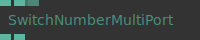
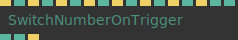
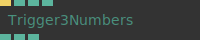
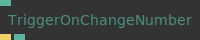

# Ops.Number

*Part of the [All Operators Reference](13-_AllOps.md)*

---

## Ops.Number

### DelayedNumber

**Full Name:** `Ops.Number.DelayedNumber`
**Description:** *Visit [documentation](https://cables.gl/op/Ops.Number.DelayedNumber) for details*

**> Input Ports:**
- **Update** (Trigger)
- **Value** (Number)
- **Delay** (Number)
- **Clear On Change** (Number: Boolean)
- **Easing Index** (Number: Integer)

**< Output Ports:**
- **Result** (Number)

**Example Patch:** [Open in Editor](https://cables.gl/op/Ops.Number.DelayedNumber#example)
**Patches Using This Op:** *Search [cables.gl patches](https://cables.gl/patches) for "DelayedNumber"*
**Docs:** [https://cables.gl/op/Ops.Number.DelayedNumber](https://cables.gl/op/Ops.Number.DelayedNumber)

---

### DelayNumberSimple

**Full Name:** `Ops.Number.DelayNumberSimple`
**Description:** *Visit [documentation](https://cables.gl/op/Ops.Number.DelayNumberSimple) for details*

**> Input Ports:**
- **Value** (Number)
- **Delay** (Number)

**< Output Ports:**
- **Out Value** (Number)

**Example Patch:** [Open in Editor](https://cables.gl/op/Ops.Number.DelayNumberSimple#example)
**Patches Using This Op:** *Search [cables.gl patches](https://cables.gl/patches) for "DelayNumberSimple"*
**Docs:** [https://cables.gl/op/Ops.Number.DelayNumberSimple](https://cables.gl/op/Ops.Number.DelayNumberSimple)

---

### FilterValidNumber

**Full Name:** `Ops.Number.FilterValidNumber`
**Description:** *Visit [documentation](https://cables.gl/op/Ops.Number.FilterValidNumber) for details*

**> Input Ports:**
- **Number** (Number)
- **Invalid When 0** (Number: Boolean)

**< Output Ports:**
- **Last Valid Number** (Number)
- **Is Valid** (booleanNumber)

**Example Patch:** [Open in Editor](https://cables.gl/op/Ops.Number.FilterValidNumber#example)
**Patches Using This Op:** *Search [cables.gl patches](https://cables.gl/patches) for "FilterValidNumber"*
**Docs:** [https://cables.gl/op/Ops.Number.FilterValidNumber](https://cables.gl/op/Ops.Number.FilterValidNumber)

---

### FreezeNumber

**Full Name:** `Ops.Number.FreezeNumber`
**Description:** *Visit [documentation](https://cables.gl/op/Ops.Number.FreezeNumber) for details*

**> Input Ports:**
- **Number** (Number)
- **Button** (Trigger)

**< Output Ports:**
- **Frozen Number** (Number)

**Example Patch:** [Open in Editor](https://cables.gl/op/Ops.Number.FreezeNumber#example)
**Patches Using This Op:** *Search [cables.gl patches](https://cables.gl/patches) for "FreezeNumber"*
**Docs:** [https://cables.gl/op/Ops.Number.FreezeNumber](https://cables.gl/op/Ops.Number.FreezeNumber)

---

### GateNumber

**Full Name:** `Ops.Number.GateNumber`
**Description:** *Visit [documentation](https://cables.gl/op/Ops.Number.GateNumber) for details*

**> Input Ports:**
- **Value In** (Number)
- **Pass Through** (Number: Boolean)
- **Custom Value** (Number)

**< Output Ports:**
- **Value Out** (Number)

**Example Patch:** [Open in Editor](https://cables.gl/op/Ops.Number.GateNumber#example)
**Patches Using This Op:** *Search [cables.gl patches](https://cables.gl/patches) for "GateNumber"*
**Docs:** [https://cables.gl/op/Ops.Number.GateNumber](https://cables.gl/op/Ops.Number.GateNumber)

---

### Integer

**Full Name:** `Ops.Number.Integer`
**Description:** *Visit [documentation](https://cables.gl/op/Ops.Number.Integer) for details*

**> Input Ports:**
- **Integer** (Number: Integer)

**< Output Ports:**
- **Number Out** (Number)

**Example Patch:** [Open in Editor](https://cables.gl/op/Ops.Number.Integer#example)
**Patches Using This Op:** *Search [cables.gl patches](https://cables.gl/patches) for "Integer"*
**Docs:** [https://cables.gl/op/Ops.Number.Integer](https://cables.gl/op/Ops.Number.Integer)

---

### MaximumSafeInteger

**Full Name:** `Ops.Number.MaximumSafeInteger`
**Description:** *Visit [documentation](https://cables.gl/op/Ops.Number.MaximumSafeInteger) for details*

**> Input Ports:**
- *Visit [Ops.Number.MaximumSafeInteger documentation](https://cables.gl/op/Ops.Number.MaximumSafeInteger) for input port details*

**< Output Ports:**
- **Max Int** (Number)

**Example Patch:** [Open in Editor](https://cables.gl/op/Ops.Number.MaximumSafeInteger#example)
**Patches Using This Op:** *Search [cables.gl patches](https://cables.gl/patches) for "MaximumSafeInteger"*
**Docs:** [https://cables.gl/op/Ops.Number.MaximumSafeInteger](https://cables.gl/op/Ops.Number.MaximumSafeInteger)

---

### MinimumSafeInteger

**Full Name:** `Ops.Number.MinimumSafeInteger`
**Description:** *Visit [documentation](https://cables.gl/op/Ops.Number.MinimumSafeInteger) for details*

**> Input Ports:**
- *Visit [Ops.Number.MinimumSafeInteger documentation](https://cables.gl/op/Ops.Number.MinimumSafeInteger) for input port details*

**< Output Ports:**
- **Min Int** (Number)

**Example Patch:** [Open in Editor](https://cables.gl/op/Ops.Number.MinimumSafeInteger#example)
**Patches Using This Op:** *Search [cables.gl patches](https://cables.gl/patches) for "MinimumSafeInteger"*
**Docs:** [https://cables.gl/op/Ops.Number.MinimumSafeInteger](https://cables.gl/op/Ops.Number.MinimumSafeInteger)

---

### Number

**Full Name:** `Ops.Number.Number`
**Description:** *Visit [documentation](https://cables.gl/op/Ops.Number.Number) for details*

**> Input Ports:**
- **Value** (Number)

**< Output Ports:**
- **Result** (Number)

**Example Patch:** [Open in Editor](https://cables.gl/op/Ops.Number.Number#example)
**Patches Using This Op:** *Search [cables.gl patches](https://cables.gl/patches) for "Number"*
**Docs:** [https://cables.gl/op/Ops.Number.Number](https://cables.gl/op/Ops.Number.Number)

---

### NumberSequence

**Full Name:** `Ops.Number.NumberSequence`
**Description:** *Visit [documentation](https://cables.gl/op/Ops.Number.NumberSequence) for details*

**> Input Ports:**
- **In Value** (Number)

**< Output Ports:**
- **In Value** (Number)
- **Value Changed** (Trigger)
- **Out Value 0** (Number)
- **Out Value 1** (Number)
- **Out Value 2** (Number)
- **Out Value 3** (Number)

**Example Patch:** [Open in Editor](https://cables.gl/op/Ops.Number.NumberSequence#example)
**Patches Using This Op:** *Search [cables.gl patches](https://cables.gl/patches) for "NumberSequence"*
**Docs:** [https://cables.gl/op/Ops.Number.NumberSequence](https://cables.gl/op/Ops.Number.NumberSequence)

---

### Preset

**Full Name:** `Ops.Number.Preset`
**Description:** *Visit [documentation](https://cables.gl/op/Ops.Number.Preset) for details*

**> Input Ports:**
- **Data** (String)
- **Sets** (String)
- **Presetid** (String)
- **Interpolation Index** (Number: Integer)
- **Interpolation** (String)
- **Preset A** (Number)
- **Preset B** (Number)
- **Fade** (Number)
- **Preset Index** (Number: Integer)
- **Preset** (Number: String)
- **Create New** (Trigger)
- **Update** (Trigger)
- **Move** (Trigger)
- **Delete** (Trigger)
- **Rename** (Trigger)

**< Output Ports:**
- **Create Variable** (Dynamic)
- **Num Presets** (Number)
- **Current Preset** (Number)
- **Dbg_data** (Array)
- **Dbg_sets** (Array)

**Example Patch:** [Open in Editor](https://cables.gl/op/Ops.Number.Preset#example)
**Patches Using This Op:** *Search [cables.gl patches](https://cables.gl/patches) for "Preset"*
**Docs:** [https://cables.gl/op/Ops.Number.Preset](https://cables.gl/op/Ops.Number.Preset)

---

### PreviousNumberStore

**Full Name:** `Ops.Number.PreviousNumberStore`
**Description:** *Visit [documentation](https://cables.gl/op/Ops.Number.PreviousNumberStore) for details*

**> Input Ports:**
- **Value** (Number)

**< Output Ports:**
- **Current Value** (Number)
- **Previous Value** (Number)

**Example Patch:** [Open in Editor](https://cables.gl/op/Ops.Number.PreviousNumberStore#example)
**Patches Using This Op:** *Search [cables.gl patches](https://cables.gl/patches) for "PreviousNumberStore"*
**Docs:** [https://cables.gl/op/Ops.Number.PreviousNumberStore](https://cables.gl/op/Ops.Number.PreviousNumberStore)

---

### RouteNumber

**Full Name:** `Ops.Number.RouteNumber`
**Description:** *Visit [documentation](https://cables.gl/op/Ops.Number.RouteNumber) for details*

**> Input Ports:**
- **Index** (Number: Integer)
- **Value** (Number)

**< Output Ports:**
- **Index** (Number: Integer)
- **Value** (Number)
- **Default VaonlyOnePortlue** (Number)
- **Set Inactive To Default** (Number: Boolean)
- **Index 0 Value** (Number)
- **Index 1 Value** (Number)
- **Index 2 Value** (Number)
- **Index 3 Value** (Number)
- **Index 4 Value** (Number)
- **Index 5 Value** (Number)
- **Index 6 Value** (Number)
- **Index 7 Value** (Number)
- **Index 8 Value** (Number)
- **Index 9 Value** (Number)

**Example Patch:** [Open in Editor](https://cables.gl/op/Ops.Number.RouteNumber#example)
**Patches Using This Op:** *Search [cables.gl patches](https://cables.gl/patches) for "RouteNumber"*
**Docs:** [https://cables.gl/op/Ops.Number.RouteNumber](https://cables.gl/op/Ops.Number.RouteNumber)

---

### SequenceNumbers

**Full Name:** `Ops.Number.SequenceNumbers`
**Description:** *Visit [documentation](https://cables.gl/op/Ops.Number.SequenceNumbers) for details*

**> Input Ports:**
- **Number 0** (Number)
- **Number 1** (Number)
- **Number 2** (Number)
- **Number 3** (Number)
- **Number 4** (Number)
- **Number 5** (Number)
- **Number 6** (Number)
- **Number 7** (Number)
- **Number 8** (Number)
- **Number 9** (Number)
- **Number 10** (Number)
- **Number 11** (Number)
- **Number 12** (Number)
- **Number 13** (Number)
- **Number 14** (Number)
- **Number 15** (Number)

**< Output Ports:**
- **Output 0** (Number)
- **Output 1** (Number)
- **Output 2** (Number)
- **Output 3** (Number)
- **Output 4** (Number)
- **Output 5** (Number)
- **Output 6** (Number)
- **Output 7** (Number)
- **Output 8** (Number)
- **Output 9** (Number)
- **Output 10** (Number)
- **Output 11** (Number)
- **Output 12** (Number)
- **Output 13** (Number)
- **Output 14** (Number)
- **Output 15** (Number)

**Example Patch:** [Open in Editor](https://cables.gl/op/Ops.Number.SequenceNumbers#example)
**Patches Using This Op:** *Search [cables.gl patches](https://cables.gl/patches) for "SequenceNumbers"*
**Docs:** [https://cables.gl/op/Ops.Number.SequenceNumbers](https://cables.gl/op/Ops.Number.SequenceNumbers)

---

### SumMultiPort_v2

**Full Name:** `Ops.Number.SumMultiPort_v2`
**Description:** *Visit [documentation](https://cables.gl/op/Ops.Number.SumMultiPort_v2) for details*

**> Input Ports:**
- **Numbers_0** (Number)
- **Add Port** (Number)

**< Output Ports:**
- **Number** (Number)
- **Num Values** (Number)

**Example Patch:** [Open in Editor](https://cables.gl/op/Ops.Number.SumMultiPort_v2#example)
**Patches Using This Op:** *Search [cables.gl patches](https://cables.gl/patches) for "SumMultiPort_v2"*
**Docs:** [https://cables.gl/op/Ops.Number.SumMultiPort_v2](https://cables.gl/op/Ops.Number.SumMultiPort_v2)

---

### SwitchNumber

**Full Name:** `Ops.Number.SwitchNumber`
**Description:** *Visit [documentation](https://cables.gl/op/Ops.Number.SwitchNumber) for details*

**> Input Ports:**
- **Index** (Number: Integer)
- **Value 0** (Number)
- **Value 1** (Number)
- **Value 2** (Number)
- **Value 3** (Number)
- **Value 4** (Number)
- **Value 5** (Number)
- **Value 6** (Number)
- **Value 7** (Number)
- **Value 8** (Number)
- **Value 9** (Number)
- **Value 10** (Number)
- **Value 11** (Number)
- **Value 12** (Number)
- **Value 13** (Number)
- **Value 14** (Number)
- **Value 15** (Number)

**< Output Ports:**
- **Result** (Number)

**Example Patch:** [Open in Editor](https://cables.gl/op/Ops.Number.SwitchNumber#example)
**Patches Using This Op:** *Search [cables.gl patches](https://cables.gl/patches) for "SwitchNumber"*
**Docs:** [https://cables.gl/op/Ops.Number.SwitchNumber](https://cables.gl/op/Ops.Number.SwitchNumber)

---

### SwitchNumberMultiPort_v2

**Full Name:** `Ops.Number.SwitchNumberMultiPort_v2`
**Description:** *Visit [documentation](https://cables.gl/op/Ops.Number.SwitchNumberMultiPort_v2) for details*

**> Input Ports:**
- **Index** (Number: Integer)
- **Numbers_0** (Number)
- **Add Port** (Number)

**< Output Ports:**
- **Number** (Number)
- **Num Values** (Number)

**Example Patch:** [Open in Editor](https://cables.gl/op/Ops.Number.SwitchNumberMultiPort_v2#example)
**Patches Using This Op:** *Search [cables.gl patches](https://cables.gl/patches) for "SwitchNumberMultiPort_v2"*
**Docs:** [https://cables.gl/op/Ops.Number.SwitchNumberMultiPort_v2](https://cables.gl/op/Ops.Number.SwitchNumberMultiPort_v2)

---

### SwitchNumberOnTrigger

**Full Name:** `Ops.Number.SwitchNumberOnTrigger`
**Description:** *Visit [documentation](https://cables.gl/op/Ops.Number.SwitchNumberOnTrigger) for details*

**> Input Ports:**
- **Trigger 0** (Trigger)
- **Value 0** (Number)
- **Trigger 1** (Trigger)
- **Value 1** (Number)
- **Trigger 2** (Trigger)
- **Value 2** (Number)
- **Trigger 3** (Trigger)
- **Value 3** (Number)
- **Trigger 4** (Trigger)
- **Value 4** (Number)
- **Trigger 5** (Trigger)
- **Value 5** (Number)
- **Trigger 6** (Trigger)
- **Value 6** (Number)
- **Trigger 7** (Trigger)
- **Value 7** (Number)
- **Default Value** (Number: String)

**< Output Ports:**
- **Value** (Number)
- **Last Value** (Number)
- **Triggered** (Trigger)

**Example Patch:** [Open in Editor](https://cables.gl/op/Ops.Number.SwitchNumberOnTrigger#example)
**Patches Using This Op:** *Search [cables.gl patches](https://cables.gl/patches) for "SwitchNumberOnTrigger"*
**Docs:** [https://cables.gl/op/Ops.Number.SwitchNumberOnTrigger](https://cables.gl/op/Ops.Number.SwitchNumberOnTrigger)

---

### Trigger3Numbers

**Full Name:** `Ops.Number.Trigger3Numbers`
**Description:** *Visit [documentation](https://cables.gl/op/Ops.Number.Trigger3Numbers) for details*

**> Input Ports:**
- **Exe** (Trigger)
- **Value X** (Number)
- **Value Y** (Number)
- **Value Z** (Number)

**< Output Ports:**
- **Exe** (Trigger)
- **Value X** (Number)
- **Value Y** (Number)
- **Value Z** (Number)
- **Result X** (Number)
- **Result Y** (Number)
- **Result Z** (Number)

**Example Patch:** [Open in Editor](https://cables.gl/op/Ops.Number.Trigger3Numbers#example)
**Patches Using This Op:** *Search [cables.gl patches](https://cables.gl/patches) for "Trigger3Numbers"*
**Docs:** [https://cables.gl/op/Ops.Number.Trigger3Numbers](https://cables.gl/op/Ops.Number.Trigger3Numbers)

---

### TriggerOnChangeNumber_v2

**Full Name:** `Ops.Number.TriggerOnChangeNumber_v2`
**Description:** *Visit [documentation](https://cables.gl/op/Ops.Number.TriggerOnChangeNumber_v2) for details*

**> Input Ports:**
- **Value** (Number)

**< Output Ports:**
- **Next** (Trigger)
- **Number** (Number)

**Example Patch:** [Open in Editor](https://cables.gl/op/Ops.Number.TriggerOnChangeNumber_v2#example)
**Patches Using This Op:** *Search [cables.gl patches](https://cables.gl/patches) for "TriggerOnChangeNumber_v2"*
**Docs:** [https://cables.gl/op/Ops.Number.TriggerOnChangeNumber_v2](https://cables.gl/op/Ops.Number.TriggerOnChangeNumber_v2)

---

