# Ops.Sidebar

*Part of the [All Operators Reference](13-_AllOps.md)*

---

## Ops.Sidebar

### Button_v2
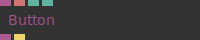

**Full Name:** `Ops.Sidebar.Button_v2`
**Description:** sidebar push button/trigger element

**> Input Ports:**
- **Link** (Object)
- **Text** (String)
- **Grey Out** (Number: Boolean)
- **Visible** (Number: Boolean)

**< Output Ports:**
- **Childs** (Object)
- **Pressed Trigger** (Trigger)

**Example Patch:** [Open in Editor](https://cables.gl/edit/aDgYX5)
**Patches Using This Op:** *Search [cables.gl patches](https://cables.gl/patches) for "Button_v2"*
**Docs:** [https://cables.gl/op/Ops.Sidebar.Button_v2](https://cables.gl/op/Ops.Sidebar.Button_v2)

---

### ColorPicker_v3
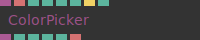

**Full Name:** `Ops.Sidebar.ColorPicker_v3`
**Description:** Shows a color-picker in the sidebar

**> Input Ports:**
- **Link** (Object)
- **Text** (String)
- **Input Red** (Number)
- **Input Green** (Number)
- **Input Blue** (Number)
- **Input Opacity** (Number)
- **Set Default** (Trigger)
- **Show Opacity** (Number: Boolean)

**< Output Ports:**
- **Children** (Object)
- **Red** (Number)
- **Green** (Number)
- **Blue** (Number)
- **Opacity** (Number)
- **Hex** (String)

**Example Patch:** [Open in Editor](https://cables.gl/edit/8-XQ5d)
**Patches Using This Op:** *Search [cables.gl patches](https://cables.gl/patches) for "ColorPicker_v3"*
**Docs:** [https://cables.gl/op/Ops.Sidebar.ColorPicker_v3](https://cables.gl/op/Ops.Sidebar.ColorPicker_v3)

---

### DisplayValue_v2
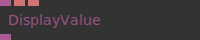

**Full Name:** `Ops.Sidebar.DisplayValue_v2`
**Description:** display a value or string

**> Input Ports:**
- **Link** (Object)
- **Text** (String)
- **Value** (String)

**< Output Ports:**
- **Childs** (Object)

**Example Patch:** [Open in Editor](https://cables.gl/edit/aDgYX5)
**Patches Using This Op:** *Search [cables.gl patches](https://cables.gl/patches) for "DisplayValue_v2"*
**Docs:** [https://cables.gl/op/Ops.Sidebar.DisplayValue_v2](https://cables.gl/op/Ops.Sidebar.DisplayValue_v2)

---

### DropDown_v2
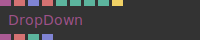

**Full Name:** `Ops.Sidebar.DropDown_v2`
**Description:** Shows a drop-down (select) element in the sidebar

**> Input Ports:**
- **Link** (Object)
- **Text** (String)
- **Values** (Array)
- **Grey Out** (Number: Boolean)
- **Visible** (Number: Boolean)
- **Multiple Selection** (Number: Boolean)
- **Lines** (Number: Integer)
- **Set Default** (Trigger)

**< Output Ports:**
- **Children** (Object)
- **Result** (String)
- **Index** (Number)
- **Selected Values** (Array)

**Example Patch:** [Open in Editor](https://cables.gl/edit/0wKJ5d)
**Patches Using This Op:** *Search [cables.gl patches](https://cables.gl/patches) for "DropDown_v2"*
**Docs:** [https://cables.gl/op/Ops.Sidebar.DropDown_v2](https://cables.gl/op/Ops.Sidebar.DropDown_v2)

---

### Group
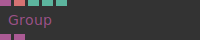

**Full Name:** `Ops.Sidebar.Group`
**Description:** organize sidebar elements into groups

**> Input Ports:**
- **Link** (Object)
- **Text** (String)
- **Show Title** (Number: Boolean)
- **Default Minimized** (Number: Boolean)
- **Visible** (Number: Boolean)

**< Output Ports:**
- **Next** (Object)
- **Childs** (Object)

**Example Patch:** [Open in Editor](https://cables.gl/op/Ops.Sidebar.Group#example)
**Patches Using This Op:** *Search [cables.gl patches](https://cables.gl/patches) for "Group"*
**Docs:** [https://cables.gl/op/Ops.Sidebar.Group](https://cables.gl/op/Ops.Sidebar.Group)

---

### Incrementor_v3
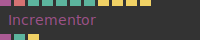

**Full Name:** `Ops.Sidebar.Incrementor_v3`
**Description:** steps through numerical or array values one by one

**> Input Ports:**
- **Link** (Object)
- **Label** (String)
- **Min** (Number)
- **Max** (Number)
- **Stepsize** (Number)
- **Default** (Number)
- **Grey Out** (Number: Boolean)
- **Increment** (Trigger)
- **Decrement** (Trigger)
- **Set Default** (Trigger)
- **Reset** (Trigger)

**< Output Ports:**
- **Childs** (Object)
- **Value** (Number)
- **Changed** (Trigger)

**Example Patch:** [Open in Editor](https://cables.gl/edit/DLV0n6)
**Patches Using This Op:** *Search [cables.gl patches](https://cables.gl/patches) for "Incrementor_v3"*
**Docs:** [https://cables.gl/op/Ops.Sidebar.Incrementor_v3](https://cables.gl/op/Ops.Sidebar.Incrementor_v3)

---

### LocalFileToDataUrl
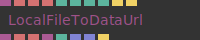

**Full Name:** `Ops.Sidebar.LocalFileToDataUrl`
**Description:** load a local file and output as data url

**> Input Ports:**
- **Link** (Object)
- **Text** (String)
- **Button Text** (String)
- **Accept Files** (String)
- **Allow Multiple Files** (Number: Boolean)
- **Id** (Number: String)
- **Visible** (Number: Boolean)
- **Grey Out** (Number: Boolean)
- **Show Dialog** (Trigger)
- **Reset** (Trigger)

**< Output Ports:**
- **Childs** (Object)
- **Data URL** (String)
- **Filename** (String)
- **File Object** (Object)
- **Num Files** (Number)
- **Data URLs** (Array)
- **Filenames** (Array)
- **File Changed** (Trigger)

**Example Patch:** [Open in Editor](https://cables.gl/edit/a0V6xn)
**Patches Using This Op:** *Search [cables.gl patches](https://cables.gl/patches) for "LocalFileToDataUrl"*
**Docs:** [https://cables.gl/op/Ops.Sidebar.LocalFileToDataUrl](https://cables.gl/op/Ops.Sidebar.LocalFileToDataUrl)

---

### NumberInput_v2
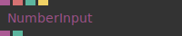

**Full Name:** `Ops.Sidebar.NumberInput_v2`
**Description:** Enter a number in the sidebar

**> Input Ports:**
- **Link** (Object)
- **Text** (String)
- **Set Default** (Trigger)

**< Output Ports:**
- **Children** (Object)
- **Result** (Number)

**Example Patch:** [Open in Editor](https://cables.gl/edit/aDgYX5)
**Patches Using This Op:** *Search [cables.gl patches](https://cables.gl/patches) for "NumberInput_v2"*
**Docs:** [https://cables.gl/op/Ops.Sidebar.NumberInput_v2](https://cables.gl/op/Ops.Sidebar.NumberInput_v2)

---

### Presets_v2
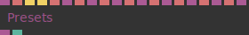

**Full Name:** `Ops.Sidebar.Presets_v2`
**Description:** manage sidebar presets

**> Input Ports:**
- **Link** (Object)
- **Text** (String)
- **Add Preset** (Trigger)
- **Update Current Preset** (Trigger)
- **Preset Title 0** (String)
- **Preset 0** (Object)
- **Preset Title 1** (String)
- **Preset 1** (Object)
- **Preset Title 2** (String)
- **Preset 2** (Object)
- **Preset Title 3** (String)
- **Preset 3** (Object)
- **Preset Title 4** (String)
- **Preset 4** (Object)
- **Preset Title 5** (String)
- **Preset 5** (Object)
- **Preset Title 6** (String)
- **Preset 6** (Object)
- **Preset Title 7** (String)
- **Preset 7** (Object)

**< Output Ports:**
- **Children** (Object)
- **Index** (Number)

**Example Patch:** [Open in Editor](https://cables.gl/edit/KKabBN)
**Patches Using This Op:** *Search [cables.gl patches](https://cables.gl/patches) for "Presets_v2"*
**Docs:** [https://cables.gl/op/Ops.Sidebar.Presets_v2](https://cables.gl/op/Ops.Sidebar.Presets_v2)

---

### Sidebar
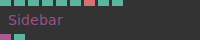

**Full Name:** `Ops.Sidebar.Sidebar`
**Description:** Sidebar overlay to control values

**> Input Ports:**
- **Visible** (Number: Boolean)
- **Opacity** (Number)
- **Default Minimized** (Number: Boolean)
- **Minimized Opacity** (Number)
- **Show Undo Button** (Number: Boolean)
- **Show Minimize** (Number: Boolean)
- **Title** (String)
- **Side** (Number: Boolean)
- **Default CSS** (Number: Boolean)

**< Output Ports:**
- **Childs** (Object)
- **Opfened** (booleanNumber)

**Example Patch:** [Open in Editor](https://cables.gl/edit/aDgYX5)
**Patches Using This Op:** *Search [cables.gl patches](https://cables.gl/patches) for "Sidebar"*
**Docs:** [https://cables.gl/op/Ops.Sidebar.Sidebar](https://cables.gl/op/Ops.Sidebar.Sidebar)

---

### SidebarDateTime
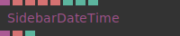

**Full Name:** `Ops.Sidebar.SidebarDateTime`
**Description:** date or datetime picker in the sidebar

**> Input Ports:**
- **Link** (Object)
- **Text** (String)
- **Default** (String)
- **Min** (String)
- **Max** (String)
- **Type Index** (Number: Integer)
- **Grey Out** (Number: Boolean)
- **Visible** (Number: Boolean)

**< Output Ports:**
- **Children** (Object)
- **Result** (String)
- **Focus** (booleanNumber)

**Example Patch:** [Open in Editor](https://cables.gl/edit/Bkzmci)
**Patches Using This Op:** *Search [cables.gl patches](https://cables.gl/patches) for "SidebarDateTime"*
**Docs:** [https://cables.gl/op/Ops.Sidebar.SidebarDateTime](https://cables.gl/op/Ops.Sidebar.SidebarDateTime)

---

### SidebarElement
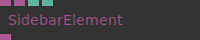

**Full Name:** `Ops.Sidebar.SidebarElement`
**Description:** Add custom HTML Elements into the sidebar

**> Input Ports:**
- **Link** (Object)
- **Child Element** (Object)
- **Border** (Number: Boolean)
- **Visible** (Number: Boolean)

**< Output Ports:**
- **Childs** (Object)

**Example Patch:** [Open in Editor](https://cables.gl/edit/CQrFox)
**Patches Using This Op:** *Search [cables.gl patches](https://cables.gl/patches) for "SidebarElement"*
**Docs:** [https://cables.gl/op/Ops.Sidebar.SidebarElement](https://cables.gl/op/Ops.Sidebar.SidebarElement)

---

### SideBarImage
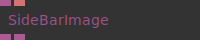

**Full Name:** `Ops.Sidebar.SideBarImage`
**Description:** Display an image in the sidebar

**> Input Ports:**
- **Link** (Object)
- **File** (String)

**< Output Ports:**
- **Childs** (Object)
- **Image Element** (Object)

**Example Patch:** [Open in Editor](https://cables.gl/edit/nLvdby)
**Patches Using This Op:** *Search [cables.gl patches](https://cables.gl/patches) for "SideBarImage"*
**Docs:** [https://cables.gl/op/Ops.Sidebar.SideBarImage](https://cables.gl/op/Ops.Sidebar.SideBarImage)

---

### SideBarStyle
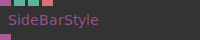

**Full Name:** `Ops.Sidebar.SideBarStyle`
**Description:** adjust appearance of sidebar

**> Input Ports:**
- **Link** (Object)
- **Width** (Number: Integer)
- **Round Corners** (Number)
- **Special Color** (String)

**< Output Ports:**
- **Childs** (Object)

**Example Patch:** [Open in Editor](https://cables.gl/edit/o1fXgI)
**Patches Using This Op:** *Search [cables.gl patches](https://cables.gl/patches) for "SideBarStyle"*
**Docs:** [https://cables.gl/op/Ops.Sidebar.SideBarStyle](https://cables.gl/op/Ops.Sidebar.SideBarStyle)

---

### SideBarSwitch
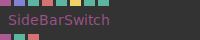

**Full Name:** `Ops.Sidebar.SideBarSwitch`
**Description:** add tabs or switchbar to a sidebar

**> Input Ports:**
- **Link** (Object)
- **Names** (Array)
- **Text** (String)
- **Set Default** (Trigger)
- **Grey Out** (Number: Boolean)
- **Default** (Number)

**< Output Ports:**
- **Childs** (Object)
- **Index** (Number)
- **String** (String)

**Example Patch:** [Open in Editor](https://cables.gl/edit/7uuz6D)
**Patches Using This Op:** *Search [cables.gl patches](https://cables.gl/patches) for "SideBarSwitch"*
**Docs:** [https://cables.gl/op/Ops.Sidebar.SideBarSwitch](https://cables.gl/op/Ops.Sidebar.SideBarSwitch)

---

### SidebarText_v3
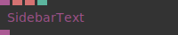

**Full Name:** `Ops.Sidebar.SidebarText_v3`
**Description:** Display text in the sidebar

**> Input Ports:**
- **Link** (Object)
- **Text** (String)
- **Id** (String)
- **Visible** (Number: Boolean)

**< Output Ports:**
- **Childs** (Object)

**Example Patch:** [Open in Editor](https://cables.gl/edit/Ut4y8i)
**Patches Using This Op:** *Search [cables.gl patches](https://cables.gl/patches) for "SidebarText_v3"*
**Docs:** [https://cables.gl/op/Ops.Sidebar.SidebarText_v3](https://cables.gl/op/Ops.Sidebar.SidebarText_v3)

---

### SidebarVariables
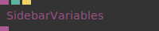

**Full Name:** `Ops.Sidebar.SidebarVariables`
**Description:** show values of all variables in a sidebar

**> Input Ports:**
- **Link** (Object)
- **Id** (Number: String)
- **Update** (Trigger)

**< Output Ports:**
- **Childs** (Object)

**Example Patch:** [Open in Editor](https://cables.gl/edit/H2kYgL)
**Patches Using This Op:** *Search [cables.gl patches](https://cables.gl/patches) for "SidebarVariables"*
**Docs:** [https://cables.gl/op/Ops.Sidebar.SidebarVariables](https://cables.gl/op/Ops.Sidebar.SidebarVariables)

---

### Slider_v3
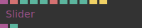

**Full Name:** `Ops.Sidebar.Slider_v3`
**Description:** Sidebar slider element (range)

**> Input Ports:**
- **Link** (Object)
- **Text** (String)
- **Min** (Number)
- **Max** (Number)
- **Step** (Number)
- **Suffix** (String)
- **Grey Out** (Number: Boolean)
- **Visible** (Number: Boolean)
- **Set Default** (Trigger)
- **Reset** (Trigger)

**< Output Ports:**
- **Childs** (Object)
- **Result** (Number)

**Example Patch:** [Open in Editor](https://cables.gl/edit/aDgYX5)
**Patches Using This Op:** *Search [cables.gl patches](https://cables.gl/patches) for "Slider_v3"*
**Docs:** [https://cables.gl/op/Ops.Sidebar.Slider_v3](https://cables.gl/op/Ops.Sidebar.Slider_v3)

---

### TextInput_v2

**Full Name:** `Ops.Sidebar.TextInput_v2`
**Description:** Get a string from an sidebar input field

**> Input Ports:**
- **Link** (Object)
- **Where to attach the sidebar item to** (Sidebar / Sidebar Group)
- **Text** (String)
- **Default** (String)
- **Placeholder** (String)
- **TextArea** (Number: Boolean)
- **Grey Out** (Number: Boolean)
- **Visible** (Number: Boolean)
- **Spellcheck** (Number: Boolean)
- **Enter Key Prevent Default** (Number: Boolean)
- **Clear** (Trigger)
- **Focus Input** (Trigger)

**< Output Ports:**
- **Children** (Object)
- **Result** (String)
- **Focus** (booleanNumber)
- **Keypress Enter** (Trigger)
- **Keypress ESC** (Trigger)

**Example Patch:** [Open in Editor](https://cables.gl/edit/wa-KH-)
**Patches Using This Op:** *Search [cables.gl patches](https://cables.gl/patches) for "TextInput_v2"*
**Docs:** [https://cables.gl/op/Ops.Sidebar.TextInput_v2](https://cables.gl/op/Ops.Sidebar.TextInput_v2)

---

### Toggle_v4
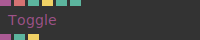

**Full Name:** `Ops.Sidebar.Toggle_v4`
**Description:** sidebar boolean toggle/switch element

**> Input Ports:**
- **Link** (Object)
- **Text** (String)
- **Set Default** (Trigger)
- **Grey Out** (Number: Boolean)
- **Visible** (Number: Boolean)

**< Output Ports:**
- **Childs** (Object)
- **Value** (booleanNumber)
- **Toggled** (Trigger)

**Example Patch:** [Open in Editor](https://cables.gl/edit/aDgYX5)
**Patches Using This Op:** *Search [cables.gl patches](https://cables.gl/patches) for "Toggle_v4"*
**Docs:** [https://cables.gl/op/Ops.Sidebar.Toggle_v4](https://cables.gl/op/Ops.Sidebar.Toggle_v4)

---

### XYPad
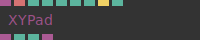

**Full Name:** `Ops.Sidebar.XYPad`
**Description:** 2d coordinate input element

**> Input Ports:**
- **Link** (Object)
- **Text** (String)
- **Input X** (Number)
- **Input Y** (Number)
- **Flip X** (Number: Boolean)
- **Flip Y** (Number: Boolean)
- **Set Default** (Trigger)
- **Visible** (Number: Boolean)

**< Output Ports:**
- **Children** (Object)
- **X** (Number)
- **Y** (Number)
- **HTML Element** (Object)

**Example Patch:** [Open in Editor](https://cables.gl/edit/0NF2FL)
**Patches Using This Op:** *Search [cables.gl patches](https://cables.gl/patches) for "XYPad"*
**Docs:** [https://cables.gl/op/Ops.Sidebar.XYPad](https://cables.gl/op/Ops.Sidebar.XYPad)

---

