# Ops.String


```{=latex}
\OpsSubsubNoSubsectionNumbering\setcounter{subsubsection}{0}
```
### AddLineBreaks_v2
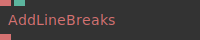

**Full Name:** `Ops.String.AddLineBreaks_v2`

**Description:** Insert a line break in a string of words

**`\inputsymbol`{=latex} Inputs**

- **String** (String)
- **Max Characters Per Line** (Number: Integer)

**`\outputsymbol`{=latex} Output**

- **Result** (String)

**Example Patch:** [Open in Editor](https://cables.gl/edit/4f-D16)

**Docs:** [https://cables.gl/op/Ops.String.AddLineBreaks_v2](https://cables.gl/op/Ops.String.AddLineBreaks_v2)

### ArrayContainsString
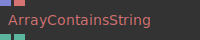

**Full Name:** `Ops.String.ArrayContainsString`

**Description:** Check if an array contains a string which can also be a number (find,search,indexOf)

**`\inputsymbol`{=latex} Inputs**

- **Array** (Array)
- **SearchValue** (String)

**`\outputsymbol`{=latex} Output**

- **Found** (booleanNumber)
- **Index** (Number)

**Example Patch:** [Open in Editor](https://cables.gl/edit/VuK4ve)

**Docs:** [https://cables.gl/op/Ops.String.ArrayContainsString](https://cables.gl/op/Ops.String.ArrayContainsString)

### ArrayOfStrings
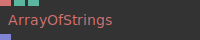

**Full Name:** `Ops.String.ArrayOfStrings`

**Description:** Create an array of strings and optionally attach index-number

**`\inputsymbol`{=latex} Inputs**

- **String** (String)
- **Length** (Number: Integer)
- **Attach Number** (Number: Boolean)

**`\outputsymbol`{=latex} Output**

- **Array** (Array)

**Example Patch:** [Open in Editor](https://cables.gl/edit/haeXx3)

**Docs:** [https://cables.gl/op/Ops.String.ArrayOfStrings](https://cables.gl/op/Ops.String.ArrayOfStrings)

### CharacterRotate
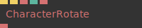

**Full Name:** `Ops.String.CharacterRotate`

**Description:** String rotate characters like a split-flap display

**`\inputsymbol`{=latex} Inputs**

- **Update** (Trigger)
- **Reset** (Trigger)
- **Text** (String)
- **Random Seed** (Number)
- **Characters** (String)

**`\outputsymbol`{=latex} Output**

- **Result** (String)

**Example Patch:** [Open in Editor](https://cables.gl/edit/-IuM8S)

**Docs:** [https://cables.gl/op/Ops.String.CharacterRotate](https://cables.gl/op/Ops.String.CharacterRotate)

### Concat_v2
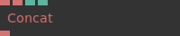

**Full Name:** `Ops.String.Concat_v2`

**Description:** Joins two strings together

**`\inputsymbol`{=latex} Inputs**

- **String1** (String)
- **String2** (String)
- **New Line** (Number: Boolean)
- **Active** (Number: Boolean)

**`\outputsymbol`{=latex} Output**

- **Result** (String)

**Example Patch:** [Open in Editor](https://cables.gl/edit/a8qVz6)

**Docs:** [https://cables.gl/op/Ops.String.Concat_v2](https://cables.gl/op/Ops.String.Concat_v2)

### ConcatMulti_v2
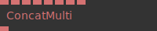

**Full Name:** `Ops.String.ConcatMulti_v2`

**Description:** Joins multiple strings together

**`\inputsymbol`{=latex} Inputs**

- **String 0** (String)
- **String 1** (String)
- **String 2** (String)
- **String 3** (String)
- **String 4** (String)
- **String 5** (String)
- **String 6** (String)
- **String 7** (String)

**`\outputsymbol`{=latex} Output**

- **Concat String** (String)

**Example Patch:** [Open in Editor](https://cables.gl/edit/DNW-QJ)

**Docs:** [https://cables.gl/op/Ops.String.ConcatMulti_v2](https://cables.gl/op/Ops.String.ConcatMulti_v2)

### ConcatMultiPort_v2
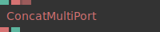

**Full Name:** `Ops.String.ConcatMultiPort_v2`

**Description:** concatinate/join multiple string inputs

**`\inputsymbol`{=latex} Inputs**

- **Strings_0** (String)
- **Add Port** (String)

**`\outputsymbol`{=latex} Output**

- **String** (String)
- **Num Strings** (Number)

**Example Patch:** [Open in Editor](https://cables.gl/edit/PBHPrh)

**Docs:** [https://cables.gl/op/Ops.String.ConcatMultiPort_v2](https://cables.gl/op/Ops.String.ConcatMultiPort_v2)

### CopyToClipboard
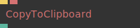

**Full Name:** `Ops.String.CopyToClipboard`

**Description:** Copy string to clipboard on trigger

**`\inputsymbol`{=latex} Inputs**

- **Copy** (Trigger)
- **String** (String)

**`\outputsymbol`{=latex} Output**

- **Success** (booleanNumber)

**Example Patch:** [Open in Editor](https://cables.gl/edit/Rquam4)

**Docs:** [https://cables.gl/op/Ops.String.CopyToClipboard](https://cables.gl/op/Ops.String.CopyToClipboard)

### DelayStringSimple
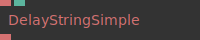

**Full Name:** `Ops.String.DelayStringSimple`

**Description:** delay the output of a string by n seconds

**`\inputsymbol`{=latex} Inputs**

- **Value** (String)
- **Delay** (Number)

**`\outputsymbol`{=latex} Output**

- **Out Value** (String)

**Example Patch:** [Open in Editor](https://cables.gl/edit/kqtJkE)

**Docs:** [https://cables.gl/op/Ops.String.DelayStringSimple](https://cables.gl/op/Ops.String.DelayStringSimple)

### EndsWith
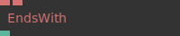

**Full Name:** `Ops.String.EndsWith`

**Description:** does a string starts with another string?

**`\inputsymbol`{=latex} Inputs**

- **String** (String)
- **Search** (String)

**`\outputsymbol`{=latex} Output**

- **Ends With** (booleanNumber)

**Example Patch:** [Open in Editor](https://cables.gl/edit/X0EBz1)

**Docs:** [https://cables.gl/op/Ops.String.EndsWith](https://cables.gl/op/Ops.String.EndsWith)

### FileUrlsToArrayMultiPort_v2
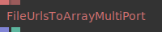

**Full Name:** `Ops.String.FileUrlsToArrayMultiPort_v2`

**Description:** create an array from multiple string

**`\inputsymbol`{=latex} Inputs**

- **Strings_0** (String)
- **Add Port** (String)

**`\outputsymbol`{=latex} Output**

- **Result** (Array)
- **Num Values** (Number)

**Example Patch:** [Open in Editor](https://cables.gl/edit/uoPbz1)

**Docs:** [https://cables.gl/op/Ops.String.FileUrlsToArrayMultiPort_v2](https://cables.gl/op/Ops.String.FileUrlsToArrayMultiPort_v2)

### FilterValidString
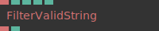

**Full Name:** `Ops.String.FilterValidString`

**Description:** filter valid strings (not null,undefined or empty)

**`\inputsymbol`{=latex} Inputs**

- **String** (String)
- **Invalid If Null** (Number: Boolean)
- **Invalid If Undefined** (Number: Boolean)
- **Invalid If Empty** (Number: Boolean)
- **Invalid If 0** (Number: Boolean)

**`\outputsymbol`{=latex} Output**

- **Last Valid String** (String)
- **Is Valid** (Number)

**Example Patch:** [Open in Editor](https://cables.gl/op/Ops.String.FilterValidString#example)

**Docs:** [https://cables.gl/op/Ops.String.FilterValidString](https://cables.gl/op/Ops.String.FilterValidString)

### FreezeString
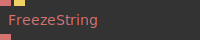

**Full Name:** `Ops.String.FreezeString`

**Description:** capture the current input and copy it to the output, even after a reload

**`\inputsymbol`{=latex} Inputs**

- **String** (String)
- **Button** (Trigger)

**`\outputsymbol`{=latex} Output**

- **Frozen String** (String)

**Example Patch:** [Open in Editor](https://cables.gl/edit/MuPepX)

**Docs:** [https://cables.gl/op/Ops.String.FreezeString](https://cables.gl/op/Ops.String.FreezeString)

### GateString


**Full Name:** `Ops.String.GateString`

**Description:** Output string if pass through is true

**`\inputsymbol`{=latex} Inputs**

- **String In** (String)
- **Pass Through** (Number: Boolean)
- **Custom Value** (String)

**`\outputsymbol`{=latex} Output**

- **String Out** (String)

**Example Patch:** [Open in Editor](https://cables.gl/op/Ops.String.GateString#example)

**Docs:** [https://cables.gl/op/Ops.String.GateString](https://cables.gl/op/Ops.String.GateString)

### HandleBarsHtml_v2
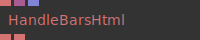

**Full Name:** `Ops.String.HandleBarsHtml_v2`

**Description:** string conversion using handlebars template engine

**`\inputsymbol`{=latex} Inputs**

- **Template** (String)
- **Data** (Object)
- **Array** (Array)

**`\outputsymbol`{=latex} Output**

- **Result** (String)
- **Errors** (String)

**Example Patch:** [Open in Editor](https://cables.gl/edit/TKQIs7)

**Docs:** [https://cables.gl/op/Ops.String.HandleBarsHtml_v2](https://cables.gl/op/Ops.String.HandleBarsHtml_v2)

### HtmlDecode


**Full Name:** `Ops.String.HtmlDecode`

**Description:** convert a html encoded string to a normal UTF8 string

**`\inputsymbol`{=latex} Inputs**

- **String** (String)

**`\outputsymbol`{=latex} Output**

- **Result** (String)

**Example Patch:** [Open in Editor](https://cables.gl/edit/jVwciO)

**Docs:** [https://cables.gl/op/Ops.String.HtmlDecode](https://cables.gl/op/Ops.String.HtmlDecode)

### HtmlEncode


**Full Name:** `Ops.String.HtmlEncode`

**Description:** encode a string to html

**`\inputsymbol`{=latex} Inputs**

- **String** (String)

**`\outputsymbol`{=latex} Output**

- **Result** (String)

**Example Patch:** [Open in Editor](https://cables.gl/edit/jVwciO)

**Docs:** [https://cables.gl/op/Ops.String.HtmlEncode](https://cables.gl/op/Ops.String.HtmlEncode)

### LeftPad_v2
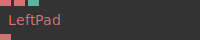

**Full Name:** `Ops.String.LeftPad_v2`

**Description:** create a fixed length string from a number 1 -> 0001

**`\inputsymbol`{=latex} Inputs**

- **Value** (String)
- **Char** (String)
- **Num** (Number: Integer)

**`\outputsymbol`{=latex} Output**

- **String** (String)

**Example Patch:** [Open in Editor](https://cables.gl/edit/8LJxz7)

**Docs:** [https://cables.gl/op/Ops.String.LeftPad_v2](https://cables.gl/op/Ops.String.LeftPad_v2)

### LimitLineBreaks_v2
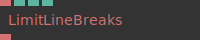

**Full Name:** `Ops.String.LimitLineBreaks_v2`

**Description:** Limit number of lines in a string

**`\inputsymbol`{=latex} Inputs**

- **String** (String)
- **Num Lines** (Number: Integer)
- **Reverse** (Number: Boolean)
- **Force Num Lines** (Number: Boolean)

**`\outputsymbol`{=latex} Output**

- **Result** (String)

**Example Patch:** [Open in Editor](https://cables.gl/edit/ZCUND-)

**Docs:** [https://cables.gl/op/Ops.String.LimitLineBreaks_v2](https://cables.gl/op/Ops.String.LimitLineBreaks_v2)

### LineBreak
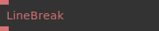

**Full Name:** `Ops.String.LineBreak`

**Description:** Outputs a linebreak, or adds a linebreak to a string

**`\inputsymbol`{=latex} Inputs**

- **String** (String)

**`\outputsymbol`{=latex} Output**

- **Result** (String)

**Example Patch:** [Open in Editor](https://cables.gl/edit/U7PniO)

**Docs:** [https://cables.gl/op/Ops.String.LineBreak](https://cables.gl/op/Ops.String.LineBreak)

### LineBreaksHtml
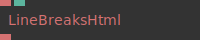

**Full Name:** `Ops.String.LineBreaksHtml`

**Description:** Convert linebreaks to html breaks

**`\inputsymbol`{=latex} Inputs**

- **String** (String)
- **Add Num Breaks** (Number: Integer)

**`\outputsymbol`{=latex} Output**

- **HTML** (String)

**Example Patch:** [Open in Editor](https://cables.gl/edit/M0BG16)

**Docs:** [https://cables.gl/op/Ops.String.LineBreaksHtml](https://cables.gl/op/Ops.String.LineBreaksHtml)

### LoremIpsum
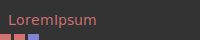

**Full Name:** `Ops.String.LoremIpsum`

**Description:** Lorem ipsum dolor sit amet

**`\inputsymbol`{=latex} Inputs**

- *Visit [Ops.String.LoremIpsum documentation](https://cables.gl/op/Ops.String.LoremIpsum) for input port details*

**`\outputsymbol`{=latex} Output**

- **String** (String)
- **HTML String** (String)
- **Array** (Array)

**Example Patch:** [Open in Editor](https://cables.gl/edit/4f-D16)

**Docs:** [https://cables.gl/op/Ops.String.LoremIpsum](https://cables.gl/op/Ops.String.LoremIpsum)

### Lowercase_v2
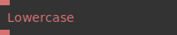

**Full Name:** `Ops.String.Lowercase_v2`

**Description:** convert all characters to small letters

**`\inputsymbol`{=latex} Inputs**

- **String** (String)

**`\outputsymbol`{=latex} Output**

- **Result** (String)

**Example Patch:** [Open in Editor](https://cables.gl/edit/a8qVz6)

**Docs:** [https://cables.gl/op/Ops.String.Lowercase_v2](https://cables.gl/op/Ops.String.Lowercase_v2)

### Md5
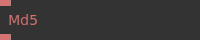

**Full Name:** `Ops.String.Md5`

**Description:** Create a md5 hash of a string

**`\inputsymbol`{=latex} Inputs**

- **String** (String)

**`\outputsymbol`{=latex} Output**

- **MD5 Hash** (String)

**Example Patch:** [Open in Editor](https://cables.gl/edit/IyC0O8)

**Docs:** [https://cables.gl/op/Ops.String.Md5](https://cables.gl/op/Ops.String.Md5)

### NumberFormatter
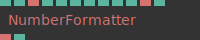

**Full Name:** `Ops.String.NumberFormatter`

**Description:** Format a number to a string in the given locale and format

**`\inputsymbol`{=latex} Inputs**

- **Input Number** (Number)
- **Locale String** (String)
- **Minimum Integer Digits** (Number: Integer)
- **Minimum Fraction Digits** (Number: Integer)
- **Maximum Fraction Digits** (Number: Integer)
- **Minimum Significant Digits** (Number: Integer)
- **Maximum Significant Digits** (Number: Integer)
- **Use Grouping** (Number: Boolean)
- **Currency Name** (String)

**`\outputsymbol`{=latex} Output**

- **Formatted Number** (String)
- **Has Error** (booleanNumber)

**Example Patch:** [Open in Editor](https://cables.gl/edit/-h-Rx3)

**Docs:** [https://cables.gl/op/Ops.String.NumberFormatter](https://cables.gl/op/Ops.String.NumberFormatter)

### NumberSwitchByString
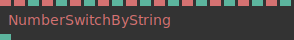

**Full Name:** `Ops.String.NumberSwitchByString`

**Description:** associate numbers by strings

**`\inputsymbol`{=latex} Inputs**

- **String** (String)
- **String 1** (String)
- **Number 1** (Number)
- **String 2** (String)
- **Number 2** (Number)
- **String 3** (String)
- **Number 3** (Number)
- **String 4** (String)
- **Number 4** (Number)
- **String 5** (String)
- **Number 5** (Number)
- **String 6** (String)
- **Number 6** (Number)
- **String 7** (String)
- **Number 7** (Number)
- **String 8** (String)
- **Number 8** (Number)
- **String 9** (String)
- **Number 9** (Number)
- **String 10** (String)
- **Number 10** (Number)

**`\outputsymbol`{=latex} Output**

- **Result** (Number)

**Example Patch:** [Open in Editor](https://cables.gl/edit/CWSBeE)

**Docs:** [https://cables.gl/op/Ops.String.NumberSwitchByString](https://cables.gl/op/Ops.String.NumberSwitchByString)

### NumberToString_v2
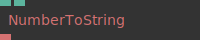

**Full Name:** `Ops.String.NumberToString_v2`

**Description:** Convert a number to a string

**`\inputsymbol`{=latex} Inputs**

- **Number** (Number)
- **Decimal Places** (Number: Integer)

**`\outputsymbol`{=latex} Output**

- **Result** (String)

**Example Patch:** [Open in Editor](https://cables.gl/edit/fo6nci)

**Docs:** [https://cables.gl/op/Ops.String.NumberToString_v2](https://cables.gl/op/Ops.String.NumberToString_v2)

### NumTotalLineBreaks
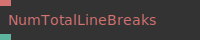

**Full Name:** `Ops.String.NumTotalLineBreaks`

**Description:** Count number of line breaks in a string

**`\inputsymbol`{=latex} Inputs**

- **String** (String)

**`\outputsymbol`{=latex} Output**

- **Total Lines** (Number)

**Example Patch:** [Open in Editor](https://cables.gl/edit/lkDCeT)

**Docs:** [https://cables.gl/op/Ops.String.NumTotalLineBreaks](https://cables.gl/op/Ops.String.NumTotalLineBreaks)

### OrString
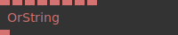

**Full Name:** `Ops.String.OrString`

**Description:** outputs the first valid string

**`\inputsymbol`{=latex} Inputs**

- **String 1** (String)
- **String 2** (String)
- **String 3** (String)
- **String 4** (String)
- **String 5** (String)
- **String 6** (String)
- **String 7** (String)
- **String 8** (String)

**`\outputsymbol`{=latex} Output**

- **Result** (String)

**Example Patch:** [Open in Editor](https://cables.gl/op/Ops.String.OrString#example)

**Docs:** [https://cables.gl/op/Ops.String.OrString](https://cables.gl/op/Ops.String.OrString)

### ParseInt_v2
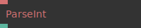

**Full Name:** `Ops.String.ParseInt_v2`

**Description:** Parse a string to a integer number / string to number

**`\inputsymbol`{=latex} Inputs**

- **String** (String)

**`\outputsymbol`{=latex} Output**

- **Number** (Number)

**Example Patch:** [Open in Editor](https://cables.gl/op/Ops.String.ParseInt_v2#example)

**Docs:** [https://cables.gl/op/Ops.String.ParseInt_v2](https://cables.gl/op/Ops.String.ParseInt_v2)

### RandomString_v3
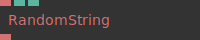

**Full Name:** `Ops.String.RandomString_v3`

**Description:** Generate a random string of given characters

**`\inputsymbol`{=latex} Inputs**

- **Chars** (String)
- **Length** (Number: Integer)
- **Seed** (Number)

**`\outputsymbol`{=latex} Output**

- **Result** (String)

**Example Patch:** [Open in Editor](https://cables.gl/edit/HqmXN8)

**Docs:** [https://cables.gl/op/Ops.String.RandomString_v3](https://cables.gl/op/Ops.String.RandomString_v3)

### RightPad_v2
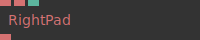

**Full Name:** `Ops.String.RightPad_v2`

**Description:** create a string with a fixed length filling the space with a character

**`\inputsymbol`{=latex} Inputs**

- **Value** (String)
- **Char** (String)
- **Num** (Number: Integer)

**`\outputsymbol`{=latex} Output**

- **String** (String)

**Example Patch:** [Open in Editor](https://cables.gl/edit/8LJxz7)

**Docs:** [https://cables.gl/op/Ops.String.RightPad_v2](https://cables.gl/op/Ops.String.RightPad_v2)

### RightPadNumber_v2
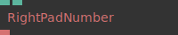

**Full Name:** `Ops.String.RightPadNumber_v2`

**Description:** Converts a number to a string with num decimal places, adds 0's

**`\inputsymbol`{=latex} Inputs**

- **Value** (Number)
- **Num** (Number: Integer)

**`\outputsymbol`{=latex} Output**

- **String** (String)

**Example Patch:** [Open in Editor](https://cables.gl/edit/ps8ZHq)

**Docs:** [https://cables.gl/op/Ops.String.RightPadNumber_v2](https://cables.gl/op/Ops.String.RightPadNumber_v2)

### RouteString
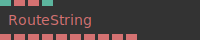

**Full Name:** `Ops.String.RouteString`

**Description:** Route a string to an output port

**`\inputsymbol`{=latex} Inputs**

- **Index** (Number: Integer)
- **String In** (String)
- **Default String** (String)
- **Set Inactive To Default** (Number: Boolean)

**`\outputsymbol`{=latex} Output**

- **Index 0 String** (String)
- **Index 1 String** (String)
- **Index 2 String** (String)
- **Index 3 String** (String)
- **Index 4 String** (String)
- **Index 5 String** (String)
- **Index 6 String** (String)
- **Index 7 String** (String)
- **Index 8 String** (String)
- **Index 9 String** (String)

**Example Patch:** [Open in Editor](https://cables.gl/edit/WDoBX8)

**Docs:** [https://cables.gl/op/Ops.String.RouteString](https://cables.gl/op/Ops.String.RouteString)

### SaveTextFile
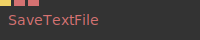

**Full Name:** `Ops.String.SaveTextFile`

**Description:** download a textfile containing the input string

**`\inputsymbol`{=latex} Inputs**

- **Download** (Trigger)
- **Filename** (String)
- **Content String** (String)

**`\outputsymbol`{=latex} Output**

- *Visit [Ops.String.SaveTextFile documentation](https://cables.gl/op/Ops.String.SaveTextFile) for output port details*

**Example Patch:** [Open in Editor](https://cables.gl/edit/mxybpX)

**Docs:** [https://cables.gl/op/Ops.String.SaveTextFile](https://cables.gl/op/Ops.String.SaveTextFile)

### SequenceStrings
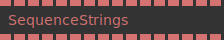

**Full Name:** `Ops.String.SequenceStrings`

**Description:** control order and flow of strings

**`\inputsymbol`{=latex} Inputs**

- **String 0** (String)
- **String 1** (String)
- **String 2** (String)
- **String 3** (String)
- **String 4** (String)
- **String 5** (String)
- **String 6** (String)
- **String 7** (String)
- **String 8** (String)
- **String 9** (String)
- **String 10** (String)
- **String 11** (String)
- **String 12** (String)
- **String 13** (String)
- **String 14** (String)
- **String 15** (String)

**`\outputsymbol`{=latex} Output**

- **Output 0** (String)
- **Output 1** (String)
- **Output 2** (String)
- **Output 3** (String)
- **Output 4** (String)
- **Output 5** (String)
- **Output 6** (String)
- **Output 7** (String)
- **Output 8** (String)
- **Output 9** (String)
- **Output 10** (String)
- **Output 11** (String)
- **Output 12** (String)
- **Output 13** (String)
- **Output 14** (String)
- **Output 15** (String)

**Example Patch:** [Open in Editor](https://cables.gl/op/Ops.String.SequenceStrings#example)

**Docs:** [https://cables.gl/op/Ops.String.SequenceStrings](https://cables.gl/op/Ops.String.SequenceStrings)

### StartsWith
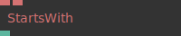

**Full Name:** `Ops.String.StartsWith`

**Description:** does a string starts with another string?

**`\inputsymbol`{=latex} Inputs**

- **String** (String)
- **Search** (String)

**`\outputsymbol`{=latex} Output**

- **Starts With** (booleanNumber)

**Example Patch:** [Open in Editor](https://cables.gl/edit/Hht1O8)

**Docs:** [https://cables.gl/op/Ops.String.StartsWith](https://cables.gl/op/Ops.String.StartsWith)

### String_v3
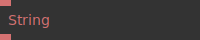

**Full Name:** `Ops.String.String_v3`

**Description:** String input/output

**`\inputsymbol`{=latex} Inputs**

- **Value** (String)

**`\outputsymbol`{=latex} Output**

- **String** (String)

**Example Patch:** [Open in Editor](https://cables.gl/edit/FXRsii)

**Docs:** [https://cables.gl/op/Ops.String.String_v3](https://cables.gl/op/Ops.String.String_v3)

### StringCompose_v3
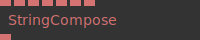

**Full Name:** `Ops.String.StringCompose_v3`

**Description:** Combine multiple Values to a new String

**`\inputsymbol`{=latex} Inputs**

- **Format** (String)
- **String A** (String)
- **String B** (String)
- **String C** (String)
- **String D** (String)
- **String E** (String)
- **String F** (String)

**`\outputsymbol`{=latex} Output**

- **Result** (String)

**Example Patch:** [Open in Editor](https://cables.gl/edit/U4M4J5)

**Docs:** [https://cables.gl/op/Ops.String.StringCompose_v3](https://cables.gl/op/Ops.String.StringCompose_v3)

### StringContains_v2
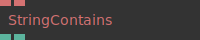

**Full Name:** `Ops.String.StringContains_v2`

**Description:** check if string contains another string (find,search,indexOf)

**`\inputsymbol`{=latex} Inputs**

- **String** (String)
- **SearchValue** (String)

**`\outputsymbol`{=latex} Output**

- **Found** (Number)
- **Index** (Number)

**Example Patch:** [Open in Editor](https://cables.gl/op/Ops.String.StringContains_v2#example)

**Docs:** [https://cables.gl/op/Ops.String.StringContains_v2](https://cables.gl/op/Ops.String.StringContains_v2)

### StringEditor
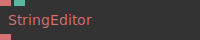

**Full Name:** `Ops.String.StringEditor`

**Description:** string text editor

**`\inputsymbol`{=latex} Inputs**

- **Value** (String)
- **Syntax Index** (Number: Integer)

**`\outputsymbol`{=latex} Output**

- **Result** (String)

**Example Patch:** [Open in Editor](https://cables.gl/edit/Jhvn8i)

**Docs:** [https://cables.gl/op/Ops.String.StringEditor](https://cables.gl/op/Ops.String.StringEditor)

### StringEquals_v2
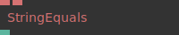

**Full Name:** `Ops.String.StringEquals_v2`

**Description:** check if content of two strings is the same

**`\inputsymbol`{=latex} Inputs**

- **String 1** (String)
- **String 2** (String)

**`\outputsymbol`{=latex} Output**

- **Result** (booleanNumber)

**Example Patch:** [Open in Editor](https://cables.gl/edit/Nx2zci)

**Docs:** [https://cables.gl/op/Ops.String.StringEquals_v2](https://cables.gl/op/Ops.String.StringEquals_v2)

### StringGetLineNumAtIndex
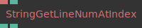

**Full Name:** `Ops.String.StringGetLineNumAtIndex`

**Description:** output the line number at the character index

**`\inputsymbol`{=latex} Inputs**

- **String** (String)
- **Index** (Number: Integer)

**`\outputsymbol`{=latex} Output**

- **Line** (Number)
- **Found** (Number)

**Example Patch:** [Open in Editor](https://cables.gl/op/Ops.String.StringGetLineNumAtIndex#example)

**Docs:** [https://cables.gl/op/Ops.String.StringGetLineNumAtIndex](https://cables.gl/op/Ops.String.StringGetLineNumAtIndex)

### StringIterator_v2
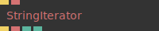

**Full Name:** `Ops.String.StringIterator_v2`

**Description:** iterate over every character of a string

**`\inputsymbol`{=latex} Inputs**

- **Exec** (Trigger)
- **String** (String)

**`\outputsymbol`{=latex} Output**

- **Next** (Trigger)
- **Character** (String)
- **Index** (Number)
- **Length** (Number)

**Example Patch:** [Open in Editor](https://cables.gl/op/Ops.String.StringIterator_v2#example)

**Docs:** [https://cables.gl/op/Ops.String.StringIterator_v2](https://cables.gl/op/Ops.String.StringIterator_v2)

### StringLength_v2
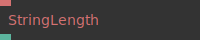

**Full Name:** `Ops.String.StringLength_v2`

**Description:** number of characters in a string

**`\inputsymbol`{=latex} Inputs**

- **String** (String)

**`\outputsymbol`{=latex} Output**

- **Result** (Number)

**Example Patch:** [Open in Editor](https://cables.gl/edit/v9GLji)

**Docs:** [https://cables.gl/op/Ops.String.StringLength_v2](https://cables.gl/op/Ops.String.StringLength_v2)

### StringRemoveCharacters
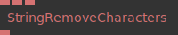

**Full Name:** `Ops.String.StringRemoveCharacters`

**Description:** Remove every occurances of given characters from a string

**`\inputsymbol`{=latex} Inputs**

- **String** (String)
- **Characters** (String)
- **Replace** (String)

**`\outputsymbol`{=latex} Output**

- **Result** (String)

**Example Patch:** [Open in Editor](https://cables.gl/edit/ls8ciO)

**Docs:** [https://cables.gl/op/Ops.String.StringRemoveCharacters](https://cables.gl/op/Ops.String.StringRemoveCharacters)

### StringReplace
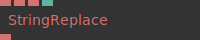

**Full Name:** `Ops.String.StringReplace`

**Description:** replace occurrences of a string with another string

**`\inputsymbol`{=latex} Inputs**

- **String** (String)
- **Search For** (String)
- **Replace** (String)
- **Replace What Index** (Number: Integer)

**`\outputsymbol`{=latex} Output**

- **Result** (String)

**Example Patch:** [Open in Editor](https://cables.gl/edit/q0iLkE)

**Docs:** [https://cables.gl/op/Ops.String.StringReplace](https://cables.gl/op/Ops.String.StringReplace)

### StringSortLines
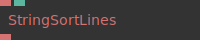

**Full Name:** `Ops.String.StringSortLines`

**Description:** sort each line of a string alphabetically

**`\inputsymbol`{=latex} Inputs**

- **String** (String)
- **Reverse** (Number: Boolean)

**`\outputsymbol`{=latex} Output**

- **Result** (String)

**Example Patch:** [Open in Editor](https://cables.gl/edit/MMS2O8)

**Docs:** [https://cables.gl/op/Ops.String.StringSortLines](https://cables.gl/op/Ops.String.StringSortLines)

### StringsToArrayMultiPort_v2
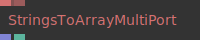

**Full Name:** `Ops.String.StringsToArrayMultiPort_v2`

**Description:** create an array from multiple string

**`\inputsymbol`{=latex} Inputs**

- **Strings_0** (String)
- **Add Port** (String)

**`\outputsymbol`{=latex} Output**

- **Result** (Array)
- **Num Values** (Number)

**Example Patch:** [Open in Editor](https://cables.gl/edit/oBPhsh)

**Docs:** [https://cables.gl/op/Ops.String.StringsToArrayMultiPort_v2](https://cables.gl/op/Ops.String.StringsToArrayMultiPort_v2)

### StringSwitchByString
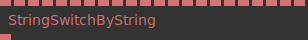

**Full Name:** `Ops.String.StringSwitchByString`

**Description:** Switch between multiple strings by a string index

**`\inputsymbol`{=latex} Inputs**

- **String** (String)
- **Default** (String)
- **String 1** (String)
- **Result String 1** (String)
- **String 2** (String)
- **Result String 2** (String)
- **String 3** (String)
- **Result String 3** (String)
- **String 4** (String)
- **Result String 4** (String)
- **String 5** (String)
- **Result String 5** (String)
- **String 6** (String)
- **Result String 6** (String)
- **String 7** (String)
- **Result String 7** (String)
- **String 8** (String)
- **Result String 8** (String)
- **String 9** (String)
- **Result String 9** (String)
- **String 10** (String)
- **Result String 10** (String)

**`\outputsymbol`{=latex} Output**

- **Result** (String)

**Example Patch:** [Open in Editor](https://cables.gl/op/Ops.String.StringSwitchByString#example)

**Docs:** [https://cables.gl/op/Ops.String.StringSwitchByString](https://cables.gl/op/Ops.String.StringSwitchByString)

### StringToNumber
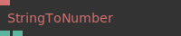

**Full Name:** `Ops.String.StringToNumber`

**Description:** Parses a string and returns a floating point number / string to number

**`\inputsymbol`{=latex} Inputs**

- **String** (String)

**`\outputsymbol`{=latex} Output**

- **Number** (Number)
- **Not A Number** (booleanNumber)

**Example Patch:** [Open in Editor](https://cables.gl/edit/XMEwci)

**Docs:** [https://cables.gl/op/Ops.String.StringToNumber](https://cables.gl/op/Ops.String.StringToNumber)

### StringTrim_v2
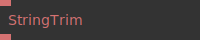

**Full Name:** `Ops.String.StringTrim_v2`

**Description:** Remove whitespace from both ends of a string

**`\inputsymbol`{=latex} Inputs**

- **String** (String)

**`\outputsymbol`{=latex} Output**

- **Result** (String)

**Example Patch:** [Open in Editor](https://cables.gl/edit/Ddmsii)

**Docs:** [https://cables.gl/op/Ops.String.StringTrim_v2](https://cables.gl/op/Ops.String.StringTrim_v2)

### StripHtml
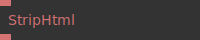

**Full Name:** `Ops.String.StripHtml`

**Description:** remove html tags from a string

**`\inputsymbol`{=latex} Inputs**

- **String** (String)

**`\outputsymbol`{=latex} Output**

- **Result** (String)

**Example Patch:** [Open in Editor](https://cables.gl/edit/5NsMve)

**Docs:** [https://cables.gl/op/Ops.String.StripHtml](https://cables.gl/op/Ops.String.StripHtml)

### SubString_v2


**Full Name:** `Ops.String.SubString_v2`

**Description:** Subset of a string between one index and another

**`\inputsymbol`{=latex} Inputs**

- **String** (String)
- **Start** (Number: Integer)
- **End** (Number: Integer)
- **End Of String** (Number: Boolean)

**`\outputsymbol`{=latex} Output**

- **Result** (String)

**Example Patch:** [Open in Editor](https://cables.gl/edit/FvIvci)

**Docs:** [https://cables.gl/op/Ops.String.SubString_v2](https://cables.gl/op/Ops.String.SubString_v2)

### SwitchString


**Full Name:** `Ops.String.SwitchString`

**Description:** Switch between multiple strings with an index

**`\inputsymbol`{=latex} Inputs**

- **Index** (Number: Integer)
- **String 0** (String)
- **String 1** (String)
- **String 2** (String)
- **String 3** (String)
- **String 4** (String)
- **String 5** (String)
- **String 6** (String)
- **String 7** (String)
- **String 8** (String)
- **String 9** (String)

**`\outputsymbol`{=latex} Output**

- **Result** (String)

**Example Patch:** [Open in Editor](https://cables.gl/edit/2uRAci)

**Docs:** [https://cables.gl/op/Ops.String.SwitchString](https://cables.gl/op/Ops.String.SwitchString)

### SwitchStringMultiPort_v2


**Full Name:** `Ops.String.SwitchStringMultiPort_v2`

**Description:** switch between multiple string inputs

**`\inputsymbol`{=latex} Inputs**

- **Index** (Number: Integer)
- **Strings_0** (String)
- **Add Port** (String)

**`\outputsymbol`{=latex} Output**

- **String** (String)
- **Num Values** (Number)

**Example Patch:** [Open in Editor](https://cables.gl/edit/TwZ1sh)

**Docs:** [https://cables.gl/op/Ops.String.SwitchStringMultiPort_v2](https://cables.gl/op/Ops.String.SwitchStringMultiPort_v2)

### Uppercase_v2


**Full Name:** `Ops.String.Uppercase_v2`

**Description:** Convert all characters in a string to upperase

**`\inputsymbol`{=latex} Inputs**

- **String** (String)

**`\outputsymbol`{=latex} Output**

- **Result** (String)

**Example Patch:** [Open in Editor](https://cables.gl/edit/a8qVz6)

**Docs:** [https://cables.gl/op/Ops.String.Uppercase_v2](https://cables.gl/op/Ops.String.Uppercase_v2)

### UUID


**Full Name:** `Ops.String.UUID`

**Description:** outputs a unique identifier string

**`\inputsymbol`{=latex} Inputs**

- **Generate** (Trigger)

**`\outputsymbol`{=latex} Output**

- **Id** (String)

**Example Patch:** [Open in Editor](https://cables.gl/edit/ryYQwn)

**Docs:** [https://cables.gl/op/Ops.String.UUID](https://cables.gl/op/Ops.String.UUID)


