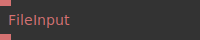
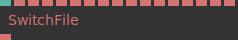

# Ops.String.File


```{=latex}
\OpsSubsubNoSubsectionNumbering\setcounter{subsubsection}{0}
```
### FileInput_v2


**Full Name:** `Ops.String.File.FileInput_v2`

get URL of a file.

**`\inputsymbol`{=latex} Inputs**

- **File** (String)

**`\outputsymbol`{=latex} Output**

- **URL** (String)

**Example:** [cables.gl/op/Ops.String.File.FileInput_v2#example](https://cables.gl/op/Ops.String.File.FileInput_v2#example)

**Doc:** [cables.gl/op/Ops.String.File.FileInput_v2](https://cables.gl/op/Ops.String.File.FileInput_v2)

### SwitchFile_v2


**Full Name:** `Ops.String.File.SwitchFile_v2`

switch between filenames.

**`\inputsymbol`{=latex} Inputs**

- **Index** (Number: Integer)
- **File 0** (String)
- **File 1** (String)
- **File 2** (String)
- **File 3** (String)
- **File 4** (String)
- **File 5** (String)
- **File 6** (String)
- **File 7** (String)
- **File 8** (String)
- **File 9** (String)
- **File 10** (String)
- **File 11** (String)
- **File 12** (String)
- **File 13** (String)
- **File 14** (String)
- **File 15** (String)

**`\outputsymbol`{=latex} Output**

- **Result** (String)

**Example:** [cables.gl/edit/unutii](https://cables.gl/edit/unutii)

**Doc:** [cables.gl/op/Ops.String.File.SwitchFile_v2](https://cables.gl/op/Ops.String.File.SwitchFile_v2)


