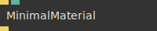
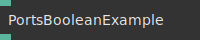
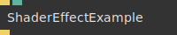
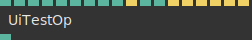

# Ops.Templates


```{=latex}
\OpsSubsubNoSubsectionNumbering\setcounter{subsubsection}{0}
```
### ExampleVizOp


**Full Name:** `Ops.Templates.ExampleVizOp`

example how to code a viz layer op.

**`\inputsymbol`{=latex} Inputs**

- **Number** (Number)

**Example:** [cables.gl/op/Ops.Templates.ExampleVizOp#example](https://cables.gl/op/Ops.Templates.ExampleVizOp#example)

**Doc:** [cables.gl/op/Ops.Templates.ExampleVizOp](https://cables.gl/op/Ops.Templates.ExampleVizOp)

### MinimalMaterial


**Full Name:** `Ops.Templates.MinimalMaterial`

Material Example Template.

**`\inputsymbol`{=latex} Inputs**

- **Render** (Trigger)
- **Red** (Number)

**`\outputsymbol`{=latex} Output**

- **Trigger** (Trigger)

**Example:** [cables.gl/edit/aySyci](https://cables.gl/edit/aySyci)

**Doc:** [cables.gl/op/Ops.Templates.MinimalMaterial](https://cables.gl/op/Ops.Templates.MinimalMaterial)

### PortsArrayExample


**Full Name:** `Ops.Templates.PortsArrayExample`

Is a template for creating Array ports.

**`\inputsymbol`{=latex} Inputs**

- **Array In** (Array)

**`\outputsymbol`{=latex} Output**

- **Array Out** (Array)

**Example:** [cables.gl/edit/rWJICn](https://cables.gl/edit/rWJICn)

**Doc:** [cables.gl/op/Ops.Templates.PortsArrayExample](https://cables.gl/op/Ops.Templates.PortsArrayExample)

### PortsBooleanExample


**Full Name:** `Ops.Templates.PortsBooleanExample`

Is a template for creating Boolean ports.

**`\inputsymbol`{=latex} Inputs**

- **Boolean In** (Number: Boolean)

**`\outputsymbol`{=latex} Output**

- **Boolean Out** (Number)

**Example:** [cables.gl/edit/rWJICn](https://cables.gl/edit/rWJICn)

**Doc:** [cables.gl/op/Ops.Templates.PortsBooleanExample](https://cables.gl/op/Ops.Templates.PortsBooleanExample)

### PortsObjectExample


**Full Name:** `Ops.Templates.PortsObjectExample`

Is a template for creating Object ports.

**`\inputsymbol`{=latex} Inputs**

- **Object In** (Object)

**`\outputsymbol`{=latex} Output**

- **Object Out** (Object)

**Example:** [cables.gl/edit/rWJICn](https://cables.gl/edit/rWJICn)

**Doc:** [cables.gl/op/Ops.Templates.PortsObjectExample](https://cables.gl/op/Ops.Templates.PortsObjectExample)

### PortsStringExample


**Full Name:** `Ops.Templates.PortsStringExample`

Is a template for creating String ports.

**`\inputsymbol`{=latex} Inputs**

- **String In** (String)

**`\outputsymbol`{=latex} Output**

- **String Out** (String)

**Example:** [cables.gl/edit/rWJICn](https://cables.gl/edit/rWJICn)

**Doc:** [cables.gl/op/Ops.Templates.PortsStringExample](https://cables.gl/op/Ops.Templates.PortsStringExample)

### PortsTriggerExample


**Full Name:** `Ops.Templates.PortsTriggerExample`

Is a template for creating Trigger ports.

**`\inputsymbol`{=latex} Inputs**

- **Trigger In** (Trigger)
- **Press Me** (Trigger)

**`\outputsymbol`{=latex} Output**

- **Trigger Out** (Trigger)

**Example:** [cables.gl/edit/rWJICn](https://cables.gl/edit/rWJICn)

**Doc:** [cables.gl/op/Ops.Templates.PortsTriggerExample](https://cables.gl/op/Ops.Templates.PortsTriggerExample)

### PortsValueExample


**Full Name:** `Ops.Templates.PortsValueExample`

Is a template for creating Value ports.

**`\inputsymbol`{=latex} Inputs**

- **Number In** (Number)

**`\outputsymbol`{=latex} Output**

- **Value Out** (Number)

**Example:** [cables.gl/edit/rWJICn](https://cables.gl/edit/rWJICn)

**Doc:** [cables.gl/op/Ops.Templates.PortsValueExample](https://cables.gl/op/Ops.Templates.PortsValueExample)

### ShaderEffectExample


**Full Name:** `Ops.Templates.ShaderEffectExample`

shader effect example template.

**`\inputsymbol`{=latex} Inputs**

- **Render** (Trigger)
- **Width** (Number)

**`\outputsymbol`{=latex} Output**

- **Next** (Trigger)

**Example:** [cables.gl/op/Ops.Templates.ShaderEffectExample#example](https://cables.gl/op/Ops.Templates.ShaderEffectExample#example)

**Doc:** [cables.gl/op/Ops.Templates.ShaderEffectExample](https://cables.gl/op/Ops.Templates.ShaderEffectExample)

### UiTestOp


**Full Name:** `Ops.Templates.UiTestOp`

UI indicators example op.

**`\inputsymbol`{=latex} Inputs**

- **Loading Task** (Number: Boolean)
- **Loading** (Number: Boolean)
- **Warning** (Number: Boolean)
- **Error** (Number: Boolean)
- **Hint** (Number: Boolean)
- **Not Working** (Number: Boolean)
- **Slider** (Number)
- **Gradient** (Number)
- **Resizable** (Number: Boolean)
- **Trigger** (Trigger)
- **Greyout** (Number: Boolean)
- **This Will Greyout** (Number)
- **Open Prompt** (Trigger)
- **Open Modal** (Trigger)
- **Open New Tab** (Trigger)

**`\outputsymbol`{=latex} Output**

- **Something** (Number)

**Example:** [cables.gl/edit/RUUacI](https://cables.gl/edit/RUUacI)

**Doc:** [cables.gl/op/Ops.Templates.UiTestOp](https://cables.gl/op/Ops.Templates.UiTestOp)


