# Ops.TimeLine


```{=latex}
\OpsSubsubNoSubsectionNumbering\setcounter{subsubsection}{0}
```
### Anim
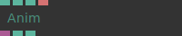

**Full Name:** `Ops.TimeLine.Anim`

timeline keyframable animation object.

**`\inputsymbol`{=latex} Inputs**

- **Value** (Number)
- **Clip** (Number: Boolean)
- **Clip Name** (String)

**`\outputsymbol`{=latex} Output**

- **Anim** (Object)
- **Loop Length** (Number)
- **Length** (Number)

**Example Patch:** [cables.gl/edit/sKguKJ](https://cables.gl/edit/sKguKJ)

**Doc:** [cables.gl/op/Ops.TimeLine.Anim](https://cables.gl/op/Ops.TimeLine.Anim)

### AnimGetKey
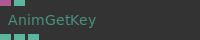

**Full Name:** `Ops.TimeLine.AnimGetKey`

Get data from a single key in an animation.

**`\inputsymbol`{=latex} Inputs**

- **Anim** (Object)
- **Time** (Number)

**`\outputsymbol`{=latex} Output**

- **Index** (Number)
- **Key Value** (Number)
- **Key Time** (Number)

**Example Patch:** [cables.gl/edit/gXgDz1](https://cables.gl/edit/gXgDz1)

**Doc:** [cables.gl/op/Ops.TimeLine.AnimGetKey](https://cables.gl/op/Ops.TimeLine.AnimGetKey)

### AnimGetValue
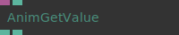

**Full Name:** `Ops.TimeLine.AnimGetValue`

get the animated value at time x of an animation object.

**`\inputsymbol`{=latex} Inputs**

- **Anim** (Object)
- **Time** (Number)

**`\outputsymbol`{=latex} Output**

- **Value** (Number)
- **Loop** (Number)

**Example Patch:** [cables.gl/edit/yEIpR1](https://cables.gl/edit/yEIpR1)

**Doc:** [cables.gl/op/Ops.TimeLine.AnimGetValue](https://cables.gl/op/Ops.TimeLine.AnimGetValue)

### AnimInfo


**Full Name:** `Ops.TimeLine.AnimInfo`

Get information about an anim object.

**`\inputsymbol`{=latex} Inputs**

- **Anim** (Object)

**`\outputsymbol`{=latex} Output**

- **Total Keys** (Number)
- **Length Seconds** (Number)

**Example Patch:** [cables.gl/op/Ops.TimeLine.AnimInfo#example](https://cables.gl/op/Ops.TimeLine.AnimInfo#example)

**Doc:** [cables.gl/op/Ops.TimeLine.AnimInfo](https://cables.gl/op/Ops.TimeLine.AnimInfo)

### AutoPlay


**Full Name:** `Ops.TimeLine.AutoPlay`

Automatically starts the timeline playback when opening patch.

**Example Patch:** [cables.gl/op/Ops.TimeLine.AutoPlay#example](https://cables.gl/op/Ops.TimeLine.AutoPlay#example)

**Doc:** [cables.gl/op/Ops.TimeLine.AutoPlay](https://cables.gl/op/Ops.TimeLine.AutoPlay)

### DemoPrerender
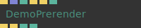

**Full Name:** `Ops.TimeLine.DemoPrerender`

Prerenderer based on timeline progress.

**`\inputsymbol`{=latex} Inputs**

- **Render** (Trigger)
- **Manual Timestamps** (Array)
- **Record Events** (Number: Boolean)
- **Reset** (Trigger)
- **Clear** (Trigger)
- **ReRender On Resize** (Number: Boolean)

**`\outputsymbol`{=latex} Output**

- **Next** (Trigger)
- **Prerendered Frame** (Trigger)
- **Progress** (Number)
- **Num Events** (Number)

**Example Patch:** [cables.gl/edit/sewM2h](https://cables.gl/edit/sewM2h)

**Doc:** [cables.gl/op/Ops.TimeLine.DemoPrerender](https://cables.gl/op/Ops.TimeLine.DemoPrerender)

### GotoFrame
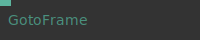

**Full Name:** `Ops.TimeLine.GotoFrame`

jump to a key in the timeline.

**`\inputsymbol`{=latex} Inputs**

- **Frame** (Number)

**Example Patch:** [cables.gl/op/Ops.TimeLine.GotoFrame#example](https://cables.gl/op/Ops.TimeLine.GotoFrame#example)

**Doc:** [cables.gl/op/Ops.TimeLine.GotoFrame](https://cables.gl/op/Ops.TimeLine.GotoFrame)

### PreRender
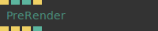

**Full Name:** `Ops.TimeLine.PreRender`

Render the patch at certain times.

**`\inputsymbol`{=latex} Inputs**

- **Render** (Trigger)
- **Max Time** (Number: Integer)
- **Step** (Number: Integer)
- **Reset** (Trigger)

**`\outputsymbol`{=latex} Output**

- **Next** (Trigger)
- **Render Progress** (Trigger)
- **Done** (Trigger)
- **Progress** (Number)

**Example Patch:** [cables.gl/op/Ops.TimeLine.PreRender#example](https://cables.gl/op/Ops.TimeLine.PreRender#example)

**Doc:** [cables.gl/op/Ops.TimeLine.PreRender](https://cables.gl/op/Ops.TimeLine.PreRender)

### TimelineConfig
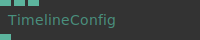

**Full Name:** `Ops.TimeLine.TimelineConfig`

configure the timeline for the current patch.

**`\inputsymbol`{=latex} Inputs**

- **FPS** (Number: Integer)
- **Restrict To Frames** (Number: Boolean)
- **Fade In Frames** (Number: Boolean)

**`\outputsymbol`{=latex} Output**

- **Duration Seconds** (Number)

**Example Patch:** [cables.gl/op/Ops.TimeLine.TimelineConfig#example](https://cables.gl/op/Ops.TimeLine.TimelineConfig#example)

**Doc:** [cables.gl/op/Ops.TimeLine.TimelineConfig](https://cables.gl/op/Ops.TimeLine.TimelineConfig)

### TimeLineControls
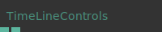

**Full Name:** `Ops.TimeLine.TimeLineControls`

use position and play pause state of cables timeline.

**`\outputsymbol`{=latex} Output**

- **Time** (Number)

**Example Patch:** [cables.gl/op/Ops.TimeLine.TimeLineControls#example](https://cables.gl/op/Ops.TimeLine.TimeLineControls#example)

**Doc:** [cables.gl/op/Ops.TimeLine.TimeLineControls](https://cables.gl/op/Ops.TimeLine.TimeLineControls)

### TimelineDebug
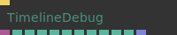

**Full Name:** `Ops.TimeLine.TimelineDebug`

*Visit [documentation](https://cables.gl/op/Ops.TimeLine.TimelineDebug) for details*.

**`\inputsymbol`{=latex} Inputs**

- **Update** (Trigger)

**`\outputsymbol`{=latex} Output**

- **Data** (Object)
- **Time Cursor** (Number)
- **Visible Duration** (Number)
- **Visible Time Start** (Number)
- **Loop Start** (Number)
- **Loop End** (Number)
- **Num Selected Keys** (Number)
- **Selected Values Min** (Number)
- **Selected Values Max** (Number)
- **Selected Times Min** (Number)
- **Selected Times Max** (Number)
- **Selected Keys** (Array)

**Example Patch:** [cables.gl/op/Ops.TimeLine.TimelineDebug#example](https://cables.gl/op/Ops.TimeLine.TimelineDebug#example)

**Doc:** [cables.gl/op/Ops.TimeLine.TimelineDebug](https://cables.gl/op/Ops.TimeLine.TimelineDebug)

### TimeLineFrame
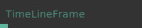

**Full Name:** `Ops.TimeLine.TimeLineFrame`

Returns the current frame number of the timeline.

**`\outputsymbol`{=latex} Output**

- **Time** (Number)

**Example Patch:** [cables.gl/op/Ops.TimeLine.TimeLineFrame#example](https://cables.gl/op/Ops.TimeLine.TimeLineFrame#example)

**Doc:** [cables.gl/op/Ops.TimeLine.TimeLineFrame](https://cables.gl/op/Ops.TimeLine.TimeLineFrame)

### TimeLineLength
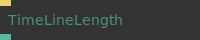

**Full Name:** `Ops.TimeLine.TimeLineLength`

current set length of the timeline.

**`\inputsymbol`{=latex} Inputs**

- **Update** (Trigger)

**`\outputsymbol`{=latex} Output**

- **Length** (Number)

**Example Patch:** [cables.gl/edit/qSMdck](https://cables.gl/edit/qSMdck)

**Doc:** [cables.gl/op/Ops.TimeLine.TimeLineLength](https://cables.gl/op/Ops.TimeLine.TimeLineLength)

### TimeLineLoop
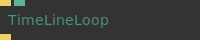

**Full Name:** `Ops.TimeLine.TimeLineLoop`

Automatic rewind of timeline at a certain time.

**`\inputsymbol`{=latex} Inputs**

- **Execute** (Trigger)
- **Duration** (Number)
- **How long the loop should be** (in seconds)

**`\outputsymbol`{=latex} Output**

- **Trigger** (Trigger)

**Example Patch:** [cables.gl/edit/GbEqL-](https://cables.gl/edit/GbEqL-)

**Doc:** [cables.gl/op/Ops.TimeLine.TimeLineLoop](https://cables.gl/op/Ops.TimeLine.TimeLineLoop)

### TimeLineOverwrite
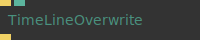

**Full Name:** `Ops.TimeLine.TimeLineOverwrite`

overwrite timeline time value.

**`\inputsymbol`{=latex} Inputs**

- **Exe** (Trigger)
- **New Time** (Number)

**`\outputsymbol`{=latex} Output**

- **Trigger** (Trigger)

**Example Patch:** [cables.gl/op/Ops.TimeLine.TimeLineOverwrite#example](https://cables.gl/op/Ops.TimeLine.TimeLineOverwrite#example)

**Doc:** [cables.gl/op/Ops.TimeLine.TimeLineOverwrite](https://cables.gl/op/Ops.TimeLine.TimeLineOverwrite)

### TimeLinePlay
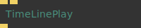

**Full Name:** `Ops.TimeLine.TimeLinePlay`

*Visit [documentation](https://cables.gl/op/Ops.TimeLine.TimeLinePlay) for details*.

**`\inputsymbol`{=latex} Inputs**

- **Play** (Trigger)
- **Pause** (Trigger)

**`\outputsymbol`{=latex} Output**

- **Next** (Trigger)

**Example Patch:** [cables.gl/edit/3F6DOe](https://cables.gl/edit/3F6DOe)

**Doc:** [cables.gl/op/Ops.TimeLine.TimeLinePlay](https://cables.gl/op/Ops.TimeLine.TimeLinePlay)

### TimeLinePlayer
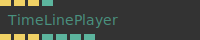

**Full Name:** `Ops.TimeLine.TimeLinePlayer`

Player controls for the timeline.

**`\inputsymbol`{=latex} Inputs**

- **Play** (Trigger)
- **Pause** (Trigger)
- **Rewind** (Trigger)
- **Set Current Time** (Number)

**`\outputsymbol`{=latex} Output**

- **Play Trigger** (Trigger)
- **Pause Trigger** (Trigger)
- **Rewind Trigger** (Trigger)
- **Is Playing** (booleanNumber)
- **Current Time** (Number)
- **Current Frame** (Number)
- **Current time in frames** (30fps)

**Example Patch:** [cables.gl/op/Ops.TimeLine.TimeLinePlayer#example](https://cables.gl/op/Ops.TimeLine.TimeLinePlayer#example)

**Doc:** [cables.gl/op/Ops.TimeLine.TimeLinePlayer](https://cables.gl/op/Ops.TimeLine.TimeLinePlayer)

### TimeLineRewind
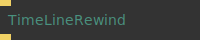

**Full Name:** `Ops.TimeLine.TimeLineRewind`

set time of timeline to 0 (rewind, restart).

**`\inputsymbol`{=latex} Inputs**

- **Exe** (Trigger)

**`\outputsymbol`{=latex} Output**

- **Next** (Trigger)

**Example Patch:** [cables.gl/edit/3F6DOe](https://cables.gl/edit/3F6DOe)

**Doc:** [cables.gl/op/Ops.TimeLine.TimeLineRewind](https://cables.gl/op/Ops.TimeLine.TimeLineRewind)

### TimeLineSetTime
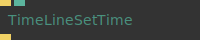

**Full Name:** `Ops.TimeLine.TimeLineSetTime`

set current time of timeline.

**`\inputsymbol`{=latex} Inputs**

- **Update** (Trigger)
- **Time** (Number)

**`\outputsymbol`{=latex} Output**

- **Next** (Trigger)

**Example Patch:** [cables.gl/edit/3F6DOe](https://cables.gl/edit/3F6DOe)

**Doc:** [cables.gl/op/Ops.TimeLine.TimeLineSetTime](https://cables.gl/op/Ops.TimeLine.TimeLineSetTime)

### TimeLineTime
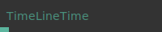

**Full Name:** `Ops.TimeLine.TimeLineTime`

Returns the current time of the timeline.

**`\outputsymbol`{=latex} Output**

- **Time** (Number)
- **The current time of the timeline** (in seconds)

**Example Patch:** [cables.gl/op/Ops.TimeLine.TimeLineTime#example](https://cables.gl/op/Ops.TimeLine.TimeLineTime#example)

**Doc:** [cables.gl/op/Ops.TimeLine.TimeLineTime](https://cables.gl/op/Ops.TimeLine.TimeLineTime)

### TimeLineTogglePlay
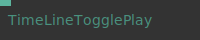

**Full Name:** `Ops.TimeLine.TimeLineTogglePlay`

toggle between timeline playing and being paused.

**`\inputsymbol`{=latex} Inputs**

- **Play** (Number: Boolean)
- **Public** (20): MY IDENTITY PATTERN

**Example Patch:** [cables.gl/op/Ops.TimeLine.TimeLineTogglePlay#example](https://cables.gl/op/Ops.TimeLine.TimeLineTogglePlay#example)

**Doc:** [cables.gl/op/Ops.TimeLine.TimeLineTogglePlay](https://cables.gl/op/Ops.TimeLine.TimeLineTogglePlay)

### TimelineValue
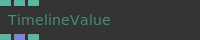

**Full Name:** `Ops.TimeLine.TimelineValue`

Animate and get value at "time" of timeline.

**`\inputsymbol`{=latex} Inputs**

- **Time** (Number)
- **Value** (Number)
- **Unit Index** (Number: Integer)

**`\outputsymbol`{=latex} Output**

- **Result** (Number)
- **Anim Array** (Array)
- **Anim Finished** (booleanNumber)

**Example Patch:** [cables.gl/edit/xAg8P6](https://cables.gl/edit/xAg8P6)

**Doc:** [cables.gl/op/Ops.TimeLine.TimelineValue](https://cables.gl/op/Ops.TimeLine.TimelineValue)


