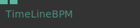
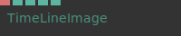

# Ops.TimeLine.Viz


```{=latex}
\OpsSubsubNoSubsectionNumbering\setcounter{subsubsection}{0}
```
### TimeLineBPM


**Full Name:** `Ops.TimeLine.Viz.TimeLineBPM`

Display current Beat index and BPM timing information as beat rectangles on the timeline.

**`\inputsymbol`{=latex} Inputs**

- **BPM** (Number)
- **Offset** (Number)

**Example Patch:** [cables.gl/edit/gpr6A1](https://cables.gl/edit/gpr6A1)

**Doc:** [cables.gl/op/Ops.TimeLine.Viz.TimeLineBPM](https://cables.gl/op/Ops.TimeLine.Viz.TimeLineBPM)

### TimeLineImage


**Full Name:** `Ops.TimeLine.Viz.TimeLineImage`

Display an image on the timeline.

**`\inputsymbol`{=latex} Inputs**

- **File** (String)
- **Slot** (Number: Integer)
- **Opacity** (Number)
- **Start** (Number)
- **End** (Number)

**Example Patch:** [cables.gl/edit/1DD6A1](https://cables.gl/edit/1DD6A1)

**Doc:** [cables.gl/op/Ops.TimeLine.Viz.TimeLineImage](https://cables.gl/op/Ops.TimeLine.Viz.TimeLineImage)


