# Ops.Trigger

---

```{=latex}
\OpsSubsubNoSubsectionNumbering\setcounter{subsubsection}{0}
```
### DelayedTrigger


**Full Name:** `Ops.Trigger.DelayedTrigger`

**Description:** delay triggering next port by x seconds

**`\inputsymbol`{=latex} Inputs**

- **Exe** (Trigger)
- **Delay** (Number)
- **Cancel** (Trigger)

**`\outputsymbol`{=latex} Output**

- **Next** (Trigger)
- **Delaying** (booleanNumber)

**Example Patch:** [Open in Editor](https://cables.gl/edit/VgtMji)

**Docs:** [https://cables.gl/op/Ops.Trigger.DelayedTrigger](https://cables.gl/op/Ops.Trigger.DelayedTrigger)

### GateTrigger
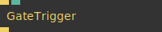

**Full Name:** `Ops.Trigger.GateTrigger`

**Description:** Allows a trigger to pass only if the gate is open

**`\inputsymbol`{=latex} Inputs**

- **Execute** (Trigger)
- **Pass Through** (Number: Boolean)

**`\outputsymbol`{=latex} Output**

- **Trigger Out** (Trigger)

**Example Patch:** [Open in Editor](https://cables.gl/edit/xotJAH)

**Docs:** [https://cables.gl/op/Ops.Trigger.GateTrigger](https://cables.gl/op/Ops.Trigger.GateTrigger)

### Interval
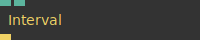

**Full Name:** `Ops.Trigger.Interval`

**Description:** Timed Trigger every x ms

**`\inputsymbol`{=latex} Inputs**

- **Interval** (Number)
- **Active** (Number: Boolean)

**`\outputsymbol`{=latex} Output**

- **Trigger** (Trigger)

**Example Patch:** [Open in Editor](https://cables.gl/edit/ZdvX7i)

**Docs:** [https://cables.gl/op/Ops.Trigger.Interval](https://cables.gl/op/Ops.Trigger.Interval)

### IsTriggered
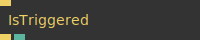

**Full Name:** `Ops.Trigger.IsTriggered`

**Description:** outputs true if being triggered last frame

**`\inputsymbol`{=latex} Inputs**

- **Trigger** (Trigger)

**`\outputsymbol`{=latex} Output**

- **Next** (Trigger)
- **Was Triggered** (Number)

**Example Patch:** [Open in Editor](https://cables.gl/edit/kmXCm6)

**Docs:** [https://cables.gl/op/Ops.Trigger.IsTriggered](https://cables.gl/op/Ops.Trigger.IsTriggered)

### NthTrigger_v2
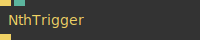

**Full Name:** `Ops.Trigger.NthTrigger_v2`

**Description:** Lets a trigger through every nth time (trigger limiter)

**`\inputsymbol`{=latex} Inputs**

- **Execute** (Trigger)
- **Nth** (Number)

**`\outputsymbol`{=latex} Output**

- **Next** (Trigger)

**Example Patch:** [Open in Editor](https://cables.gl/edit/cnVqii)

**Docs:** [https://cables.gl/op/Ops.Trigger.NthTrigger_v2](https://cables.gl/op/Ops.Trigger.NthTrigger_v2)

### NumberByTrigger
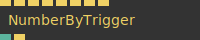

**Full Name:** `Ops.Trigger.NumberByTrigger`

**Description:** Outputs the last number of the input port which was triggered

**`\inputsymbol`{=latex} Inputs**

- *Visit [Ops.Trigger.NumberByTrigger documentation](https://cables.gl/op/Ops.Trigger.NumberByTrigger) for input port details*

**`\outputsymbol`{=latex} Output**

- **Number** (Number)
- **Triggered** (Trigger)

**Example Patch:** [Open in Editor](https://cables.gl/edit/kzTxsh)

**Docs:** [https://cables.gl/op/Ops.Trigger.NumberByTrigger](https://cables.gl/op/Ops.Trigger.NumberByTrigger)

### NumberByTriggerMultiPort_v2
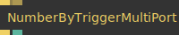

**Full Name:** `Ops.Trigger.NumberByTriggerMultiPort_v2`

**Description:** output a number by triggering an index port

**`\inputsymbol`{=latex} Inputs**

- **Trigger_0** (Trigger)
- **Add Port** (Trigger)

**`\outputsymbol`{=latex} Output**

- **Next** (Trigger)
- **Number Triggered** (Number)

**Example Patch:** [Open in Editor](https://cables.gl/edit/ubuysh)

**Docs:** [https://cables.gl/op/Ops.Trigger.NumberByTriggerMultiPort_v2](https://cables.gl/op/Ops.Trigger.NumberByTriggerMultiPort_v2)

### ProbabilityTrigger
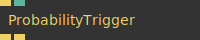

**Full Name:** `Ops.Trigger.ProbabilityTrigger`

**Description:** trigger by chance

**`\inputsymbol`{=latex} Inputs**

- **Trigger In** (Trigger)
- **Probability** (Number)

**`\outputsymbol`{=latex} Output**

- **Trigger Output** (Trigger)
- **Inverse Trigger Output** (Trigger)

**Example Patch:** [Open in Editor](https://cables.gl/edit/I61CCu)

**Docs:** [https://cables.gl/op/Ops.Trigger.ProbabilityTrigger](https://cables.gl/op/Ops.Trigger.ProbabilityTrigger)

### RandomTrigger
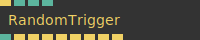

**Full Name:** `Ops.Trigger.RandomTrigger`

**Description:** randomly trigger

**`\inputsymbol`{=latex} Inputs**

- **Render** (Trigger)
- **Num Times** (Number)
- **Seed** (Number)
- **Only Once** (Number: Boolean)

**`\outputsymbol`{=latex} Output**

- **Render** (Trigger)
- **Num Times** (Number)
- **Seed** (Number)
- **Only Once** (Number: Boolean)
- **Index** (Number)
- **Trigger 0** (Trigger)
- **Trigger 1** (Trigger)
- **Trigger 2** (Trigger)
- **Trigger 3** (Trigger)
- **Trigger 4** (Trigger)
- **Trigger 5** (Trigger)
- **Trigger 6** (Trigger)
- **Trigger 7** (Trigger)

**Example Patch:** [Open in Editor](https://cables.gl/edit/3P54t7)

**Docs:** [https://cables.gl/op/Ops.Trigger.RandomTrigger](https://cables.gl/op/Ops.Trigger.RandomTrigger)

### Repeat2d


**Full Name:** `Ops.Trigger.Repeat2d`

**Description:** Triggers all ops underneath Num X * Num Y times

**`\inputsymbol`{=latex} Inputs**

- **Exe** (Trigger)
- **Num X** (Number: Integer)
- **Num Y** (Number: Integer)
- **Mul** (Number)
- **Center** (Number: Boolean)
- **Centers X and Y around the origin** (0/0)

**`\outputsymbol`{=latex} Output**

- **Trigger** (Trigger)
- **X** (Number)
- **Y** (Number)
- **Index** (Number)
- **Total Iterations** (Number)

**Example Patch:** [Open in Editor](https://cables.gl/edit/lPZfgg)

**Docs:** [https://cables.gl/op/Ops.Trigger.Repeat2d](https://cables.gl/op/Ops.Trigger.Repeat2d)

### Repeat_v2
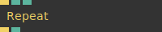

**Full Name:** `Ops.Trigger.Repeat_v2`

**Description:** Triggers all ops below x times (for loop / while)

**`\inputsymbol`{=latex} Inputs**

- **Execute** (Trigger)
- **Repeats** (Number: Integer)

**`\outputsymbol`{=latex} Output**

- **Next** (Trigger)
- **Index** (Number)

**Example Patch:** [Open in Editor](https://cables.gl/edit/VFAfgg)

**Docs:** [https://cables.gl/op/Ops.Trigger.Repeat_v2](https://cables.gl/op/Ops.Trigger.Repeat_v2)

### RouteTrigger


**Full Name:** `Ops.Trigger.RouteTrigger`

**Description:** Triggers one of the out ports - value index switch case (was SwitchTrigger)

**`\inputsymbol`{=latex} Inputs**

- **Execute** (Trigger)
- **Switch Value** (Number: Integer)

**`\outputsymbol`{=latex} Output**

- **Next Trigger** (Trigger)
- **Switched Value** (Number)
- **Trigger 0** (Trigger)
- **Trigger 1** (Trigger)
- **Trigger 2** (Trigger)
- **Trigger 3** (Trigger)
- **Trigger 4** (Trigger)
- **Trigger 5** (Trigger)
- **Trigger 6** (Trigger)
- **Trigger 7** (Trigger)
- **Trigger 8** (Trigger)
- **Trigger 9** (Trigger)
- **Trigger 10** (Trigger)
- **Trigger 11** (Trigger)
- **Trigger 12** (Trigger)
- **Trigger 13** (Trigger)
- **Trigger 14** (Trigger)
- **Trigger 15** (Trigger)
- **Trigger 16** (Trigger)
- **Trigger 17** (Trigger)
- **Trigger 18** (Trigger)
- **Trigger 19** (Trigger)
- **Trigger 20** (Trigger)
- **Trigger 21** (Trigger)
- **Trigger 22** (Trigger)
- **Trigger 23** (Trigger)
- **Default Trigger** (Trigger)
- **Highest Index** (Number)

**Example Patch:** [Open in Editor](https://cables.gl/edit/DzH9S5)

**Docs:** [https://cables.gl/op/Ops.Trigger.RouteTrigger](https://cables.gl/op/Ops.Trigger.RouteTrigger)

### RouteTriggerAnimated
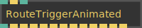

**Full Name:** `Ops.Trigger.RouteTriggerAnimated`

**Description:** animated switching between things

**`\inputsymbol`{=latex} Inputs**

- **Index** (Number: Integer)
- **Exe** (Trigger)
- **Duration** (Number)

**`\outputsymbol`{=latex} Output**

- **Qutsn94pc** (Trigger)
- **Hvyzlh9o8** (Trigger)
- **T8dvyjuoq** (Trigger)
- **A0w7orgi8** (Trigger)
- **R8h4qx4z8** (Trigger)
- **Cr80a86xi** (Trigger)

**Example Patch:** [Open in Editor](https://cables.gl/edit/pUtH15)

**Docs:** [https://cables.gl/op/Ops.Trigger.RouteTriggerAnimated](https://cables.gl/op/Ops.Trigger.RouteTriggerAnimated)

### RouteTriggerMultiPort_v2
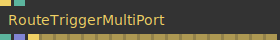

**Full Name:** `Ops.Trigger.RouteTriggerMultiPort_v2`

**Description:** Triggers one of the - value index switch case

**`\inputsymbol`{=latex} Inputs**

- **Execute** (Trigger)
- **Switch Value** (Number: Integer)

**`\outputsymbol`{=latex} Output**

- **Execute** (Trigger)
- **Switch Value** (Number: Integer)
- **Total Connections** (Number)
- **Connected Op Names** (Array)
- **Trigger_0** (Trigger)
- **Trigger_1** (Trigger)
- **Trigger_2** (Trigger)
- **Trigger_3** (Trigger)
- **Trigger_4** (Trigger)
- **Trigger_5** (Trigger)
- **Trigger_6** (Trigger)
- **Trigger_7** (Trigger)
- **Trigger_8** (Trigger)
- **Trigger_9** (Trigger)
- **Trigger_10** (Trigger)
- **Trigger_11** (Trigger)
- **Trigger_12** (Trigger)
- **Trigger_13** (Trigger)
- **Trigger_14** (Trigger)
- **Trigger_15** (Trigger)
- **Trigger_16** (Trigger)
- **Trigger_17** (Trigger)

**Example Patch:** [Open in Editor](https://cables.gl/edit/NxGysh)

**Docs:** [https://cables.gl/op/Ops.Trigger.RouteTriggerMultiPort_v2](https://cables.gl/op/Ops.Trigger.RouteTriggerMultiPort_v2)

### RouteTriggerString_v2
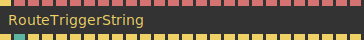

**Full Name:** `Ops.Trigger.RouteTriggerString_v2`

**Description:** route trigger output by string

**`\inputsymbol`{=latex} Inputs**

- **Execute** (Trigger)
- **Switch Value** (String)
- **String 0** (String)
- **String 1** (String)
- **String 2** (String)
- **String 3** (String)
- **String 4** (String)
- **String 5** (String)
- **String 6** (String)
- **String 7** (String)
- **String 8** (String)
- **String 9** (String)
- **String 10** (String)
- **String 11** (String)
- **String 12** (String)
- **String 13** (String)
- **String 14** (String)
- **String 15** (String)
- **String 16** (String)
- **String 17** (String)
- **String 18** (String)
- **String 19** (String)
- **String 20** (String)
- **String 21** (String)
- **String 22** (String)
- **String 23** (String)

**`\outputsymbol`{=latex} Output**

- **Next Trigger** (Trigger)
- **Switched Index** (Number)
- **Trigger 0** (Trigger)
- **Trigger 1** (Trigger)
- **Trigger 2** (Trigger)
- **Trigger 3** (Trigger)
- **Trigger 4** (Trigger)
- **Trigger 5** (Trigger)
- **Trigger 6** (Trigger)
- **Trigger 7** (Trigger)
- **Trigger 8** (Trigger)
- **Trigger 9** (Trigger)
- **Trigger 10** (Trigger)
- **Trigger 11** (Trigger)
- **Trigger 12** (Trigger)
- **Trigger 13** (Trigger)
- **Trigger 14** (Trigger)
- **Trigger 15** (Trigger)
- **Trigger 16** (Trigger)
- **Trigger 17** (Trigger)
- **Trigger 18** (Trigger)
- **Trigger 19** (Trigger)
- **Trigger 20** (Trigger)
- **Trigger 21** (Trigger)
- **Trigger 22** (Trigger)
- **Trigger 23** (Trigger)

**Example Patch:** [Open in Editor](https://cables.gl/edit/8uTjhI)

**Docs:** [https://cables.gl/op/Ops.Trigger.RouteTriggerString_v2](https://cables.gl/op/Ops.Trigger.RouteTriggerString_v2)

### Sequence
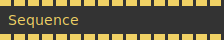

**Full Name:** `Ops.Trigger.Sequence`

**Description:** control the order of execution/triggering

**`\inputsymbol`{=latex} Inputs**

- **Exe** (Trigger)
- **Exe 0** (Trigger)
- **Exe 1** (Trigger)
- **Exe 2** (Trigger)
- **Exe 3** (Trigger)
- **Exe 4** (Trigger)
- **Exe 5** (Trigger)
- **Exe 6** (Trigger)
- **Exe 7** (Trigger)
- **Exe 8** (Trigger)
- **Exe 9** (Trigger)
- **Exe 10** (Trigger)
- **Exe 11** (Trigger)
- **Exe 12** (Trigger)
- **Exe 13** (Trigger)
- **Exe 14** (Trigger)

**`\outputsymbol`{=latex} Output**

- **Trigger 0** (Trigger)
- **Trigger 1** (Trigger)
- **Trigger 2** (Trigger)
- **Trigger 3** (Trigger)
- **Trigger 4** (Trigger)
- **Trigger 5** (Trigger)
- **Trigger 6** (Trigger)
- **Trigger 7** (Trigger)
- **Trigger 8** (Trigger)
- **Trigger 9** (Trigger)
- **Trigger 10** (Trigger)
- **Trigger 11** (Trigger)
- **Trigger 12** (Trigger)
- **Trigger 13** (Trigger)
- **Trigger 14** (Trigger)
- **Trigger 15** (Trigger)

**Example Patch:** [Open in Editor](https://cables.gl/edit/0bQrii)

**Docs:** [https://cables.gl/op/Ops.Trigger.Sequence](https://cables.gl/op/Ops.Trigger.Sequence)

### SequenceMultiPort_v2
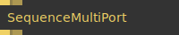

**Full Name:** `Ops.Trigger.SequenceMultiPort_v2`

**Description:** sequence trigger

**`\inputsymbol`{=latex} Inputs**

- **Input_0** (Trigger)
- **Add Port** (Trigger)

**`\outputsymbol`{=latex} Output**

- **Output_0** (Trigger)
- **Output_1** (Trigger)

**Example Patch:** [Open in Editor](https://cables.gl/edit/F5L0sh)

**Docs:** [https://cables.gl/op/Ops.Trigger.SequenceMultiPort_v2](https://cables.gl/op/Ops.Trigger.SequenceMultiPort_v2)

### SwitchTrigger
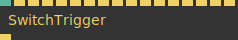

**Full Name:** `Ops.Trigger.SwitchTrigger`

**Description:** route input triggers by index to one output

**`\inputsymbol`{=latex} Inputs**

- **Trigger Index** (Number: Integer)
- **Trigger In 0** (Trigger)
- **Trigger In 1** (Trigger)
- **Trigger In 2** (Trigger)
- **Trigger In 3** (Trigger)
- **Trigger In 4** (Trigger)
- **Trigger In 5** (Trigger)
- **Trigger In 6** (Trigger)
- **Trigger In 7** (Trigger)
- **Trigger In 8** (Trigger)
- **Trigger In 9** (Trigger)
- **Trigger In 10** (Trigger)
- **Trigger In 11** (Trigger)
- **Trigger In 12** (Trigger)
- **Trigger In 13** (Trigger)
- **Trigger In 14** (Trigger)
- **Trigger In 15** (Trigger)

**`\outputsymbol`{=latex} Output**

- **Trigger Out** (Trigger)

**Example Patch:** [Open in Editor](https://cables.gl/edit/upF4rn)

**Docs:** [https://cables.gl/op/Ops.Trigger.SwitchTrigger](https://cables.gl/op/Ops.Trigger.SwitchTrigger)

### Threshold
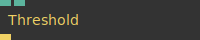

**Full Name:** `Ops.Trigger.Threshold`

**Description:** Triggers only once when threshold is crossed

**`\inputsymbol`{=latex} Inputs**

- **Threshold** (Number)

**`\outputsymbol`{=latex} Output**

- *Visit [Ops.Trigger.Threshold documentation](https://cables.gl/op/Ops.Trigger.Threshold) for output port details*

**Example Patch:** [Open in Editor](https://cables.gl/edit/pG-Mwq)

**Docs:** [https://cables.gl/op/Ops.Trigger.Threshold](https://cables.gl/op/Ops.Trigger.Threshold)

### TimedSequence


**Full Name:** `Ops.Trigger.TimedSequence`

**Description:** timed switching of trigger

**`\inputsymbol`{=latex} Inputs**

- **Exe** (Trigger)
- **Current** (Number: Integer)
- **OverwriteTime** (Number: Boolean)
- **IgnoreInSubPatch** (Number: Boolean)

**`\outputsymbol`{=latex} Output**

- **TriggerAlways** (Trigger)
- **Names** (Array)
- **CurrentKeyTime** (Number)
- **Current** (Number)
- **Trigger 0** (Trigger)
- **Trigger 1** (Trigger)
- **Trigger 2** (Trigger)
- **Trigger 3** (Trigger)
- **Trigger 4** (Trigger)
- **Trigger 5** (Trigger)
- **Trigger 6** (Trigger)
- **Trigger 7** (Trigger)
- **Trigger 8** (Trigger)
- **Trigger 9** (Trigger)
- **Trigger 10** (Trigger)
- **Trigger 11** (Trigger)
- **Trigger 12** (Trigger)
- **Trigger 13** (Trigger)
- **Trigger 14** (Trigger)
- **Trigger 15** (Trigger)
- **Trigger 16** (Trigger)
- **Trigger 17** (Trigger)
- **Trigger 18** (Trigger)
- **Trigger 19** (Trigger)
- **Trigger 20** (Trigger)
- **Trigger 21** (Trigger)
- **Trigger 22** (Trigger)
- **Trigger 23** (Trigger)
- **Trigger 24** (Trigger)
- **Trigger 25** (Trigger)
- **Trigger 26** (Trigger)
- **Trigger 27** (Trigger)
- **Trigger 28** (Trigger)
- **Trigger 29** (Trigger)
- **Trigger 30** (Trigger)
- **Trigger 31** (Trigger)

**Example Patch:** [Open in Editor](https://cables.gl/edit/GbEqL-)

**Docs:** [https://cables.gl/op/Ops.Trigger.TimedSequence](https://cables.gl/op/Ops.Trigger.TimedSequence)

### TimeSinceTrigger
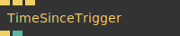

**Full Name:** `Ops.Trigger.TimeSinceTrigger`

**Description:** Get the time since last trigger

**`\inputsymbol`{=latex} Inputs**

- **Exe** (Trigger)
- **Trigger** (Trigger)
- **Reset** (Trigger)

**`\outputsymbol`{=latex} Output**

- **Next** (Trigger)
- **Time** (Number)

**Example Patch:** [Open in Editor](https://cables.gl/edit/fCN_98)

**Docs:** [https://cables.gl/op/Ops.Trigger.TimeSinceTrigger](https://cables.gl/op/Ops.Trigger.TimeSinceTrigger)

### TriggerButton
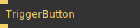

**Full Name:** `Ops.Trigger.TriggerButton`

**Description:** simple button to trigger manually

**`\inputsymbol`{=latex} Inputs**

- **Trigger** (Trigger)

**`\outputsymbol`{=latex} Output**

- **Next** (Trigger)

**Example Patch:** [Open in Editor](https://cables.gl/edit/05Arii)

**Docs:** [https://cables.gl/op/Ops.Trigger.TriggerButton](https://cables.gl/op/Ops.Trigger.TriggerButton)

### TriggerCounter
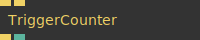

**Full Name:** `Ops.Trigger.TriggerCounter`

**Description:** Counts how often the port was triggered

**`\inputsymbol`{=latex} Inputs**

- **Exe** (Trigger)
- **Reset** (Trigger)

**`\outputsymbol`{=latex} Output**

- **Trigger** (Trigger)
- **TimesTriggered** (Number)

**Example Patch:** [Open in Editor](https://cables.gl/edit/WNh8pc)

**Docs:** [https://cables.gl/op/Ops.Trigger.TriggerCounter](https://cables.gl/op/Ops.Trigger.TriggerCounter)

### TriggerCounterLoop
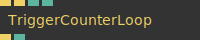

**Full Name:** `Ops.Trigger.TriggerCounterLoop`

**Description:** Increments with each trigger and loops depending on min and max loop values.

**`\inputsymbol`{=latex} Inputs**

- **Trigger In** (Trigger)
- **Reset** (Trigger)
- **Loop Min** (Number: Integer)
- **Loop Max** (Number: Integer)

**`\outputsymbol`{=latex} Output**

- **Trigger Out** (Trigger)
- **Current Count** (Number)

**Example Patch:** [Open in Editor](https://cables.gl/edit/V8TekF)

**Docs:** [https://cables.gl/op/Ops.Trigger.TriggerCounterLoop](https://cables.gl/op/Ops.Trigger.TriggerCounterLoop)

### TriggerDistributeByValue
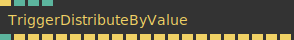

**Full Name:** `Ops.Trigger.TriggerDistributeByValue`

**Description:** triggers evenly distributed by value

**`\inputsymbol`{=latex} Inputs**

- **Exe** (Trigger)
- **Number** (Number)
- **Max** (Number)
- **Num Outputs** (Number)

**`\outputsymbol`{=latex} Output**

- **Num** (Number)
- **Trigger 0** (Trigger)
- **Trigger 1** (Trigger)
- **Trigger 2** (Trigger)
- **Trigger 3** (Trigger)
- **Trigger 4** (Trigger)
- **Trigger 5** (Trigger)
- **Trigger 6** (Trigger)
- **Trigger 7** (Trigger)
- **Trigger 8** (Trigger)
- **Trigger 9** (Trigger)
- **Trigger 10** (Trigger)
- **Trigger 11** (Trigger)
- **Trigger 12** (Trigger)
- **Trigger 13** (Trigger)
- **Trigger 14** (Trigger)
- **Trigger 15** (Trigger)
- **Trigger 16** (Trigger)
- **Trigger 17** (Trigger)
- **Trigger 18** (Trigger)
- **Trigger 19** (Trigger)

**Example Patch:** [Open in Editor](https://cables.gl/edit/FsZFVB)

**Docs:** [https://cables.gl/op/Ops.Trigger.TriggerDistributeByValue](https://cables.gl/op/Ops.Trigger.TriggerDistributeByValue)

### TriggerExtender
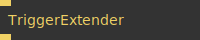

**Full Name:** `Ops.Trigger.TriggerExtender`

**Description:** Extends a trigger (useful in big patches for better overview)

**`\inputsymbol`{=latex} Inputs**

- **Execute** (Trigger)

**`\outputsymbol`{=latex} Output**

- **Next** (Trigger)

**Example Patch:** [Open in Editor](https://cables.gl/edit/mDiCq6)

**Docs:** [https://cables.gl/op/Ops.Trigger.TriggerExtender](https://cables.gl/op/Ops.Trigger.TriggerExtender)

### TriggerIfDecreased
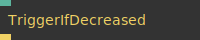

**Full Name:** `Ops.Trigger.TriggerIfDecreased`

**Description:** trigger if a value decreases / gets smaller

**`\inputsymbol`{=latex} Inputs**

- **Value** (Number)

**`\outputsymbol`{=latex} Output**

- **Trigger** (Trigger)

**Example Patch:** [Open in Editor](https://cables.gl/edit/AFiCfe)

**Docs:** [https://cables.gl/op/Ops.Trigger.TriggerIfDecreased](https://cables.gl/op/Ops.Trigger.TriggerIfDecreased)

### TriggerIfIncreased
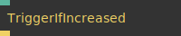

**Full Name:** `Ops.Trigger.TriggerIfIncreased`

**Description:** Outputs a trigger if the value of a number increases

**`\inputsymbol`{=latex} Inputs**

- **Value** (Number)

**`\outputsymbol`{=latex} Output**

- **Trigger** (Trigger)

**Example Patch:** [Open in Editor](https://cables.gl/edit/AFiCfe)

**Docs:** [https://cables.gl/op/Ops.Trigger.TriggerIfIncreased](https://cables.gl/op/Ops.Trigger.TriggerIfIncreased)

### TriggerLimiter
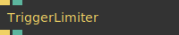

**Full Name:** `Ops.Trigger.TriggerLimiter`

**Description:** Limits how often a trigger goes through to x ms

**`\inputsymbol`{=latex} Inputs**

- **In Trigger** (Trigger)
- **Milliseconds** (Number)

**`\outputsymbol`{=latex} Output**

- **Out Trigger** (Trigger)
- **Progress** (Number)

**Example Patch:** [Open in Editor](https://cables.gl/edit/dS8EQm)

**Docs:** [https://cables.gl/op/Ops.Trigger.TriggerLimiter](https://cables.gl/op/Ops.Trigger.TriggerLimiter)

### TriggerNumber
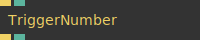

**Full Name:** `Ops.Trigger.TriggerNumber`

**Description:** Outputs a number when triggered

**`\inputsymbol`{=latex} Inputs**

- **Set** (Trigger)
- **Number** (Number)

**`\outputsymbol`{=latex} Output**

- **Next** (Trigger)
- **Out Value** (Number)

**Example Patch:** [Open in Editor](https://cables.gl/edit/Qq3Y7i)

**Docs:** [https://cables.gl/op/Ops.Trigger.TriggerNumber](https://cables.gl/op/Ops.Trigger.TriggerNumber)

### TriggerOnce
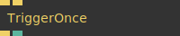

**Full Name:** `Ops.Trigger.TriggerOnce`

**Description:** Trigger the following children once

**`\inputsymbol`{=latex} Inputs**

- **Exec** (Trigger)
- **Reset** (Trigger)

**`\outputsymbol`{=latex} Output**

- **Next** (Trigger)
- **Was Triggered** (Number)

**Example Patch:** [Open in Editor](https://cables.gl/edit/9Eiyci)

**Docs:** [https://cables.gl/op/Ops.Trigger.TriggerOnce](https://cables.gl/op/Ops.Trigger.TriggerOnce)

### TriggerOnChangeArray_v2
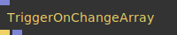

**Full Name:** `Ops.Trigger.TriggerOnChangeArray_v2`

**Description:** triggers when array has changed

**`\inputsymbol`{=latex} Inputs**

- **Array** (Array)

**`\outputsymbol`{=latex} Output**

- **Changed** (Trigger)
- **Result** (Array)

**Example Patch:** [Open in Editor](https://cables.gl/op/Ops.Trigger.TriggerOnChangeArray_v2#example)

**Docs:** [https://cables.gl/op/Ops.Trigger.TriggerOnChangeArray_v2](https://cables.gl/op/Ops.Trigger.TriggerOnChangeArray_v2)

### TriggerOnChangeObject_v2
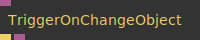

**Full Name:** `Ops.Trigger.TriggerOnChangeObject_v2`

**Description:** triggers when Object has changed

**`\inputsymbol`{=latex} Inputs**

- **Object** (Object)

**`\outputsymbol`{=latex} Output**

- **Changed** (Trigger)
- **Result** (Object)

**Example Patch:** [Open in Editor](https://cables.gl/op/Ops.Trigger.TriggerOnChangeObject_v2#example)

**Docs:** [https://cables.gl/op/Ops.Trigger.TriggerOnChangeObject_v2](https://cables.gl/op/Ops.Trigger.TriggerOnChangeObject_v2)

### TriggerOnChangeString_v2
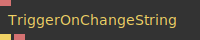

**Full Name:** `Ops.Trigger.TriggerOnChangeString_v2`

**Description:** triggers when string has changed

**`\inputsymbol`{=latex} Inputs**

- **String** (String)

**`\outputsymbol`{=latex} Output**

- **Changed** (Trigger)
- **Result** (String)

**Example Patch:** [Open in Editor](https://cables.gl/edit/ohxBci)

**Docs:** [https://cables.gl/op/Ops.Trigger.TriggerOnChangeString_v2](https://cables.gl/op/Ops.Trigger.TriggerOnChangeString_v2)

### TriggerOnChangeTexture
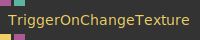

**Full Name:** `Ops.Trigger.TriggerOnChangeTexture`

**Description:** triggers when texture has changed

**`\inputsymbol`{=latex} Inputs**

- **Texture** (Object:Texture)

**`\outputsymbol`{=latex} Output**

- **Changed** (Trigger)
- **Result** (Object)

**Example Patch:** [Open in Editor](https://cables.gl/edit/QGqQ7f)

**Docs:** [https://cables.gl/op/Ops.Trigger.TriggerOnChangeTexture](https://cables.gl/op/Ops.Trigger.TriggerOnChangeTexture)

### TriggerReceive


**Full Name:** `Ops.Trigger.TriggerReceive`

**Description:** Receives triggers from a TriggerSend op with the same variable name

**`\inputsymbol`{=latex} Inputs**

- *Visit [Ops.Trigger.TriggerReceive documentation](https://cables.gl/op/Ops.Trigger.TriggerReceive) for input port details*

**`\outputsymbol`{=latex} Output**

- **Triggered** (Trigger)

**Example Patch:** [Open in Editor](https://cables.gl/edit/hrXVpH)

**Docs:** [https://cables.gl/op/Ops.Trigger.TriggerReceive](https://cables.gl/op/Ops.Trigger.TriggerReceive)

### TriggerReceiveFilter
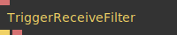

**Full Name:** `Ops.Trigger.TriggerReceiveFilter`

**Description:** receives all named trigges and relays them, optionally using a filter-prefix on the name

**`\inputsymbol`{=latex} Inputs**

- **Prefix** (String)

**`\outputsymbol`{=latex} Output**

- **Trigger Out** (Trigger)
- **Trigger Name** (String)

**Example Patch:** [Open in Editor](https://cables.gl/edit/niHmJt)

**Docs:** [https://cables.gl/op/Ops.Trigger.TriggerReceiveFilter](https://cables.gl/op/Ops.Trigger.TriggerReceiveFilter)

### TriggerSend
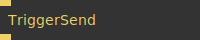

**Full Name:** `Ops.Trigger.TriggerSend`

**Description:** Allows triggers to be sent to a TriggerReceive op with the same variable name

**`\inputsymbol`{=latex} Inputs**

- **Trigger** (Trigger)

**`\outputsymbol`{=latex} Output**

- **Next** (Trigger)

**Example Patch:** [Open in Editor](https://cables.gl/edit/hrXVpH)

**Docs:** [https://cables.gl/op/Ops.Trigger.TriggerSend](https://cables.gl/op/Ops.Trigger.TriggerSend)

### TriggerSendNamed
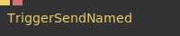

**Full Name:** `Ops.Trigger.TriggerSendNamed`

**Description:** Allows triggers to be sent to a TriggerReceive op with the same variable name

**`\inputsymbol`{=latex} Inputs**

- **Trigger** (Trigger)
- **Named Trigger** (String)

**`\outputsymbol`{=latex} Output**

- *Visit [Ops.Trigger.TriggerSendNamed documentation](https://cables.gl/op/Ops.Trigger.TriggerSendNamed) for output port details*

**Example Patch:** [Open in Editor](https://cables.gl/edit/Tc3pcI)

**Docs:** [https://cables.gl/op/Ops.Trigger.TriggerSendNamed](https://cables.gl/op/Ops.Trigger.TriggerSendNamed)

### TriggersPerSecond
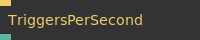

**Full Name:** `Ops.Trigger.TriggersPerSecond`

**Description:** Counts how often the port is triggered per second

**`\inputsymbol`{=latex} Inputs**

- **Exe** (Trigger)

**`\outputsymbol`{=latex} Output**

- **Cps** (Number)

**Example Patch:** [Open in Editor](https://cables.gl/edit/JCkpVJ)

**Docs:** [https://cables.gl/op/Ops.Trigger.TriggersPerSecond](https://cables.gl/op/Ops.Trigger.TriggersPerSecond)

### TriggerString
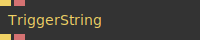

**Full Name:** `Ops.Trigger.TriggerString`

**Description:** trigger a string

**`\inputsymbol`{=latex} Inputs**

- **Trigger** (Trigger)
- **String** (String)

**`\outputsymbol`{=latex} Output**

- **Next** (Trigger)
- **Result** (String)

**Example Patch:** [Open in Editor](https://cables.gl/edit/VHsHue)

**Docs:** [https://cables.gl/op/Ops.Trigger.TriggerString](https://cables.gl/op/Ops.Trigger.TriggerString)

### ValueBecameZeroTrigger
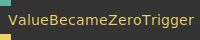

**Full Name:** `Ops.Trigger.ValueBecameZeroTrigger`

**Description:** Triggers when the input value became zero

**`\inputsymbol`{=latex} Inputs**

- **Value** (Number)

**`\outputsymbol`{=latex} Output**

- **Became Zero Trigger** (Trigger)

**Example Patch:** [Open in Editor](https://cables.gl/op/Ops.Trigger.ValueBecameZeroTrigger#example)

**Docs:** [https://cables.gl/op/Ops.Trigger.ValueBecameZeroTrigger](https://cables.gl/op/Ops.Trigger.ValueBecameZeroTrigger)


