# Ops.Ui

---

```{=latex}
\OpsSubsubNoSubsectionNumbering\setcounter{subsubsection}{0}
```
### Area
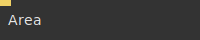

**Full Name:** `Ops.Ui.Area`

**Description:** Organize and group your patch operators

**`\inputsymbol`{=latex} Inputs**

- **Delete** (Trigger)

**`\outputsymbol`{=latex} Output**

- *Visit [Ops.Ui.Area documentation](https://cables.gl/op/Ops.Ui.Area) for output port details*

**Example Patch:** [Open in Editor](https://cables.gl/edit/ozgnnR)

**Docs:** [https://cables.gl/op/Ops.Ui.Area](https://cables.gl/op/Ops.Ui.Area)

### CablesEditorEvents
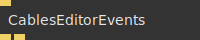

**Full Name:** `Ops.Ui.CablesEditorEvents`

**Description:** Cables UI Event Triggers

**`\inputsymbol`{=latex} Inputs**

- **Set Changed Patch** (Trigger)

**`\outputsymbol`{=latex} Output**

- **Saving Patch** (Trigger)
- **PortValueEdited** (Trigger)

**Example Patch:** [Open in Editor](https://cables.gl/edit/gdbdQc)

**Docs:** [https://cables.gl/op/Ops.Ui.CablesEditorEvents](https://cables.gl/op/Ops.Ui.CablesEditorEvents)

### Comment_v2


**Full Name:** `Ops.Ui.Comment_v2`

**Description:** Displays a comment in the patch area

**`\inputsymbol`{=latex} Inputs**

- *Visit [Ops.Ui.Comment_v2 documentation](https://cables.gl/op/Ops.Ui.Comment_v2) for input port details*

**`\outputsymbol`{=latex} Output**

- *Visit [Ops.Ui.Comment_v2 documentation](https://cables.gl/op/Ops.Ui.Comment_v2) for output port details*

**Example Patch:** [Open in Editor](https://cables.gl/edit/7Tyqii)

**Docs:** [https://cables.gl/op/Ops.Ui.Comment_v2](https://cables.gl/op/Ops.Ui.Comment_v2)

### GetCablesDefaultTheme
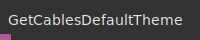

**Full Name:** `Ops.Ui.GetCablesDefaultTheme`

**Description:** Get the default theme colors of the cables editor

**`\inputsymbol`{=latex} Inputs**

- *Visit [Ops.Ui.GetCablesDefaultTheme documentation](https://cables.gl/op/Ops.Ui.GetCablesDefaultTheme) for input port details*

**`\outputsymbol`{=latex} Output**

- **Theme** (Object)

**Example Patch:** [Open in Editor](https://cables.gl/edit/Kq8Pq1)

**Docs:** [https://cables.gl/op/Ops.Ui.GetCablesDefaultTheme](https://cables.gl/op/Ops.Ui.GetCablesDefaultTheme)

### MaximizeRenderer
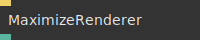

**Full Name:** `Ops.Ui.MaximizeRenderer`

**Description:** maximize renderer to window size

**`\inputsymbol`{=latex} Inputs**

- **Toggle Maximized** (Trigger)

**`\outputsymbol`{=latex} Output**

- **Maximized** (booleanNumber)

**Example Patch:** [Open in Editor](https://cables.gl/edit/BaFBnO)

**Docs:** [https://cables.gl/op/Ops.Ui.MaximizeRenderer](https://cables.gl/op/Ops.Ui.MaximizeRenderer)

### PatchInput
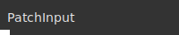

**Full Name:** `Ops.Ui.PatchInput`

**Description:** Helper op for sub-patches

**`\inputsymbol`{=latex} Inputs**

- *Visit [Ops.Ui.PatchInput documentation](https://cables.gl/op/Ops.Ui.PatchInput) for input port details*

**`\outputsymbol`{=latex} Output**

- **Create Port** (Dynamic)

**Example Patch:** [Open in Editor](https://cables.gl/op/Ops.Ui.PatchInput#example)

**Docs:** [https://cables.gl/op/Ops.Ui.PatchInput](https://cables.gl/op/Ops.Ui.PatchInput)

### PatchOutput
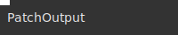

**Full Name:** `Ops.Ui.PatchOutput`

**Description:** Helper op for sub-patches

**`\inputsymbol`{=latex} Inputs**

- **Create Port** (Dynamic)

**`\outputsymbol`{=latex} Output**

- *Visit [Ops.Ui.PatchOutput documentation](https://cables.gl/op/Ops.Ui.PatchOutput) for output port details*

**Example Patch:** [Open in Editor](https://cables.gl/op/Ops.Ui.PatchOutput#example)

**Docs:** [https://cables.gl/op/Ops.Ui.PatchOutput](https://cables.gl/op/Ops.Ui.PatchOutput)

### SetCablesTheme
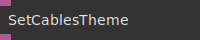

**Full Name:** `Ops.Ui.SetCablesTheme`

**Description:** Set cables editor colors

**`\inputsymbol`{=latex} Inputs**

- **Theme** (Object)

**`\outputsymbol`{=latex} Output**

- **Missing** (Object)

**Example Patch:** [Open in Editor](https://cables.gl/edit/Kq8Pq1)

**Docs:** [https://cables.gl/op/Ops.Ui.SetCablesTheme](https://cables.gl/op/Ops.Ui.SetCablesTheme)

### SubPatch
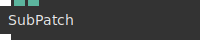

**Full Name:** `Ops.Ui.SubPatch`

**Description:** *Visit [documentation](https://cables.gl/op/Ops.Ui.SubPatch) for details*

**`\inputsymbol`{=latex} Inputs**

- **Create Port** (Dynamic)
- **DataStr** (Number)
- **PatchId** (Number)

**`\outputsymbol`{=latex} Output**

- **Create Port Out** (Dynamic)

**Example Patch:** [Open in Editor](https://cables.gl/op/Ops.Ui.SubPatch#example)

**Docs:** [https://cables.gl/op/Ops.Ui.SubPatch](https://cables.gl/op/Ops.Ui.SubPatch)

### Subpatch2Template
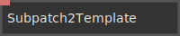

**Full Name:** `Ops.Ui.Subpatch2Template`

**Description:** *Visit [documentation](https://cables.gl/op/Ops.Ui.Subpatch2Template) for details*

**`\inputsymbol`{=latex} Inputs**

- **PatchId** (String)
- **Public** (3): 1

**`\outputsymbol`{=latex} Output**

- *Visit [Ops.Ui.Subpatch2Template documentation](https://cables.gl/op/Ops.Ui.Subpatch2Template) for output port details*

**Example Patch:** [Open in Editor](https://cables.gl/op/Ops.Ui.Subpatch2Template#example)

**Docs:** [https://cables.gl/op/Ops.Ui.Subpatch2Template](https://cables.gl/op/Ops.Ui.Subpatch2Template)

### SubPatchInput
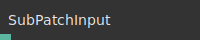

**Full Name:** `Ops.Ui.SubPatchInput`

**Description:** *Visit [documentation](https://cables.gl/op/Ops.Ui.SubPatchInput) for details*

**`\inputsymbol`{=latex} Inputs**

- *Visit [Ops.Ui.SubPatchInput documentation](https://cables.gl/op/Ops.Ui.SubPatchInput) for input port details*

**`\outputsymbol`{=latex} Output**

- **A1jf8yr1w** (Number)

**Example Patch:** [Open in Editor](https://cables.gl/op/Ops.Ui.SubPatchInput#example)

**Docs:** [https://cables.gl/op/Ops.Ui.SubPatchInput](https://cables.gl/op/Ops.Ui.SubPatchInput)

### SubPatchOutput
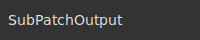

**Full Name:** `Ops.Ui.SubPatchOutput`

**Description:** *Visit [documentation](https://cables.gl/op/Ops.Ui.SubPatchOutput) for details*

**`\inputsymbol`{=latex} Inputs**

- *Visit [Ops.Ui.SubPatchOutput documentation](https://cables.gl/op/Ops.Ui.SubPatchOutput) for input port details*

**`\outputsymbol`{=latex} Output**

- *Visit [Ops.Ui.SubPatchOutput documentation](https://cables.gl/op/Ops.Ui.SubPatchOutput) for output port details*

**Example Patch:** [Open in Editor](https://cables.gl/op/Ops.Ui.SubPatchOutput#example)

**Docs:** [https://cables.gl/op/Ops.Ui.SubPatchOutput](https://cables.gl/op/Ops.Ui.SubPatchOutput)

### VizArrayChart


**Full Name:** `Ops.Ui.VizArrayChart`

**Description:** Displays information of the distribution of numerical values in an array

**`\inputsymbol`{=latex} Inputs**

- **Array Numbers** (Array)
- **Titles** (Array)

**`\outputsymbol`{=latex} Output**

- *Visit [Ops.Ui.VizArrayChart documentation](https://cables.gl/op/Ops.Ui.VizArrayChart) for output port details*

**Example Patch:** [Open in Editor](https://cables.gl/edit/bPWV2f)

**Docs:** [https://cables.gl/op/Ops.Ui.VizArrayChart](https://cables.gl/op/Ops.Ui.VizArrayChart)

### VizArrayGraph
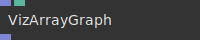

**Full Name:** `Ops.Ui.VizArrayGraph`

**Description:** Visualize Array as line graph

**`\inputsymbol`{=latex} Inputs**

- **Array Numbers** (Array)
- **Curve** (Number: Boolean)

**`\outputsymbol`{=latex} Output**

- **Passthrough Array** (Array)

**Example Patch:** [Open in Editor](https://cables.gl/edit/gCl1ws)

**Docs:** [https://cables.gl/op/Ops.Ui.VizArrayGraph](https://cables.gl/op/Ops.Ui.VizArrayGraph)

### VizArrayTable_v2


**Full Name:** `Ops.Ui.VizArrayTable_v2`

**Description:** Show the contents of the input array in a table in the patch, useful for debugging

**`\inputsymbol`{=latex} Inputs**

- **Array** (Array)
- **Stride** (Number: Integer)
- **Scroll** (Number)

**`\outputsymbol`{=latex} Output**

- **Passthrough Array** (Array)

**Example Patch:** [Open in Editor](https://cables.gl/edit/g8Qfq4)

**Docs:** [https://cables.gl/op/Ops.Ui.VizArrayTable_v2](https://cables.gl/op/Ops.Ui.VizArrayTable_v2)

### VizBool
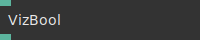

**Full Name:** `Ops.Ui.VizBool`

**Description:** Visualize the state of a boolean input in the patch, useful for debugging

**`\inputsymbol`{=latex} Inputs**

- **Boolean** (Number: Boolean)

**`\outputsymbol`{=latex} Output**

- **Bool** (booleanNumber)

**Example Patch:** [Open in Editor](https://cables.gl/edit/9SHiq4)

**Docs:** [https://cables.gl/op/Ops.Ui.VizBool](https://cables.gl/op/Ops.Ui.VizBool)

### VizGraph


**Full Name:** `Ops.Ui.VizGraph`

**Description:** Displays graphs for the numbers on the input port in the patchfield

**`\inputsymbol`{=latex} Inputs**

- **Number 1** (Number)
- **Number 2** (Number)
- **Number 3** (Number)
- **Number 4** (Number)
- **Number 5** (Number)
- **Number 6** (Number)
- **Number 7** (Number)
- **Number 8** (Number)
- **Fill Graph** (Number: Boolean)
- **Reset** (Trigger)

**`\outputsymbol`{=latex} Output**

- *Visit [Ops.Ui.VizGraph documentation](https://cables.gl/op/Ops.Ui.VizGraph) for output port details*

**Example Patch:** [Open in Editor](https://cables.gl/edit/4D2DnR)

**Docs:** [https://cables.gl/op/Ops.Ui.VizGraph](https://cables.gl/op/Ops.Ui.VizGraph)

### VizImageUrl
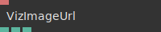

**Full Name:** `Ops.Ui.VizImageUrl`

**Description:** preview an image URL or a data/base64 URL

**`\inputsymbol`{=latex} Inputs**

- **File** (String)

**`\outputsymbol`{=latex} Output**

- **Width** (Number)
- **Height** (Number)
- **Loading** (booleanNumber)

**Example Patch:** [Open in Editor](https://cables.gl/edit/gsP8hO)

**Docs:** [https://cables.gl/op/Ops.Ui.VizImageUrl](https://cables.gl/op/Ops.Ui.VizImageUrl)

### VizLogger
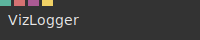

**Full Name:** `Ops.Ui.VizLogger`

**Description:** Log changes of input values line by line, use like a logfile for debugging

**`\inputsymbol`{=latex} Inputs**

- **Number** (Number)
- **String** (String)
- **Object** (Object)
- **Clear** (Trigger)

**`\outputsymbol`{=latex} Output**

- *Visit [Ops.Ui.VizLogger documentation](https://cables.gl/op/Ops.Ui.VizLogger) for output port details*

**Example Patch:** [Open in Editor](https://cables.gl/edit/-4pkq4)

**Docs:** [https://cables.gl/op/Ops.Ui.VizLogger](https://cables.gl/op/Ops.Ui.VizLogger)

### VizNumber
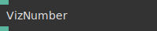

**Full Name:** `Ops.Ui.VizNumber`

**Description:** Displays input string on the patchfield

**`\inputsymbol`{=latex} Inputs**

- **Number** (Number)

**`\outputsymbol`{=latex} Output**

- **Result** (Number)

**Example Patch:** [Open in Editor](https://cables.gl/edit/gkySnR)

**Docs:** [https://cables.gl/op/Ops.Ui.VizNumber](https://cables.gl/op/Ops.Ui.VizNumber)

### VizNumberBar
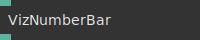

**Full Name:** `Ops.Ui.VizNumberBar`

**Description:** Visualize numbers as a bar in patch, useful for debugging

**`\inputsymbol`{=latex} Inputs**

- **Number** (Number)

**`\outputsymbol`{=latex} Output**

- **Passthrough** (Number)

**Example Patch:** [Open in Editor](https://cables.gl/edit/-yFlq4)

**Docs:** [https://cables.gl/op/Ops.Ui.VizNumberBar](https://cables.gl/op/Ops.Ui.VizNumberBar)

### VizObject


**Full Name:** `Ops.Ui.VizObject`

**Description:** Show information about any object for patch debugging

**`\inputsymbol`{=latex} Inputs**

- **Object** (Object)
- **ZoomText** (Number: Boolean)
- **Line Numbers** (Number: Boolean)
- **Experimental Stringify** (Number: Boolean)
- **Sort Keys** (Number: Boolean)
- **Font Size** (Number)
- **Scroll** (Number)

**`\outputsymbol`{=latex} Output**

- *Visit [Ops.Ui.VizObject documentation](https://cables.gl/op/Ops.Ui.VizObject) for output port details*

**Example Patch:** [Open in Editor](https://cables.gl/edit/PKAmq4)

**Docs:** [https://cables.gl/op/Ops.Ui.VizObject](https://cables.gl/op/Ops.Ui.VizObject)

### VizString


**Full Name:** `Ops.Ui.VizString`

**Description:** Displays long input string on the patchfield

**`\inputsymbol`{=latex} Inputs**

- **String** (String)
- **ZoomText** (Number: Boolean)
- **Line Numbers** (Number: Boolean)
- **Whitespace** (Number: Boolean)
- **Wrap Lines** (Number: Boolean)
- **Syntax Index** (Number: Integer)
- **Font Size** (Number)
- **Scroll** (Number)

**`\outputsymbol`{=latex} Output**

- **Passthrough String** (String)

**Example Patch:** [Open in Editor](https://cables.gl/edit/tRmy5f)

**Docs:** [https://cables.gl/op/Ops.Ui.VizString](https://cables.gl/op/Ops.Ui.VizString)

### VizTexture
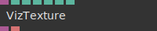

**Full Name:** `Ops.Ui.VizTexture`

**Description:** Displays texture at input port

**`\inputsymbol`{=latex} Inputs**

- **Texture In** (Object:Texture)
- **Show Info** (Number: Boolean)
- **Show Color** (Number: Boolean)
- **X** (Number)
- **Y** (Number)

**`\outputsymbol`{=latex} Output**

- **Texture Out** (Object)
- **Info** (String)

**Example Patch:** [Open in Editor](https://cables.gl/edit/HOVjnR)

**Docs:** [https://cables.gl/op/Ops.Ui.VizTexture](https://cables.gl/op/Ops.Ui.VizTexture)

### VizTextureTable
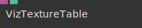

**Full Name:** `Ops.Ui.VizTextureTable`

**Description:** Show pixel colors of connected texture as a table, useful for debugging

**`\inputsymbol`{=latex} Inputs**

- **Texture** (Object:Texture)
- **Row Start** (Number: Integer)

**`\outputsymbol`{=latex} Output**

- *Visit [Ops.Ui.VizTextureTable documentation](https://cables.gl/op/Ops.Ui.VizTextureTable) for output port details*

**Example Patch:** [Open in Editor](https://cables.gl/edit/kp6oq4)

**Docs:** [https://cables.gl/op/Ops.Ui.VizTextureTable](https://cables.gl/op/Ops.Ui.VizTextureTable)

### VizTrigger
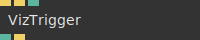

**Full Name:** `Ops.Ui.VizTrigger`

**Description:** Visualize triggering for debugging reasons

**`\inputsymbol`{=latex} Inputs**

- **Trigger** (Trigger)
- **Reset** (Trigger)
- **Count Overlay** (Number: Boolean)

**`\outputsymbol`{=latex} Output**

- **Count** (Number)
- **Next** (Trigger)

**Example Patch:** [Open in Editor](https://cables.gl/edit/ROKBEe)

**Docs:** [https://cables.gl/op/Ops.Ui.VizTrigger](https://cables.gl/op/Ops.Ui.VizTrigger)


