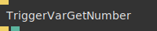
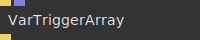
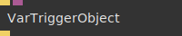
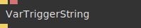
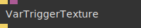

# Ops.Vars


```{=latex}
\OpsSubsubNoSubsectionNumbering\setcounter{subsubsection}{0}
```
### TriggerVarGetArray


**Full Name:** `Ops.Vars.TriggerVarGetArray`

Get an array variable value at time of trigger.

**`\inputsymbol`{=latex} Inputs**

- **Update** (Trigger)

**`\outputsymbol`{=latex} Output**

- **Next** (Trigger)
- **Value** (Array)

**Example Patch:** [cables.gl/op/Ops.Vars.TriggerVarGetArray#example](https://cables.gl/op/Ops.Vars.TriggerVarGetArray#example)

**Doc:** [cables.gl/op/Ops.Vars.TriggerVarGetArray](https://cables.gl/op/Ops.Vars.TriggerVarGetArray)

### TriggerVarGetNumber


**Full Name:** `Ops.Vars.TriggerVarGetNumber`

Get a number variable value at time of trigger.

**`\inputsymbol`{=latex} Inputs**

- **Update** (Trigger)

**`\outputsymbol`{=latex} Output**

- **Next** (Trigger)
- **Value** (Number)

**Example Patch:** [cables.gl/edit/yNCGmy](https://cables.gl/edit/yNCGmy)

**Doc:** [cables.gl/op/Ops.Vars.TriggerVarGetNumber](https://cables.gl/op/Ops.Vars.TriggerVarGetNumber)

### TriggerVarGetObject


**Full Name:** `Ops.Vars.TriggerVarGetObject`

Get an object variable value at time of trigger.

**`\inputsymbol`{=latex} Inputs**

- **Update** (Trigger)

**`\outputsymbol`{=latex} Output**

- **Next** (Trigger)
- **Value** (Object)

**Example Patch:** [cables.gl/op/Ops.Vars.TriggerVarGetObject#example](https://cables.gl/op/Ops.Vars.TriggerVarGetObject#example)

**Doc:** [cables.gl/op/Ops.Vars.TriggerVarGetObject](https://cables.gl/op/Ops.Vars.TriggerVarGetObject)

### TriggerVarGetString


**Full Name:** `Ops.Vars.TriggerVarGetString`

Get a string variable value at time of trigger.

**`\inputsymbol`{=latex} Inputs**

- **Update** (Trigger)

**`\outputsymbol`{=latex} Output**

- **Next** (Trigger)
- **Value** (String)

**Example Patch:** [cables.gl/edit/elyQeG](https://cables.gl/edit/elyQeG)

**Doc:** [cables.gl/op/Ops.Vars.TriggerVarGetString](https://cables.gl/op/Ops.Vars.TriggerVarGetString)

### VarGetArray_v2


**Full Name:** `Ops.Vars.VarGetArray_v2`

Get a variable array.

**`\outputsymbol`{=latex} Output**

- **Value** (Array)

**Example Patch:** [cables.gl/edit/3LkNp6](https://cables.gl/edit/3LkNp6)

**Doc:** [cables.gl/op/Ops.Vars.VarGetArray_v2](https://cables.gl/op/Ops.Vars.VarGetArray_v2)

### VarGetNumber_v2


**Full Name:** `Ops.Vars.VarGetNumber_v2`

read a variable number.

**`\outputsymbol`{=latex} Output**

- **Value** (Number)

**Example Patch:** [cables.gl/edit/1tfFT6](https://cables.gl/edit/1tfFT6)

**Doc:** [cables.gl/op/Ops.Vars.VarGetNumber_v2](https://cables.gl/op/Ops.Vars.VarGetNumber_v2)

### VarGetObject_v2


**Full Name:** `Ops.Vars.VarGetObject_v2`

Get a variable object.

**`\inputsymbol`{=latex} Inputs**

- **Variable** (Number: String)

**`\outputsymbol`{=latex} Output**

- **Value** (Object)

**Example Patch:** [cables.gl/edit/0pVTp6](https://cables.gl/edit/0pVTp6)

**Doc:** [cables.gl/op/Ops.Vars.VarGetObject_v2](https://cables.gl/op/Ops.Vars.VarGetObject_v2)

### VarGetString


**Full Name:** `Ops.Vars.VarGetString`

String variable getter.

**`\outputsymbol`{=latex} Output**

- **Value** (String)

**Example Patch:** [cables.gl/edit/W14clJ](https://cables.gl/edit/W14clJ)

**Doc:** [cables.gl/op/Ops.Vars.VarGetString](https://cables.gl/op/Ops.Vars.VarGetString)

### VarGetTexture_v2


**Full Name:** `Ops.Vars.VarGetTexture_v2`

get a texture from a variable.

**`\outputsymbol`{=latex} Output**

- **Value** (Object)

**Example Patch:** [cables.gl/edit/lkS998](https://cables.gl/edit/lkS998)

**Doc:** [cables.gl/op/Ops.Vars.VarGetTexture_v2](https://cables.gl/op/Ops.Vars.VarGetTexture_v2)

### VariablesAsObject


**Full Name:** `Ops.Vars.VariablesAsObject`

outputs an object containing all variables.

**`\inputsymbol`{=latex} Inputs**

- **Execute** (Trigger)
- **Filter Prefix** (String)

**`\outputsymbol`{=latex} Output**

- **Result** (Object)

**Example Patch:** [cables.gl/op/Ops.Vars.VariablesAsObject#example](https://cables.gl/op/Ops.Vars.VariablesAsObject#example)

**Doc:** [cables.gl/op/Ops.Vars.VariablesAsObject](https://cables.gl/op/Ops.Vars.VariablesAsObject)

### VarSetArray_v2


**Full Name:** `Ops.Vars.VarSetArray_v2`

Set a variable array.

**`\inputsymbol`{=latex} Inputs**

- **Value** (Array)

**Example Patch:** [cables.gl/edit/3LkNp6](https://cables.gl/edit/3LkNp6)

**Doc:** [cables.gl/op/Ops.Vars.VarSetArray_v2](https://cables.gl/op/Ops.Vars.VarSetArray_v2)

### VarSetNumber_v2


**Full Name:** `Ops.Vars.VarSetNumber_v2`

set a variable number.

**`\inputsymbol`{=latex} Inputs**

- **Value** (Number)

**Example Patch:** [cables.gl/edit/1tfFT6](https://cables.gl/edit/1tfFT6)

**Doc:** [cables.gl/op/Ops.Vars.VarSetNumber_v2](https://cables.gl/op/Ops.Vars.VarSetNumber_v2)

### VarSetObject_v2


**Full Name:** `Ops.Vars.VarSetObject_v2`

Set a variable object.

**`\inputsymbol`{=latex} Inputs**

- **Value** (Object)

**Example Patch:** [cables.gl/edit/0pVTp6](https://cables.gl/edit/0pVTp6)

**Doc:** [cables.gl/op/Ops.Vars.VarSetObject_v2](https://cables.gl/op/Ops.Vars.VarSetObject_v2)

### VarSetString_v2


**Full Name:** `Ops.Vars.VarSetString_v2`

Set string variable.

**`\inputsymbol`{=latex} Inputs**

- **Value** (String)

**Example Patch:** [cables.gl/edit/W14clJ](https://cables.gl/edit/W14clJ)

**Doc:** [cables.gl/op/Ops.Vars.VarSetString_v2](https://cables.gl/op/Ops.Vars.VarSetString_v2)

### VarSetTexture_v2


**Full Name:** `Ops.Vars.VarSetTexture_v2`

set a texture variable.

**`\inputsymbol`{=latex} Inputs**

- **Value** (Object:Texture)

**Example Patch:** [cables.gl/edit/lkS998](https://cables.gl/edit/lkS998)

**Doc:** [cables.gl/op/Ops.Vars.VarSetTexture_v2](https://cables.gl/op/Ops.Vars.VarSetTexture_v2)

### VarTriggerArray


**Full Name:** `Ops.Vars.VarTriggerArray`

Set an array variable by a trigger.

**`\inputsymbol`{=latex} Inputs**

- **Trigger** (Trigger)
- **Value** (Array)

**`\outputsymbol`{=latex} Output**

- **Next** (Trigger)

**Example Patch:** [cables.gl/edit/8WWthI](https://cables.gl/edit/8WWthI)

**Doc:** [cables.gl/op/Ops.Vars.VarTriggerArray](https://cables.gl/op/Ops.Vars.VarTriggerArray)

### VarTriggerNumber


**Full Name:** `Ops.Vars.VarTriggerNumber`

set number variable by trigger.

**`\inputsymbol`{=latex} Inputs**

- **Trigger** (Trigger)
- **Value** (Number)

**`\outputsymbol`{=latex} Output**

- **Next** (Trigger)

**Example Patch:** [cables.gl/edit/JEYSfE](https://cables.gl/edit/JEYSfE)

**Doc:** [cables.gl/op/Ops.Vars.VarTriggerNumber](https://cables.gl/op/Ops.Vars.VarTriggerNumber)

### VarTriggerObject


**Full Name:** `Ops.Vars.VarTriggerObject`

Set an object variable by trigger.

**`\inputsymbol`{=latex} Inputs**

- **Trigger** (Trigger)
- **Value** (Object)

**`\outputsymbol`{=latex} Output**

- **Next** (Trigger)

**Example Patch:** [cables.gl/op/Ops.Vars.VarTriggerObject#example](https://cables.gl/op/Ops.Vars.VarTriggerObject#example)

**Doc:** [cables.gl/op/Ops.Vars.VarTriggerObject](https://cables.gl/op/Ops.Vars.VarTriggerObject)

### VarTriggerString


**Full Name:** `Ops.Vars.VarTriggerString`

set string variable by trigger.

**`\inputsymbol`{=latex} Inputs**

- **Trigger** (Trigger)
- **Value** (String)

**`\outputsymbol`{=latex} Output**

- **Next** (Trigger)

**Example Patch:** [cables.gl/edit/PlLFcI](https://cables.gl/edit/PlLFcI)

**Doc:** [cables.gl/op/Ops.Vars.VarTriggerString](https://cables.gl/op/Ops.Vars.VarTriggerString)

### VarTriggerTexture


**Full Name:** `Ops.Vars.VarTriggerTexture`

Set an object variable by trigger.

**`\inputsymbol`{=latex} Inputs**

- **Trigger** (Trigger)
- **Value** (Object:Texture)

**`\outputsymbol`{=latex} Output**

- **Next** (Trigger)

**Example Patch:** [cables.gl/op/Ops.Vars.VarTriggerTexture#example](https://cables.gl/op/Ops.Vars.VarTriggerTexture#example)

**Doc:** [cables.gl/op/Ops.Vars.VarTriggerTexture](https://cables.gl/op/Ops.Vars.VarTriggerTexture)


