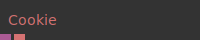
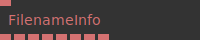
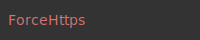
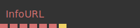
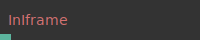
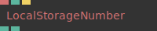
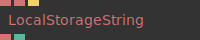
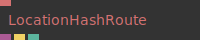
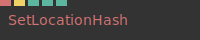
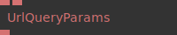

# Ops.Website

---

```{=latex}
\OpsSubsubNoSubsectionNumbering\setcounter{subsubsection}{0}
```
### Cookie


**Full Name:** `Ops.Website.Cookie`

**Description:** cookie of the current website as object

**`\inputsymbol`{=latex} Inputs**

- *Visit [Ops.Website.Cookie documentation](https://cables.gl/op/Ops.Website.Cookie) for input port details*

**`\outputsymbol`{=latex} Output**

- **Cookie** (Object)
- **Cookie String** (String)

**Example Patch:** [Open in Editor](https://cables.gl/edit/oNMzci)

**Docs:** [https://cables.gl/op/Ops.Website.Cookie](https://cables.gl/op/Ops.Website.Cookie)

### FilenameInfo


**Full Name:** `Ops.Website.FilenameInfo`

**Description:** information about a filename, like url protocol, suffix etc

**`\inputsymbol`{=latex} Inputs**

- **URL** (String)

**`\outputsymbol`{=latex} Output**

- **Protocol** (String)
- **Host** (String)
- **Full Path** (String)
- **Filename** (String)
- **Basename** (String)
- **Suffix** (String)
- **Is URL** (String)
- **QueryParams** (String)

**Example Patch:** [Open in Editor](https://cables.gl/edit/RyrLMg)

**Docs:** [https://cables.gl/op/Ops.Website.FilenameInfo](https://cables.gl/op/Ops.Website.FilenameInfo)

### ForceHttps


**Full Name:** `Ops.Website.ForceHttps`

**Description:** will redirect to same URL using https protocol

**`\inputsymbol`{=latex} Inputs**

- *Visit [Ops.Website.ForceHttps documentation](https://cables.gl/op/Ops.Website.ForceHttps) for input port details*

**`\outputsymbol`{=latex} Output**

- *Visit [Ops.Website.ForceHttps documentation](https://cables.gl/op/Ops.Website.ForceHttps) for output port details*

**Example Patch:** [Open in Editor](https://cables.gl/op/Ops.Website.ForceHttps#example)

**Docs:** [https://cables.gl/op/Ops.Website.ForceHttps](https://cables.gl/op/Ops.Website.ForceHttps)

### InfoURL


**Full Name:** `Ops.Website.InfoURL`

**Description:** Information about the current URL

**`\inputsymbol`{=latex} Inputs**

- *Visit [Ops.Website.InfoURL documentation](https://cables.gl/op/Ops.Website.InfoURL) for input port details*

**`\outputsymbol`{=latex} Output**

- **URL** (String)
- **Host** (String)
- **Hash** (String)
- **Pathname** (String)
- **Protocol** (String)
- **Port** (String)
- **Hash Changed** (Trigger)

**Example Patch:** [Open in Editor](https://cables.gl/edit/9UM2YG)

**Docs:** [https://cables.gl/op/Ops.Website.InfoURL](https://cables.gl/op/Ops.Website.InfoURL)

### InIframe


**Full Name:** `Ops.Website.InIframe`

**Description:** Outputs true if the patch is inside of an iframe

**`\inputsymbol`{=latex} Inputs**

- *Visit [Ops.Website.InIframe documentation](https://cables.gl/op/Ops.Website.InIframe) for input port details*

**`\outputsymbol`{=latex} Output**

- **In Iframe** (booleanNumber)

**Example Patch:** [Open in Editor](https://cables.gl/edit/qWDDci)

**Docs:** [https://cables.gl/op/Ops.Website.InIframe](https://cables.gl/op/Ops.Website.InIframe)

### LocalStorageNumber


**Full Name:** `Ops.Website.LocalStorageNumber`

**Description:** Store and retreive a number in browser localstorage

**`\inputsymbol`{=latex} Inputs**

- **Key** (String)
- **Number** (Number)
- **Store** (Trigger)

**`\outputsymbol`{=latex} Output**

- **Stored Number** (Number)
- **Storage Support** (Number)

**Example Patch:** [Open in Editor](https://cables.gl/edit/9di48i)

**Docs:** [https://cables.gl/op/Ops.Website.LocalStorageNumber](https://cables.gl/op/Ops.Website.LocalStorageNumber)

### LocalStorageString


**Full Name:** `Ops.Website.LocalStorageString`

**Description:** Store and retreive a string in browser localstorage

**`\inputsymbol`{=latex} Inputs**

- **Key** (String)
- **String** (String)
- **Store** (Trigger)

**`\outputsymbol`{=latex} Output**

- **Stored String** (String)
- **Storage Support** (booleanNumber)

**Example Patch:** [Open in Editor](https://cables.gl/edit/QKe58i)

**Docs:** [https://cables.gl/op/Ops.Website.LocalStorageString](https://cables.gl/op/Ops.Website.LocalStorageString)

### LocationHashRoute


**Full Name:** `Ops.Website.LocationHashRoute`

**Description:** gives updated information about window.location.hash

**`\inputsymbol`{=latex} Inputs**

- **Route** (String)
- **pattern for url and variables** (i.e. /scene/:id)

**`\outputsymbol`{=latex} Output**

- **Values** (Object)
- **Changed** (Trigger)
- **Matching** (booleanNumber)

**Example Patch:** [Open in Editor](https://cables.gl/edit/EfiWpG)

**Docs:** [https://cables.gl/op/Ops.Website.LocationHashRoute](https://cables.gl/op/Ops.Website.LocationHashRoute)

### SetLocationHash


**Full Name:** `Ops.Website.SetLocationHash`

**Description:** sets window.location.hash to the specified value(s)

**`\inputsymbol`{=latex} Inputs**

- **Hash** (String)
- **Update** (Trigger)
- **Active** (Number: Boolean)
- **Silent** (Number: Boolean)
- **Allow Empty** (Number: Boolean)

**`\outputsymbol`{=latex} Output**

- *Visit [Ops.Website.SetLocationHash documentation](https://cables.gl/op/Ops.Website.SetLocationHash) for output port details*

**Example Patch:** [Open in Editor](https://cables.gl/edit/EfiWpG)

**Docs:** [https://cables.gl/op/Ops.Website.SetLocationHash](https://cables.gl/op/Ops.Website.SetLocationHash)

### UrlQueryParams_v2


**Full Name:** `Ops.Website.UrlQueryParams_v2`

**Description:** Returns a URL query parameter

**`\inputsymbol`{=latex} Inputs**

- **Parameter** (String)
- **Default** (String)

**`\outputsymbol`{=latex} Output**

- **Result** (String)

**Example Patch:** [Open in Editor](https://cables.gl/edit/2SE58i)

**Docs:** [https://cables.gl/op/Ops.Website.UrlQueryParams_v2](https://cables.gl/op/Ops.Website.UrlQueryParams_v2)


