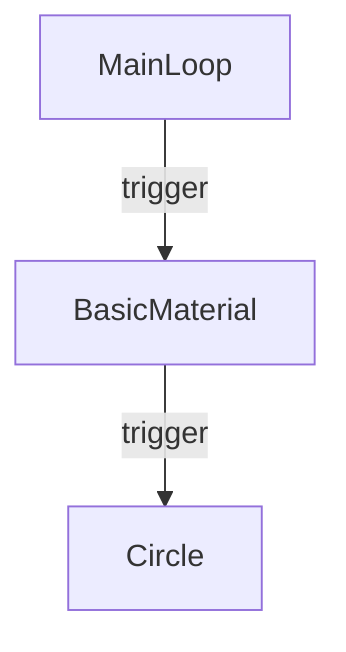

# Diagram Options Comparison

This document compares 4 different approaches for visualizing cables.gl patches in the book.

## Option 1: Custom SVG Graphics (Recommended)

### Appearance
Clean, vector-based graphics that closely mimic cables.gl styling with:
- Dark background (#1a1a1a)
- Operator boxes with rounded corners (#2d2d2d)
- Grey trigger ports as circles
- Curved bezier connection lines
- Professional labels

### Pros
- Scalable to any size (vector)
- Small file size
- Can be edited in code or Inkscape/Illustrator
- Precise color matching
- Clean, professional look
- Works in all markdown renderers
- Can be embedded inline or as file

### Cons
- Requires manual SVG coding or design tool
- Doesn't show exact cables.gl UI
- Takes time to create custom

### Best For
- Diagrams that will be reused
- Clean, simplified explanations
- Print materials
- When file size matters

## Option 2: Real Cables.gl Screenshots (Most Authentic)

**Guide**: `screenshot-guide.md`

### Appearance
Actual cables.gl interface - 100% authentic appearance including real fonts, port styling, and UI elements.

### Pros
- Completely authentic - it IS cables.gl
- Shows real interface users will see
- Quick to create (just screenshot)
- No design skills needed
- Perfect for tutorials showing exact steps

### Cons
- Larger file sizes (PNG)
- Not easily editable
- May include unwanted UI elements
- Resolution dependent
- Requires cables.gl access for each diagram

### Best For
- Step-by-step tutorials
- Showing actual UI workflows
- Quick documentation
- When authenticity is critical

## Option 3: HTML/CSS Interactive

**File**: `basic-render-chain-html.html`

### Appearance
HTML/CSS recreation that mimics cables.gl styling. Can be viewed in browser.

### Pros
- Interactive (could add hover effects, animations)
- Precise control over styling
- Can match cables.gl exactly with CSS
- Could be made responsive
- Easy to edit styles

### Cons
- Requires opening in browser
- Not embedded directly in markdown
- Need to export to image for static docs
- More complex to maintain

### Best For
- Interactive tutorials
- Web-based documentation
- When you need hover effects or interactions
- Teaching tool with live demos

## Option 4: Mermaid Diagrams (Simplest)

**Format**: Inline markdown code block

### Pros
- Extremely simple to create
- Text-based (version control friendly)
- Automatically rendered in GitHub, many markdown tools
- Easy to edit
- No separate files needed

### Cons
- Doesn't look like cables.gl at all
- Limited styling options
- Basic box-and-arrow diagrams only
- Can't show port details accurately
- Not rendered in all markdown viewers

### Best For
- Simple flow diagrams
- Quick conceptual explanations
- GitHub documentation
- When appearance doesn't matter

## Recommendations by Use Case

| Use Case | Best Option | Why |
|----------|-------------|-----|
| **Technical book (this project)** | Option 1: SVG | Scalable, professional, small files |
| **Tutorial blog posts** | Option 2: Screenshots | Shows real UI |
| **Interactive web course** | Option 3: HTML/CSS | Can add interactivity |
| **GitHub README** | Option 4: Mermaid | Native rendering |
| **Complex patches** | Option 2: Screenshots | Too time-consuming to recreate |
| **Simple concepts** | Option 1: SVG | Clean and clear |
| **Print materials** | Option 1: SVG | Vector scales perfectly |

## Hybrid Approach

Consider using multiple options throughout the book:

- **Intro/Getting Started**: Custom SVG for clean, simple examples
- **Advanced tutorials**: Screenshots for showing real complex patches
- **Quick references**: Mermaid for simple flow concepts
- **Interactive sections**: HTML/CSS for special cases

## Creating More Diagrams

### If you choose SVG (Option 1):
1. Copy 
2. Modify coordinates, text, and connections
3. Keep color scheme consistent
4. Add more port types (green for numbers, yellow for strings, blue for objects)

### If you choose Screenshots (Option 2):
1. Follow `screenshot-guide.md`
2. Keep consistent zoom level
3. Crop consistently
4. Optimize all images

### If you choose HTML (Option 3):
1. Copy `basic-render-chain-html.html`
2. Modify ops and connections
3. Add JavaScript for interactivity if desired
4. Export to PNG/SVG using browser tools

### If you choose Mermaid (Option 4):
1. Just write mermaid code blocks in markdown
2. Keep it simple and clear
3. Focus on concepts, not exact appearance

